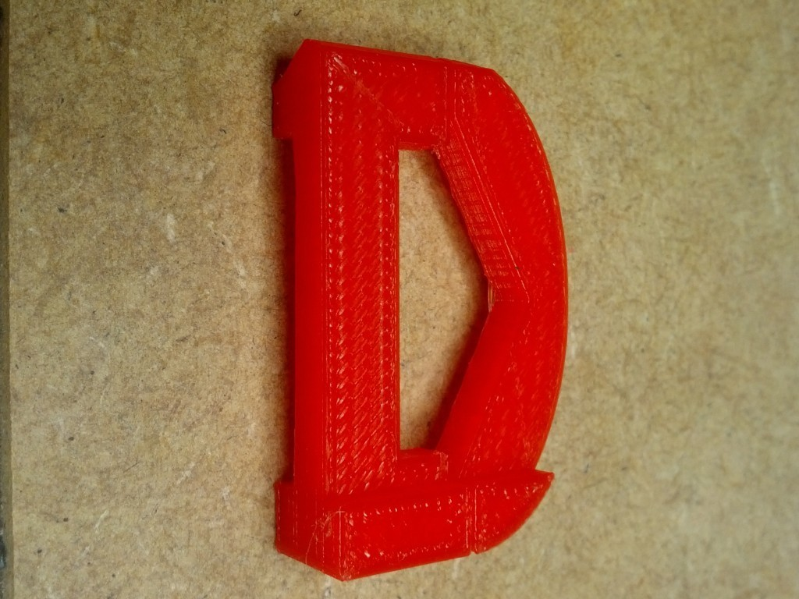
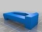
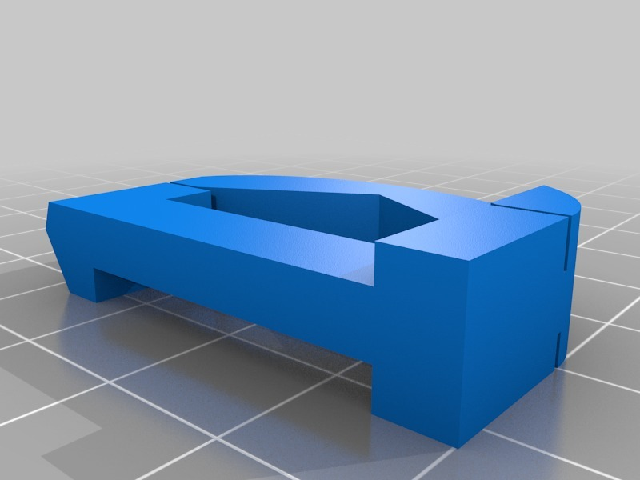

A 2D 1D in 3D
===============
**Please note: This thing is part of a list that was [automatically generated](https://github.com/carlosgs/export-things) and may have been updated since then. Make sure to check for the current license and authorship.**  

A 2D 1D in 3D  by MakeALot , published Aug 16, 2013

Description
--------
My daughter wanted a 3D model of the 1D logo, so here it is, I expect that it will be incorporated into earings, necklace, ring and whatever else she can think of...

Instructions
--------
None

Files
--------

 [ 1DLogo.stl](1DLogo.stl)  

Pictures
--------

Tags
--------
1D , 2D , 3D , Letter , Logo  

  

License
--------
A 2D 1D in 3D by MakeALot is licensed under the Creative Commons - Attribution - Share Alike license.  

By: Mark Durbin (MakeALot)
--------
<http://NestedCube.com/>