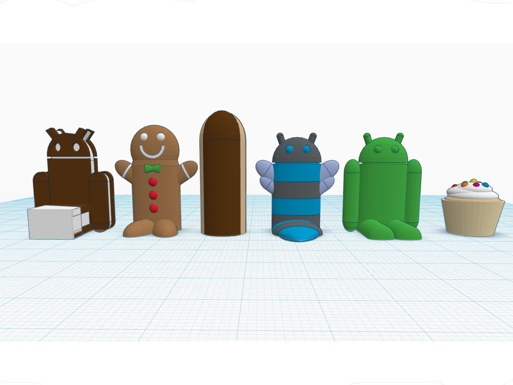

Android #Chess
===============
**Please note: This thing is part of a list that was [automatically generated](https://github.com/carlosgs/export-things) and may have been updated since then. Make sure to check for the current license and authorship.**  

Android #Chess  by MakeALot , published Mar 23, 2012

Description
--------
This part was made with Tinkercad. Edit the part online at: <a href="https://tinkercad.com/things/dyXVjX1I3AY" target="_blank" rel="nofollow">tinkercad.com/things/dyXVjX1I3AY</a>

Instructions
--------
Print, play.

Files
--------

 [ android_chess.stl](android_chess.stl)  

 [ android_chess_side.stl](android_chess_side.stl)  

Pictures
--------

Tags
--------
Android , Chess , Cupcake , Eclair , Gingerbread , Honeycomb , Ice_Cream_Sandwich , TinkerCAD  

  

License
--------
Android #Chess by MakeALot is licensed under the Creative Commons - Attribution license.  

By: Mark Durbin (MakeALot)
--------
<http://NestedCube.com/>