Android Honeycomb device rest
===============
**Please note: This thing is part of a list that was [automatically generated](https://github.com/carlosgs/export-things) and may have been updated since then. Make sure to check for the current license and authorship.**  

Android Honeycomb device rest  by MakeALot , published Feb 20, 2011

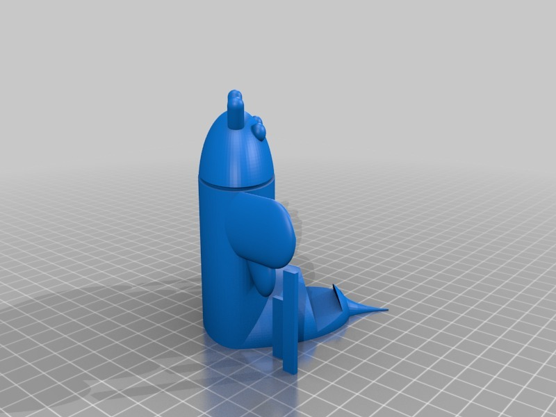

Description
--------
Android bot for your desktop, this time a cute little honey bee.

Instructions
--------
Print, and place with your other Android stuff. 
 
I added one with small support pillars and one without (the NS version).

Files
--------
[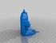](HoneyCombRest_NS.stl)
 [ HoneyCombRest_NS.stl](HoneyCombRest_NS.stl)  

[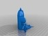](HoneyCombRest.stl)
 [ HoneyCombRest.stl](HoneyCombRest.stl)  

 [ androidHoney_NS.scad](androidHoney_NS.scad)  

 [ androidHoney.scad](androidHoney.scad)  

Pictures
--------
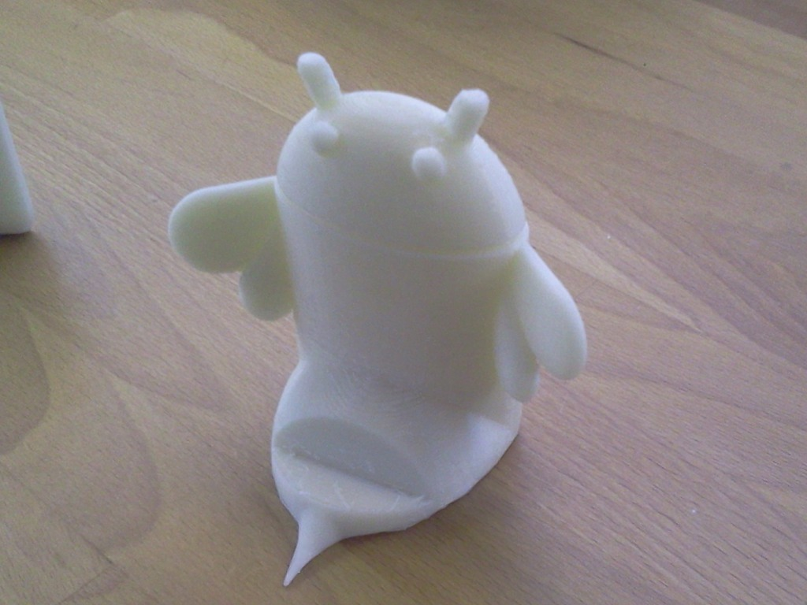
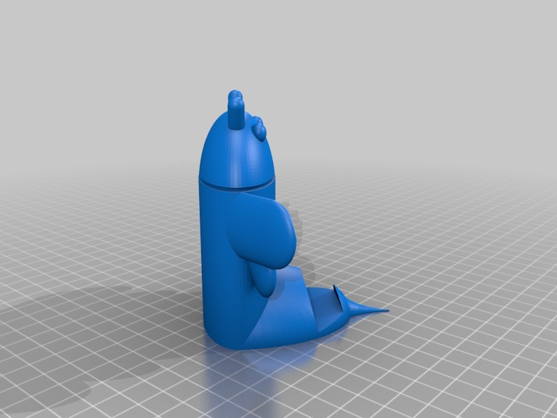
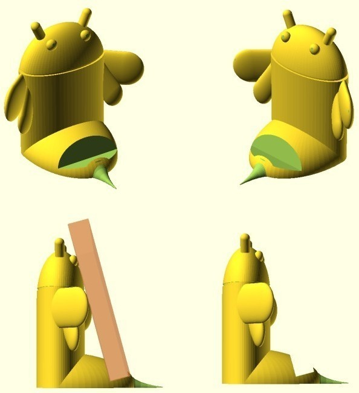
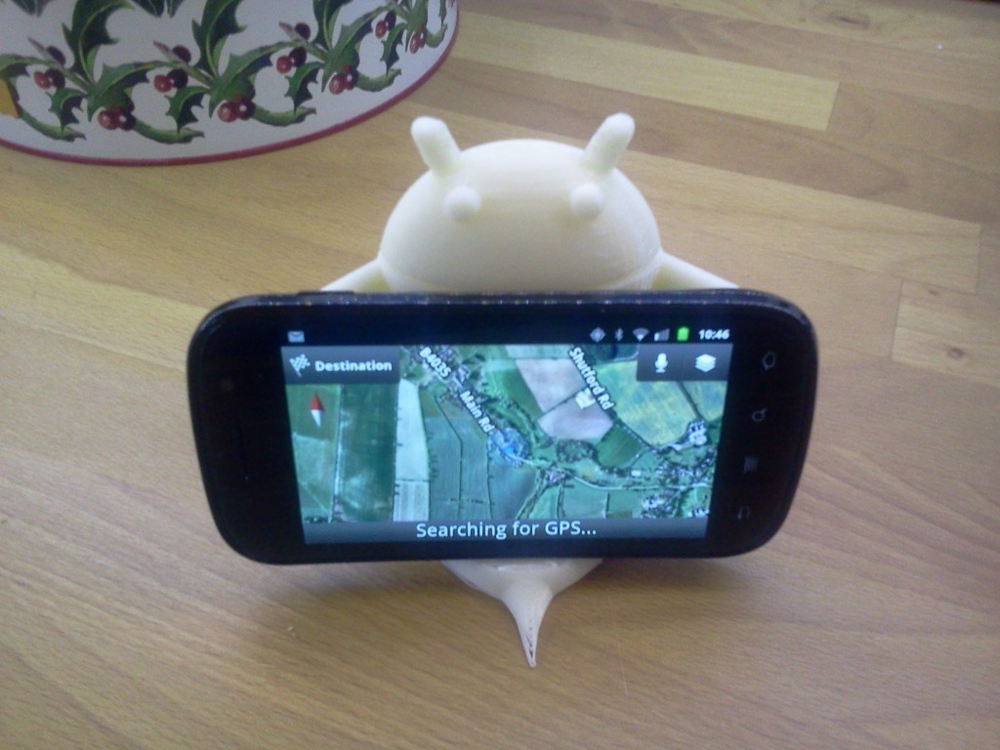
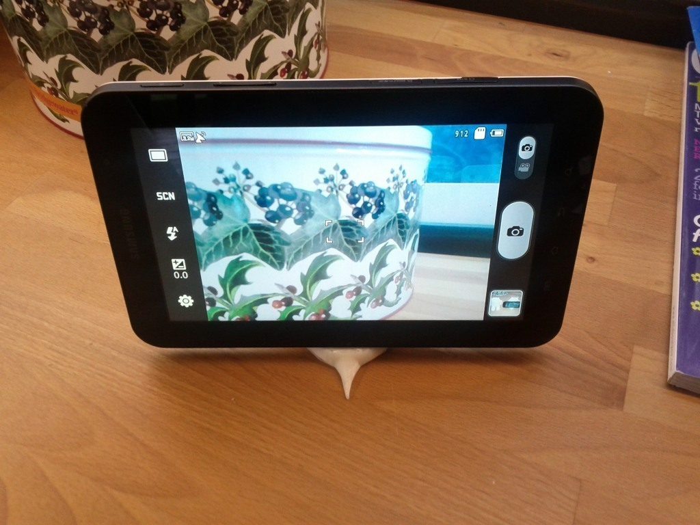
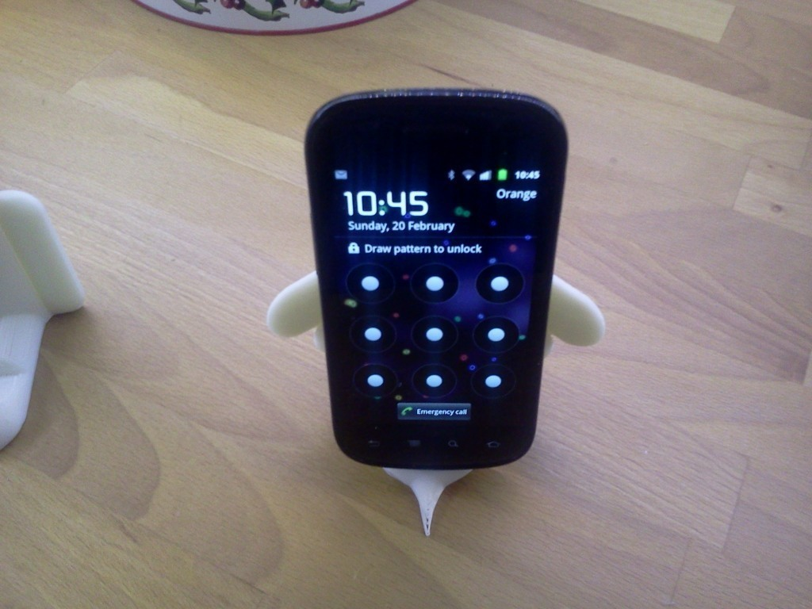
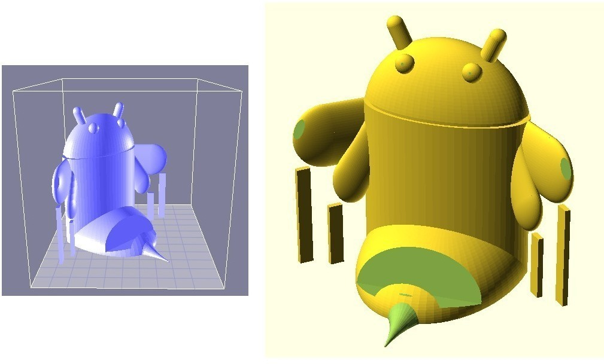
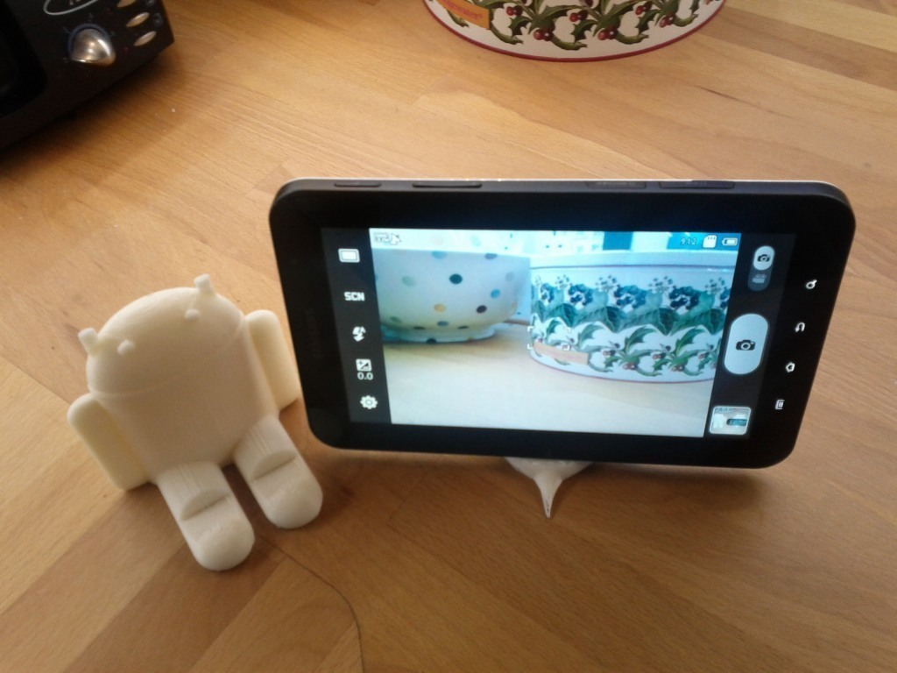
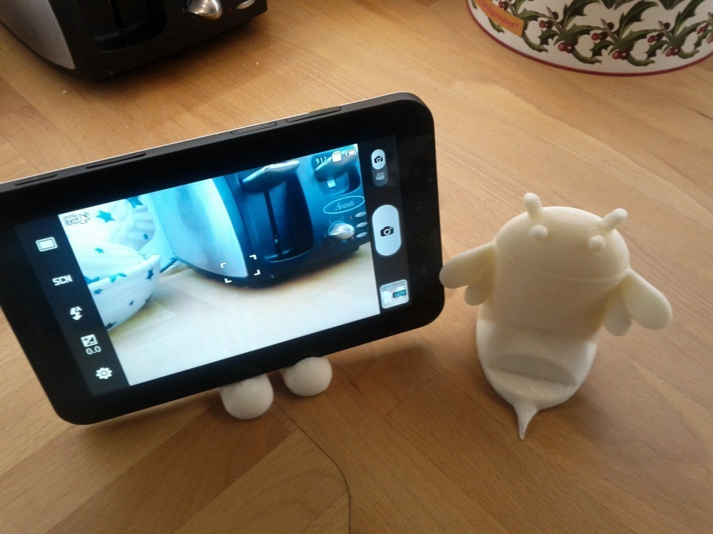
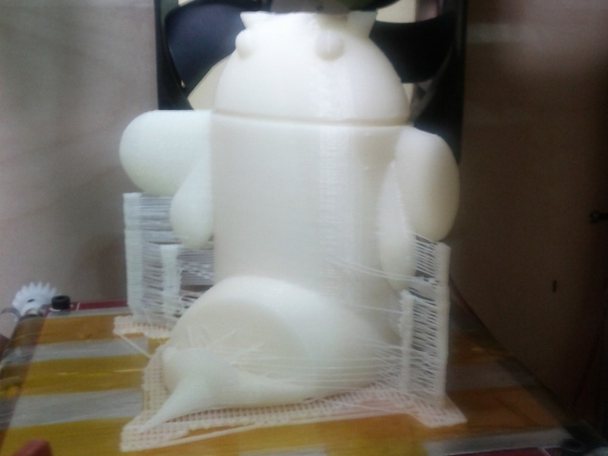
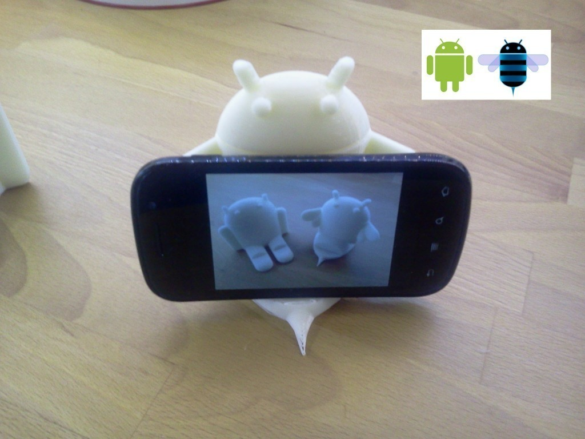
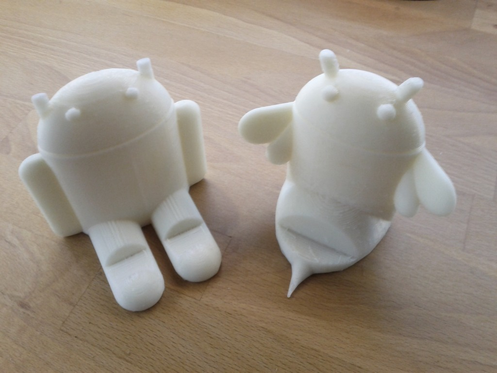

Tags
--------
android , honeycomb , openscad , stand  

  

License
--------
Android Honeycomb device rest by MakeALot is licensed under the BSD License license.  

By: Mark Durbin (MakeALot)
--------
<http://NestedCube.com/>