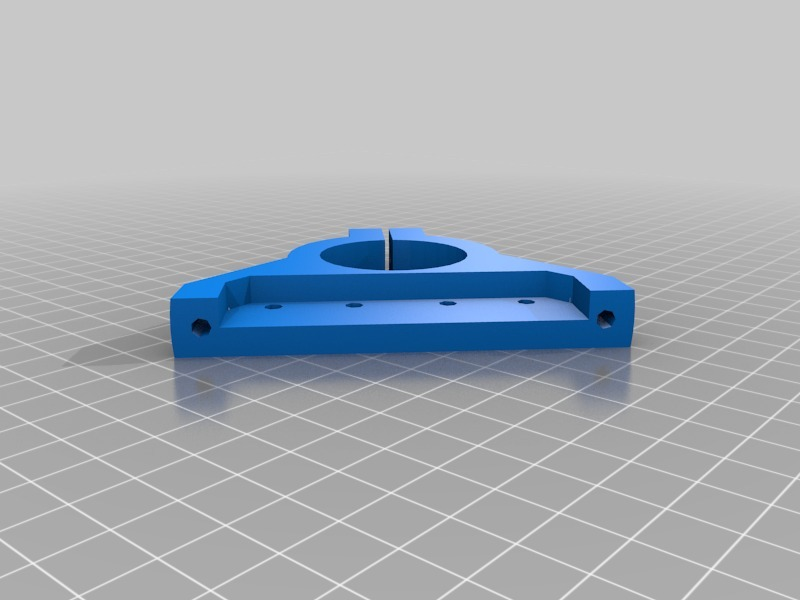
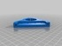
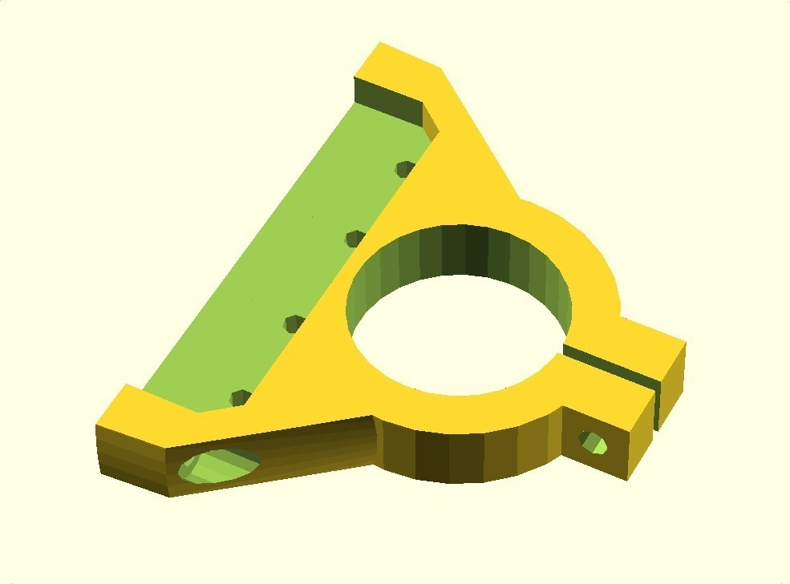
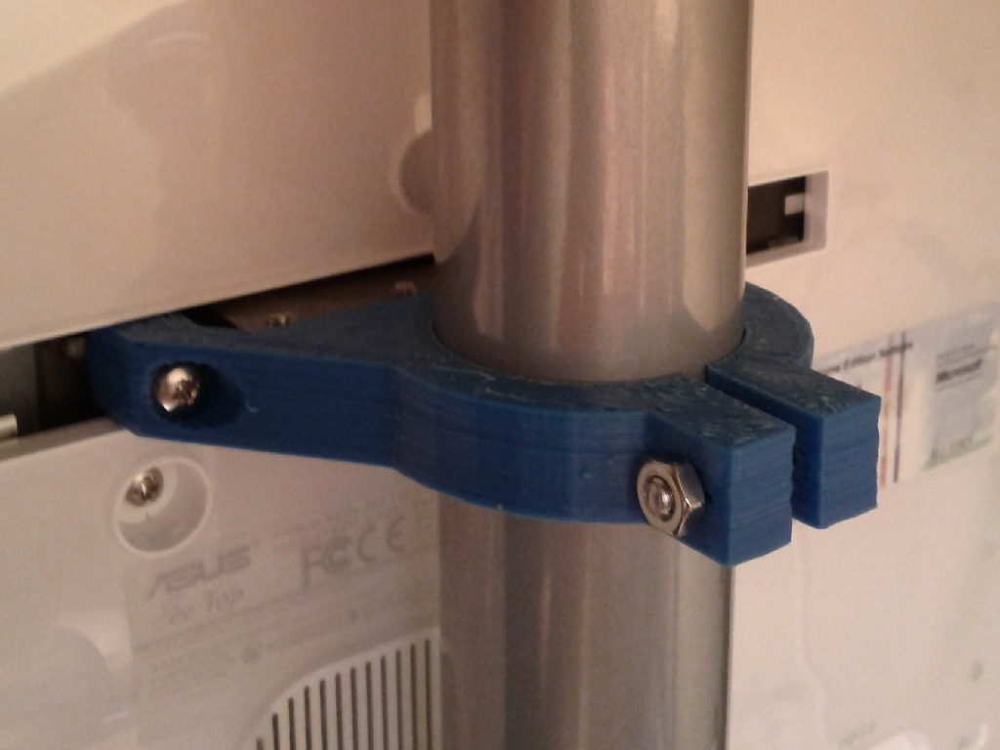
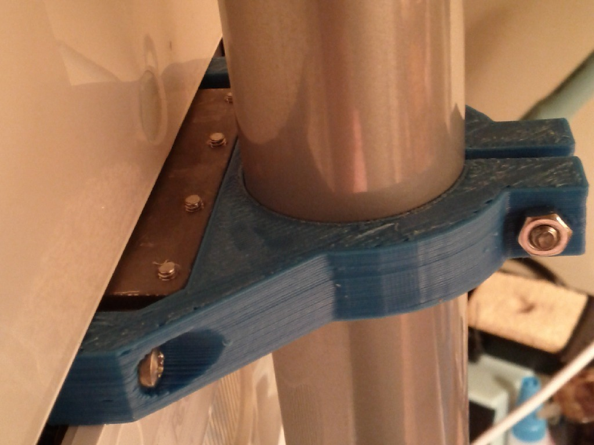

Asus EeeTop All-In-One PC Pole Mount
===============
**Please note: This thing is part of a list that was [automatically generated](https://github.com/carlosgs/export-things) and may have been updated since then. Make sure to check for the current license and authorship.**  

Asus EeeTop All-In-One PC Pole Mount  by MakeALot , published Mar 20, 2011

Description
--------
The Asus EeeTop All-In-One PC comes with a sprung desktop stand fitted to the rear and lacks the VESA mounting holes needed to mount it otherwise. This is a pole mount adapter for a standard 35mm pole.

Instructions
--------
After removing the stand from the back of the EeeTop, Push the printed mount into the back of the display and fit 4 M3x12 machine head screws and 2 M3x16 machine head screws through the mounting holes. 
 
Use a M4x25 bolt and nut to tighten it on the pole.

Files
--------

 [ eeeTopPoleMountFull.stl](eeeTopPoleMountFull.stl)  

 [ eeeTopPoleMount.scad](eeeTopPoleMount.scad)  

Pictures
--------

Tags
--------
openscad  

  

License
--------
Asus EeeTop All-In-One PC Pole Mount by MakeALot is licensed under the BSD License license.  

By: Mark Durbin (MakeALot)
--------
<http://NestedCube.com/>