Ball Maze
===============
**Please note: This thing is part of a list that was [automatically generated](https://github.com/carlosgs/export-things) and may have been updated since then. Make sure to check for the current license and authorship.**  

Ball Maze  by MakeALot , published Mar 21, 2011

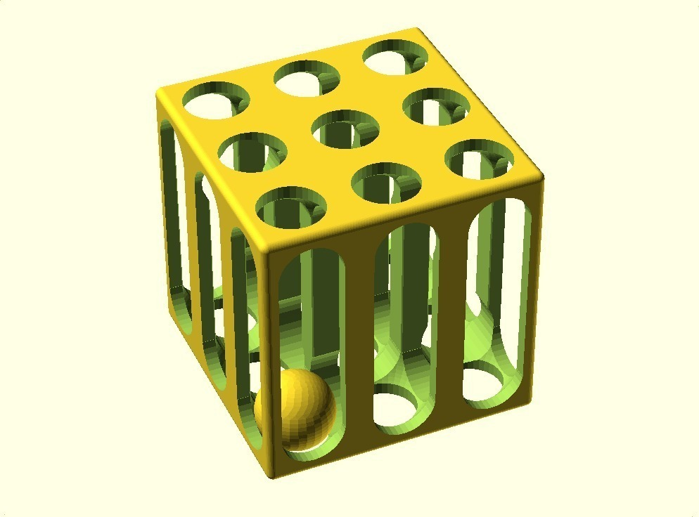

Description
--------
3x3 ball maze inspired by <a href="http://www.thingiverse.com/thing:1542" target="_blank" rel="nofollow">thingiverse.com/thing:1542</a> 
Not exactly an intellectual challenge, but an interesting print! 
 
I still find it amazing that it's possible to print these vertical columns. 

Instructions
--------
Print, clean up inside the top (the overhangs are a little too much), play. 
 
Alternatively, print ball in a different colour first using support material, clean it up to make it a perfect ball, then drop it into an empty maze halfway through the print to really confuse people. 
 
<b>Update:</b> 
I've thickened up the outer columns and the ball was also a little tight, so I reduced its radius by 0.5 mm updated files attached.

Files
--------
[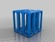](BallMaze_smallerBall_thickerPillars.stl)
 [ BallMaze_smallerBall_thickerPillars.stl](BallMaze_smallerBall_thickerPillars.stl)  

 [ BallMaze_smallerBall_thickerPillars.scad](BallMaze_smallerBall_thickerPillars.scad)  

[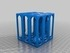](BallMaze.stl)
 [ BallMaze.stl](BallMaze.stl)  

 [ BallMaze.scad](BallMaze.scad)  

[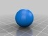](Ball.stl)
 [ Ball.stl](Ball.stl)  

[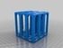](Empty_BallMaze.stl)
 [ Empty_BallMaze.stl](Empty_BallMaze.stl)  

Pictures
--------
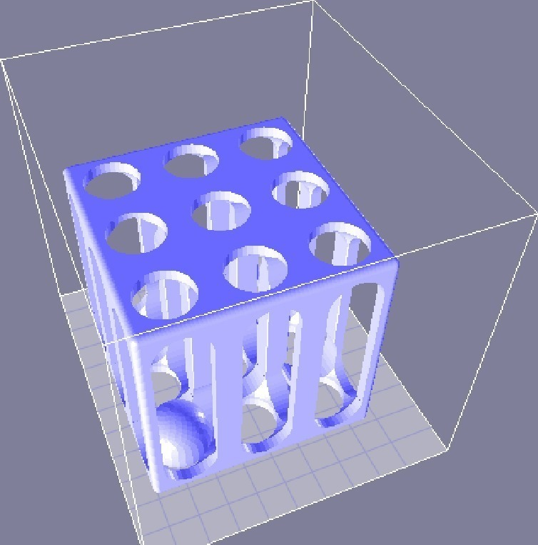
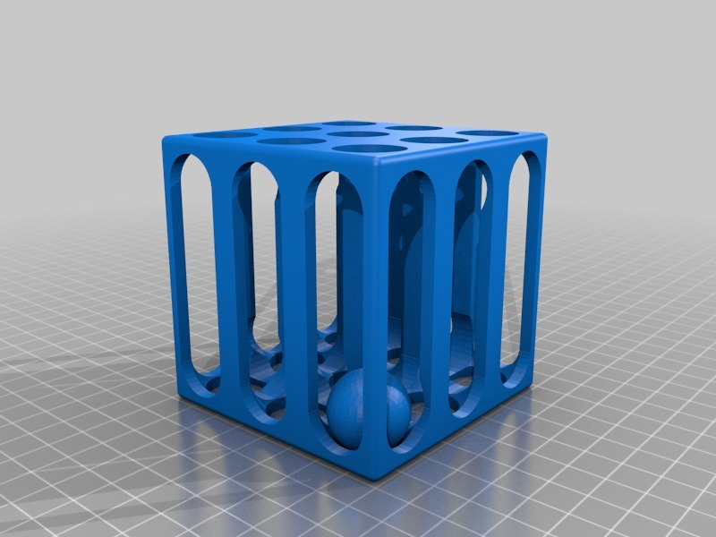
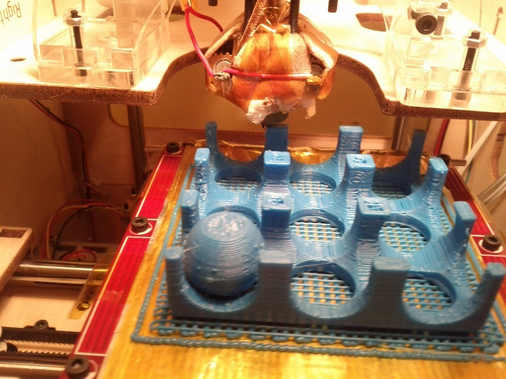
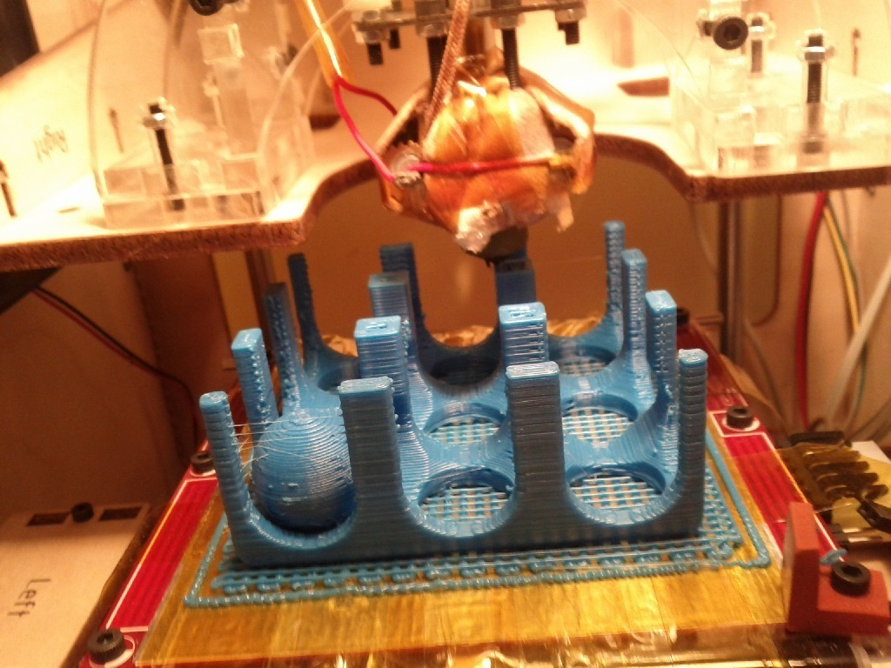
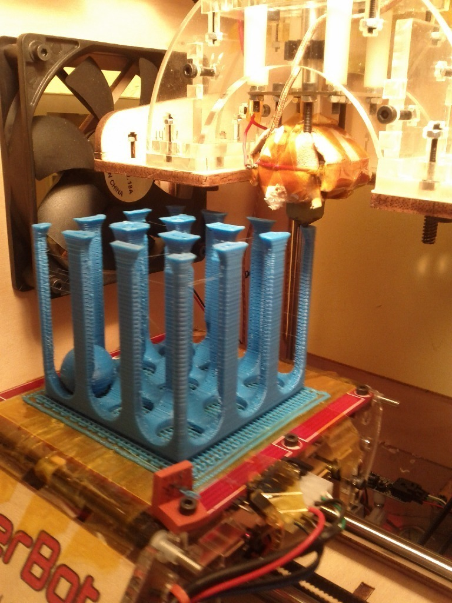
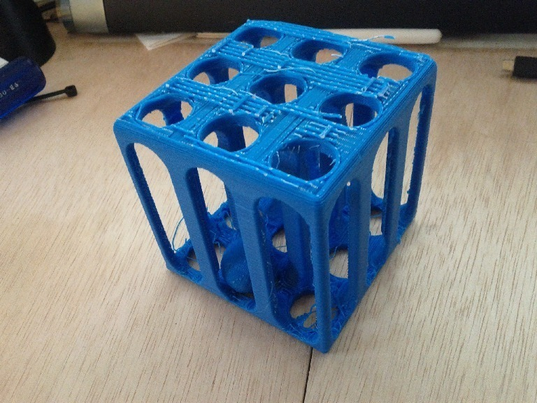

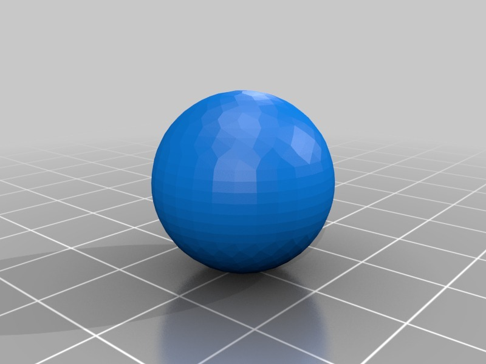
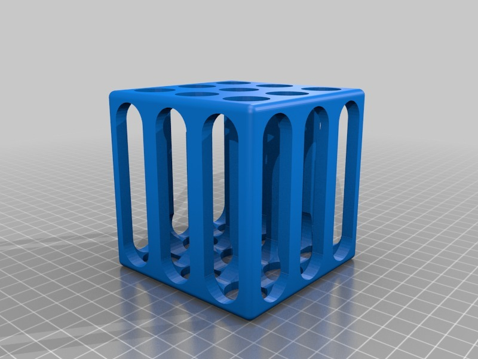
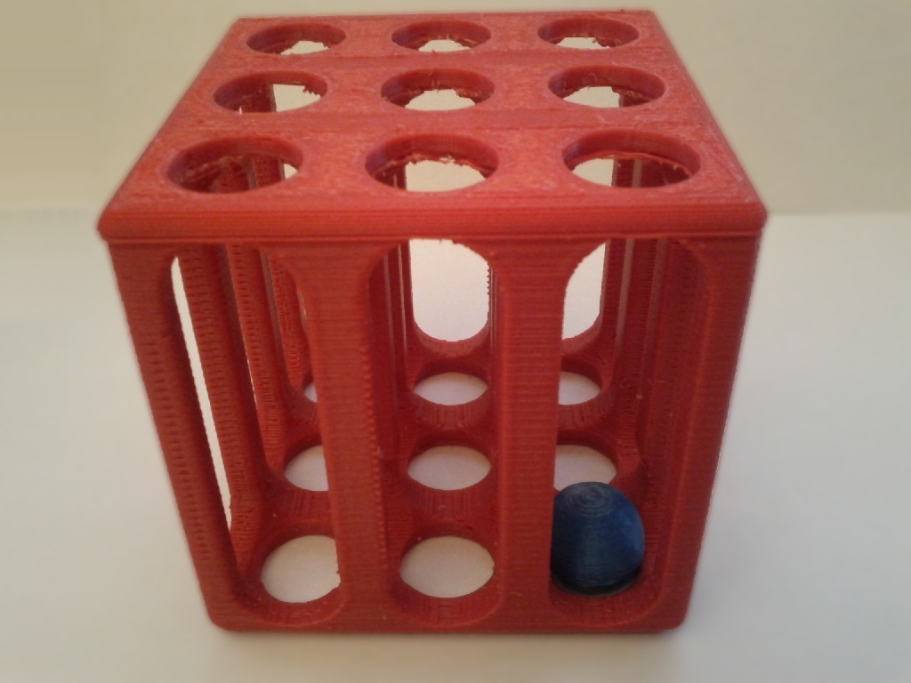

Tags
--------
maze , toy , ball , cage , openscad  

  

License
--------
Ball Maze by MakeALot is licensed under the BSD License license.  

By: Mark Durbin (MakeALot)
--------
<http://NestedCube.com/>