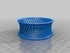

Bracelet VI
===============
**Please note: This thing is part of a list that was [automatically generated](https://github.com/carlosgs/export-things) and may have been updated since then. Make sure to check for the current license and authorship.**  

Bracelet VI  by MakeALot , published Mar 27, 2011

Description
--------
Slotted concave bracelet

Instructions
--------
Unprinted as yet...

Files
--------

 [ slottedBraceletLeft.stl](slottedBraceletLeft.stl)  

 [ slottedBracelet.stl](slottedBracelet.stl)  

 [ slottedBracelet.scad](slottedBracelet.scad)  

Pictures
--------

Tags
--------
bracelet , openscad  

  

License
--------
Bracelet VI by MakeALot is licensed under the BSD License license.  

By: Mark Durbin (MakeALot)
--------
<http://NestedCube.com/>