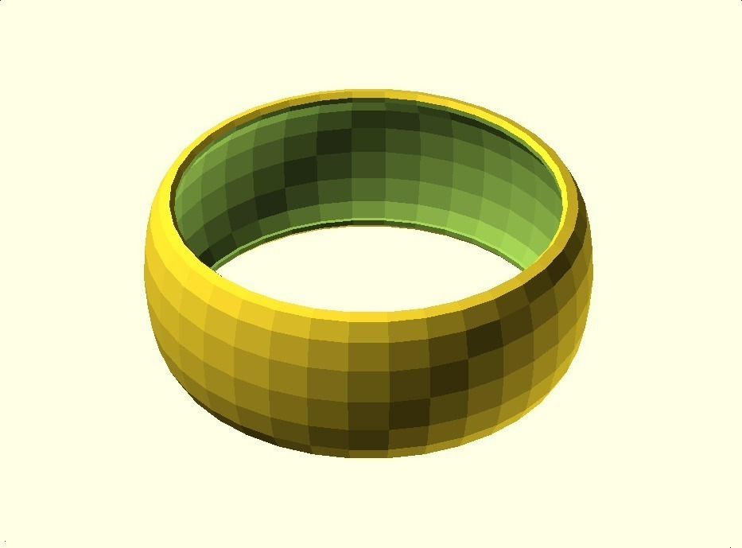
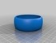
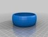
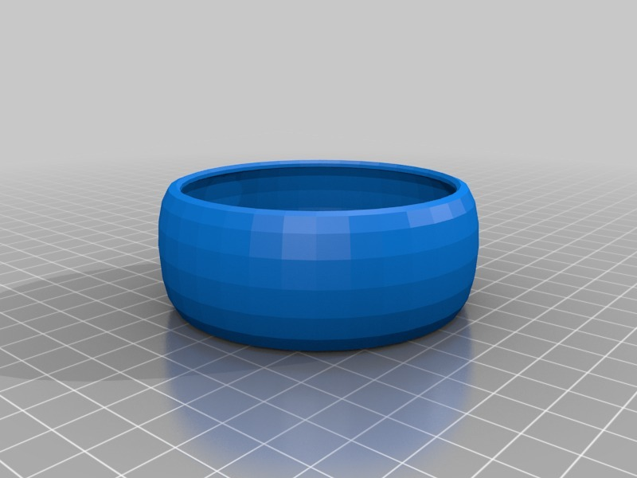
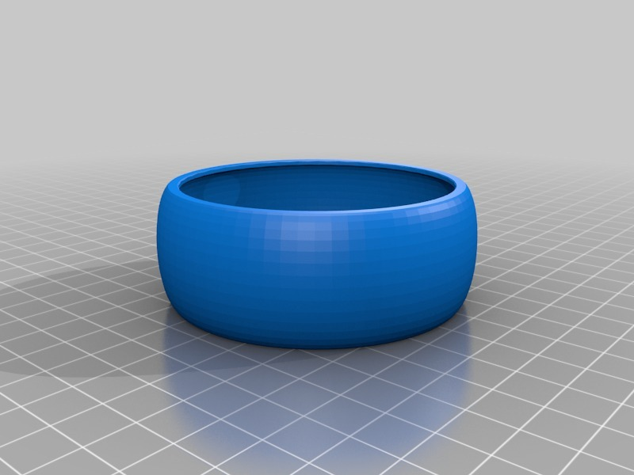

Bracelet VIII
===============
**Please note: This thing is part of a list that was [automatically generated](https://github.com/carlosgs/export-things) and may have been updated since then. Make sure to check for the current license and authorship.**  

Bracelet VIII  by MakeALot , published Mar 27, 2011

Description
--------
Convex plain bracelet

Instructions
--------
If printing from ReplicatorG, select [move] and press [put on platform] before printing.  I forgot to move it up onto the baseline ;)

Files
--------

 [ convexBracelet.scad](convexBracelet.scad)  

 [ convexBracelet_FlatEdges.stl](convexBracelet_FlatEdges.stl)  

 [ convexBracelet.stl](convexBracelet.stl)  

Pictures
--------

Tags
--------
bracelet , openscad  

  

License
--------
Bracelet VIII by MakeALot is licensed under the BSD License license.  

By: Mark Durbin (MakeALot)
--------
<http://NestedCube.com/>