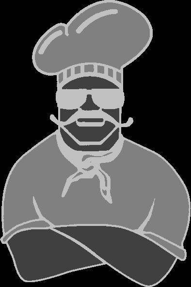
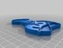

Can anyone turn this picture file into a 3d printable .stl
===============
**Please note: This thing is part of a list that was [automatically generated](https://github.com/carlosgs/export-things) and may have been updated since then. Make sure to check for the current license and authorship.**  

Can anyone turn this picture file into a 3d printable .stl  by MakeALot , published Mar 6, 2011

Description
--------
I converted the bitmap to a monochrome one and then used the pixel brightness to generate a rectangle for each pixel, hope this helps.

Instructions
--------
None

Files
--------

 [ BOSS_Pixels.stl](BOSS_Pixels.stl)  

Pictures
--------

Tags
--------
None  

  

License
--------
Can anyone turn this picture file into a 3d printable .stl by MakeALot is licensed under the Creative Commons - Attribution - Share Alike license.  

By: Mark Durbin (MakeALot)
--------
<http://NestedCube.com/>