Column #Chess
===============
**Please note: This thing is part of a list that was [automatically generated](https://github.com/carlosgs/export-things) and may have been updated since then. Make sure to check for the current license and authorship.**  

Column #Chess  by MakeALot , published Mar 21, 2012

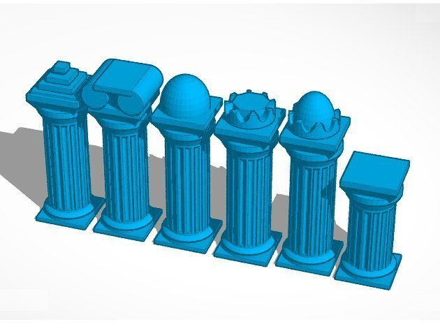

Description
--------
This part was made with Tinkercad. Edit the part online at: <a href="https://tinkercad.com/things/fnGaab2QLaw" target="_blank" rel="nofollow">tinkercad.com/things/fnGaab2QLaw</a>

Instructions
--------
print, play.

Files
--------
[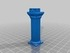](column_chess_king.stl)
 [ column_chess_king.stl](column_chess_king.stl)  

[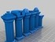](column_chess.stl)
 [ column_chess.stl](column_chess.stl)  

[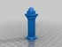](column_chess_queen.stl)
 [ column_chess_queen.stl](column_chess_queen.stl)  

[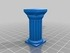](column_chess_pawn.stl)
 [ column_chess_pawn.stl](column_chess_pawn.stl)  

[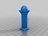](column_chess_bishop.stl)
 [ column_chess_bishop.stl](column_chess_bishop.stl)  

[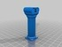](column_chess_knight.stl)
 [ column_chess_knight.stl](column_chess_knight.stl)  

[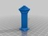](column_chess_rook.stl)
 [ column_chess_rook.stl](column_chess_rook.stl)  

Pictures
--------
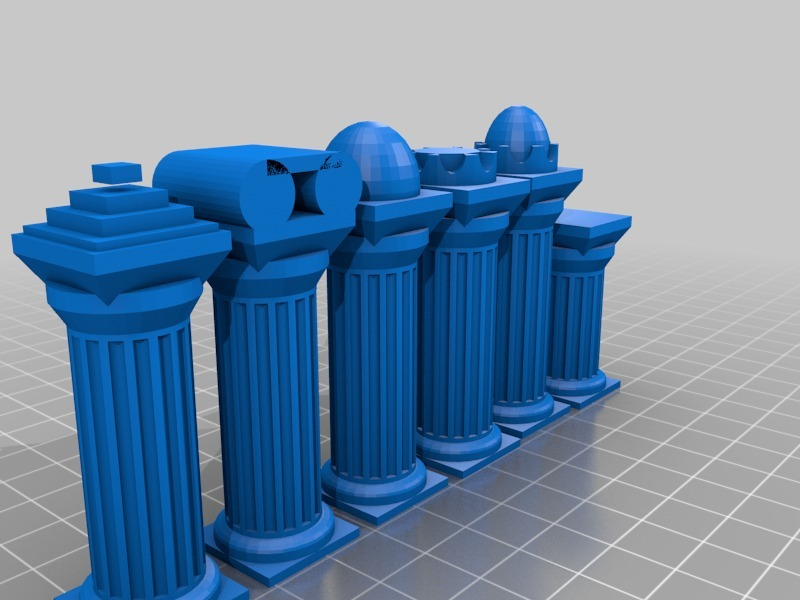
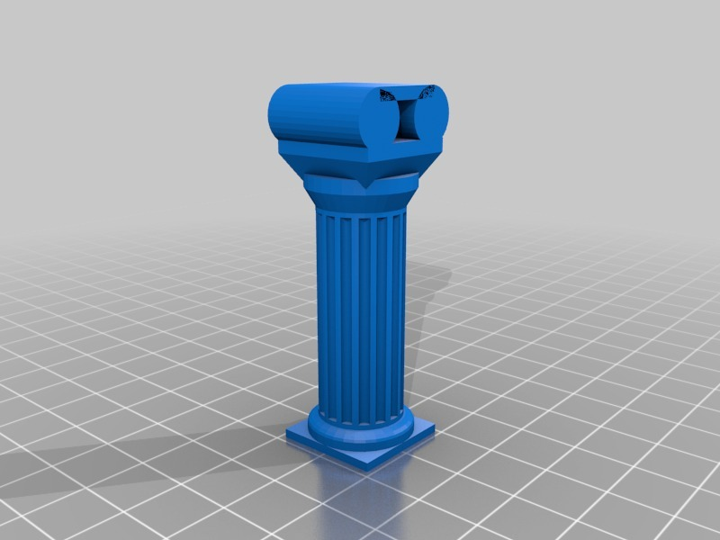
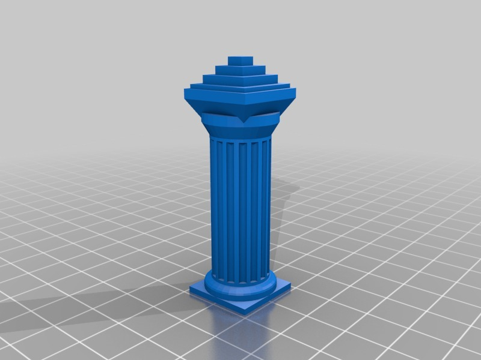
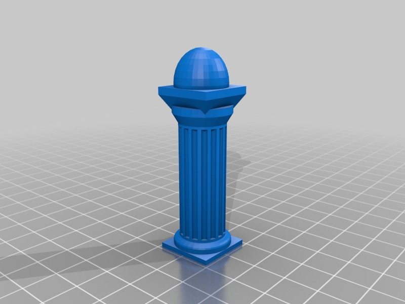
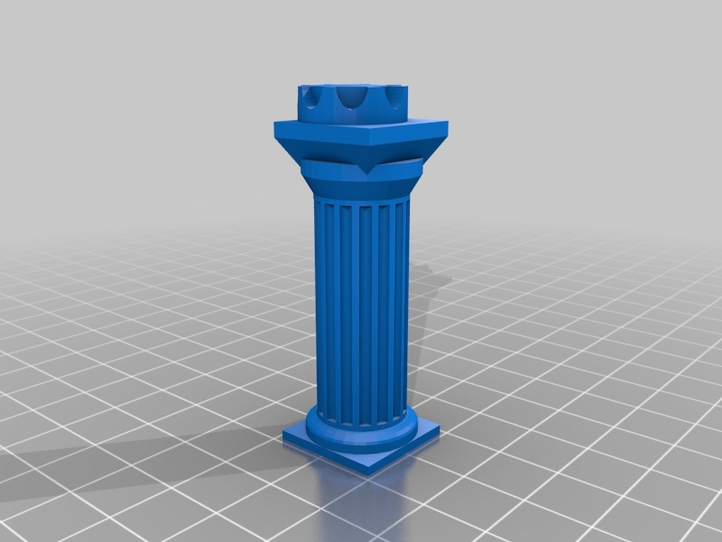
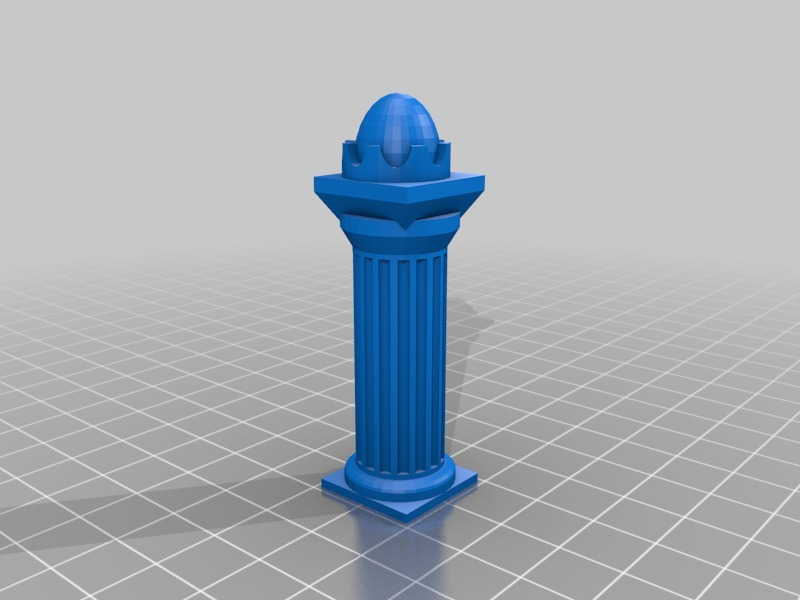
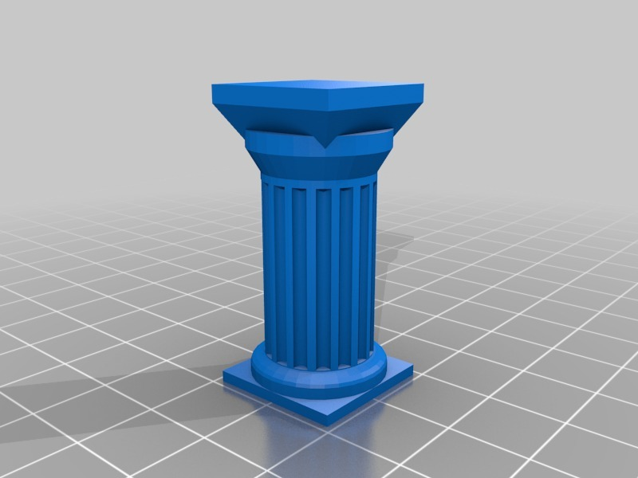
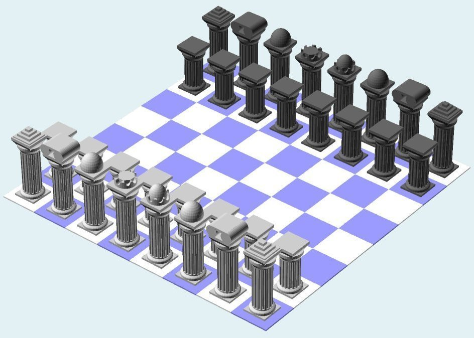

Tags
--------
Chess , TinkerCAD  

  

License
--------
Column #Chess by MakeALot is licensed under the Creative Commons - Attribution license.  

By: Mark Durbin (MakeALot)
--------
<http://NestedCube.com/>