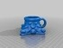

Column Espresso Cup
===============
**Please note: This thing is part of a list that was [automatically generated](https://github.com/carlosgs/export-things) and may have been updated since then. Make sure to check for the current license and authorship.**  

Column Espresso Cup  by MakeALot , published Oct 17, 2013

Description
--------
Espresso Cup made from Tom's column scan.   
I sized the interior of the cup to match some espresso cups I have.   
It should be printed in ceramic for proper espresso experience.   
 
Put together in TinkerCAD: <a href="https://tinkercad.com/things/cQQKNdozSM7-column-espresso-cup" target="_blank" rel="nofollow">tinkercad.com/things/cQQKNdozSM7-column-espresso-cup</a>  
 
Would look better if done in a package that allowed me to control the number of facets in the torus and cylinder for the brim, handle and interior, but in some ways it's interesting to see where the original scan starts and ends.

Instructions
--------
None

Files
--------

 [ column_espresso_cup.stl](column_espresso_cup.stl)  

Pictures
--------

Tags
--------
Column , Cup , Espresso  

  

License
--------
Column Espresso Cup by MakeALot is licensed under the Creative Commons - Attribution license.  

By: Mark Durbin (MakeALot)
--------
<http://NestedCube.com/>