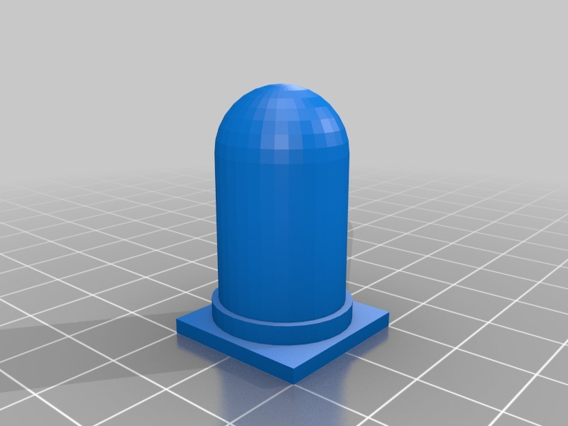

Component #Chess
===============
**Please note: This thing is part of a list that was [automatically generated](https://github.com/carlosgs/export-things) and may have been updated since then. Make sure to check for the current license and authorship.**  

Component #Chess  by MakeALot , published Mar 29, 2012

Description
--------
This part was made with Tinkercad. Edit the part online at: <a href="https://tinkercad.com/things/2U8ez26G9fE" target="_blank" rel="nofollow">tinkercad.com/things/2U8ez26G9fE</a> 
and  
<a href="https://tinkercad.com/things/08Lqhau9Gz1" target="_blank" rel="nofollow">tinkercad.com/things/08Lqhau9Gz1</a>

Instructions
--------
Print, play.

Files
--------

 [ component_chess_set_pawn.stl](component_chess_set_pawn.stl)  

 [ component_chess_set_knight.stl](component_chess_set_knight.stl)  

 [ component_chess_set_rook.stl](component_chess_set_rook.stl)  

 [ alternatecomponentchessset.stl](alternatecomponentchessset.stl)  

 [ component_chess_set_king.stl](component_chess_set_king.stl)  

 [ polysoup.stl](polysoup.stl)  

 [ component_chess_set_bishop.stl](component_chess_set_bishop.stl)  

 [ component_chess_set_queen.stl](component_chess_set_queen.stl)  

Pictures
--------

Tags
--------
Chess , TinkerCAD  

  

License
--------
Component #Chess by MakeALot is licensed under the Creative Commons - Attribution license.  

By: Mark Durbin (MakeALot)
--------
<http://NestedCube.com/>