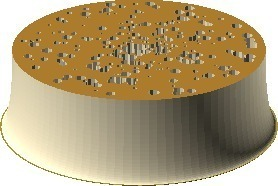
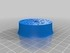
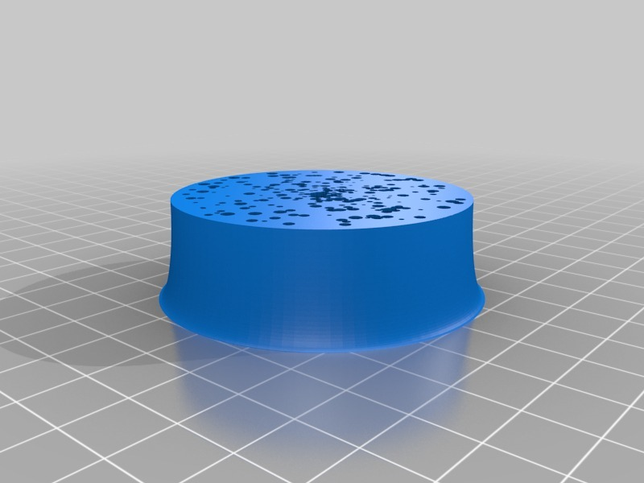

Crumpet
===============
**Please note: This thing is part of a list that was [automatically generated](https://github.com/carlosgs/export-things) and may have been updated since then. Make sure to check for the current license and authorship.**  

Crumpet  by MakeALot , published Nov 4, 2011

Description
--------
Print in creamy white with a layer of brown on the bottom and top. 
 
Inspired by the thought of what one might print on <a href="http://www.thingiverse.com/thing:12905" target="_blank" rel="nofollow">thingiverse.com/thing:12905</a> 
 
Will probably look best with a knob of <b>Local</b> butter on top ;)

Instructions
--------
Print, butter, don't eat. 
 
<b>Come to think of it, why haven't we got a crumpet / pancake / waffle / doughnut printer yet?</b>

Files
--------

 [ crumpet.scad](crumpet.scad)  

 [ crumpet.stl](crumpet.stl)  

Pictures
--------

Tags
--------
crumpet , toast , British , Food , Stage prop  

  

License
--------
Crumpet by MakeALot is licensed under the Creative Commons - Attribution license.  

By: Mark Durbin (MakeALot)
--------
<http://NestedCube.com/>