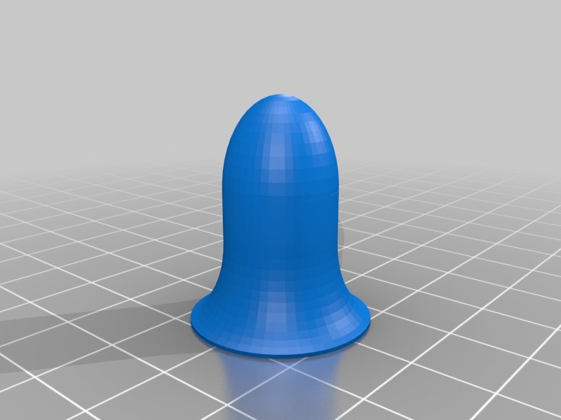

Customizered Bell
===============
**Please note: This thing is part of a list that was [automatically generated](https://github.com/carlosgs/export-things) and may have been updated since then. Make sure to check for the current license and authorship.**  

Customizered Bell  by MakeALot , published Jan 10, 2013

Description
--------
Customized version of <a href="http://www.thingiverse.com/thing:11510" target="_blank" rel="nofollow">thingiverse.com/thing:11510</a> 
 
Created with Customizer! <a href="http://www.thingiverse.com/apps/customizer/run?thing_id=11510" target="_blank" rel="nofollow">thingiverse.com/apps/customizer/run?thing_id=11510</a> 
 

Instructions
--------
Using the following options: 
 
bellHeight = 30 
bellCenterSectionLength = 7 
bellRatio = 1.1 
bellRadius = 12 
bellThickness = 3 

Files
--------

 [ Bell.scad20130110-26467-d38sv1-0.stl](Bell.scad20130110-26467-d38sv1-0.stl)  

Tags
--------
bell , customized , cylindrical  

  

License
--------
Customizered Bell by MakeALot is licensed under the Creative Commons - Attribution license.  

By: Mark Durbin (MakeALot)
--------
<http://NestedCube.com/>