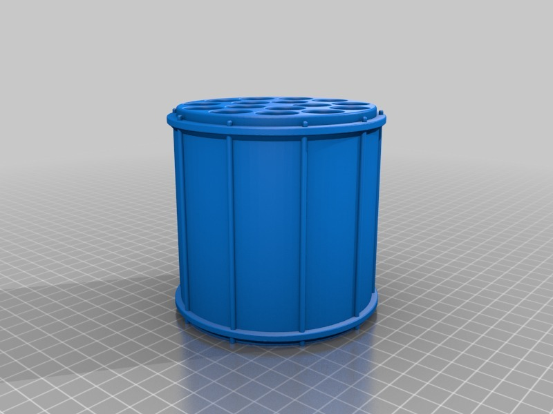
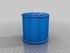
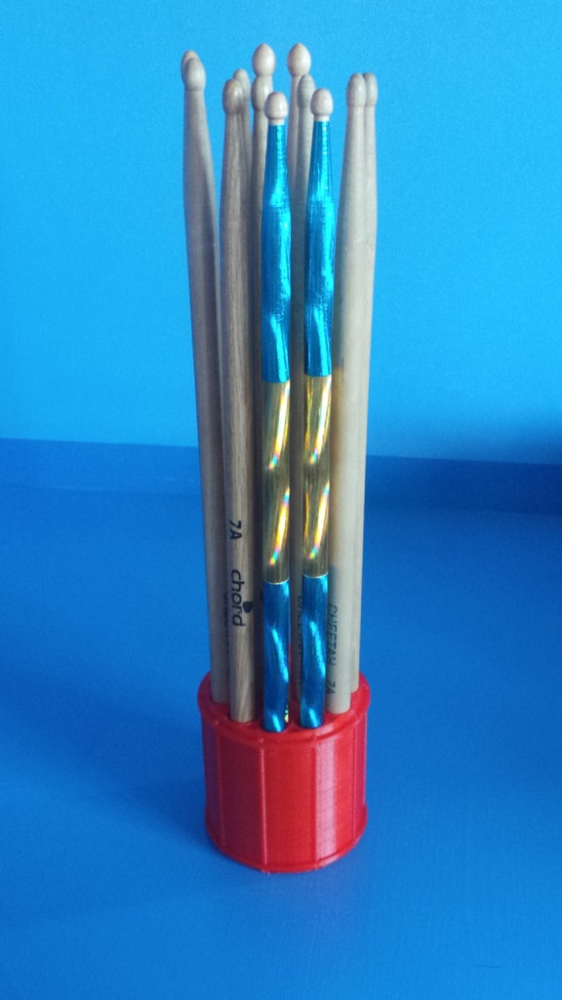
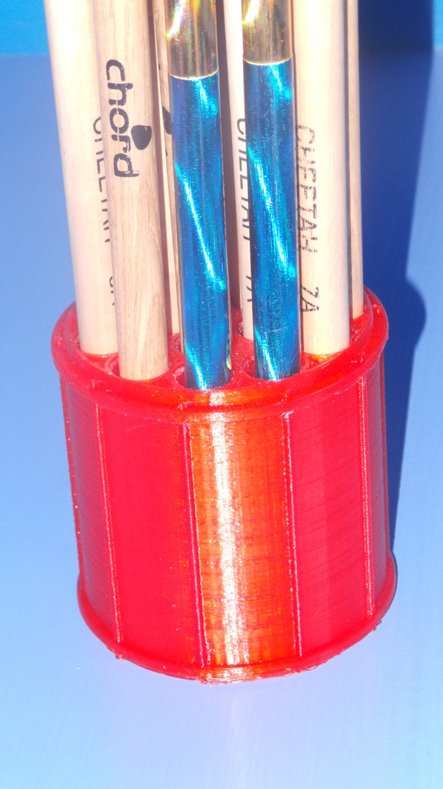

Drumstick storage drum
===============
**Please note: This thing is part of a list that was [automatically generated](https://github.com/carlosgs/export-things) and may have been updated since then. Make sure to check for the current license and authorship.**  

Drumstick storage drum  by MakeALot , published Nov 17, 2012

Description
--------
A drum shaped drumstick holder

Instructions
--------
My daughter was tiding her room! I was resting from the shock when she came and asked if I could design something for her to put her drumsticks in.   
 
I thought a drum shaped holder would probably do the trick.  
 
I bet it ends up the only tidy thing in her room (for a few days anyway) 
 
Holds 16 @ 15 mm (0.6") drumsticks.

Files
--------

 [ DSDrum.stl](DSDrum.stl)  

Pictures
--------

Tags
--------
drumstick , holder  

  

License
--------
Drumstick storage drum by MakeALot is licensed under the Creative Commons - Attribution license.  

By: Mark Durbin (MakeALot)
--------
<http://NestedCube.com/>