Hyperboloid pencil holder
===============
**Please note: This thing is part of a list that was [automatically generated](https://github.com/carlosgs/export-things) and may have been updated since then. Make sure to check for the current license and authorship.**  

Hyperboloid pencil holder  by MakeALot , published May 10, 2011

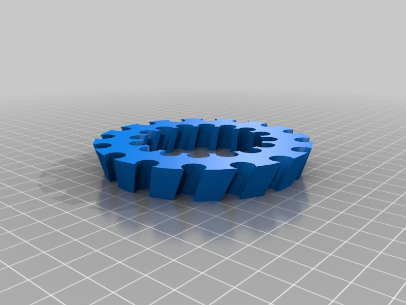

Description
--------
Turn your pencils into a couple of stacked cooling towers, very cool(ing) 
I got the idea from a suggestion by relet <a href="http://www.thingiverse.com/relet" target="_blank" rel="nofollow">thingiverse.com/relet</a> 

Instructions
--------
print, clip in pencils, admire...

Files
--------

 [ pencilpot.scad](pencilpot.scad)  

[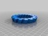](pencilHolderMidQ.stl)
 [ pencilHolderMidQ.stl](pencilHolderMidQ.stl)  

Pictures
--------
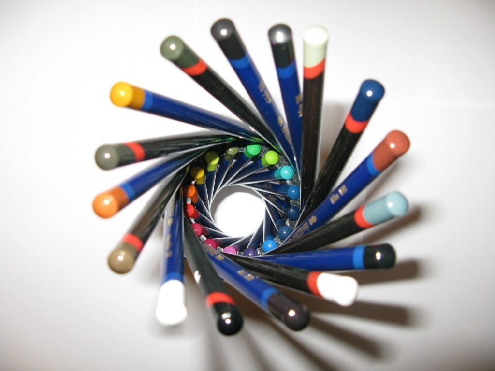
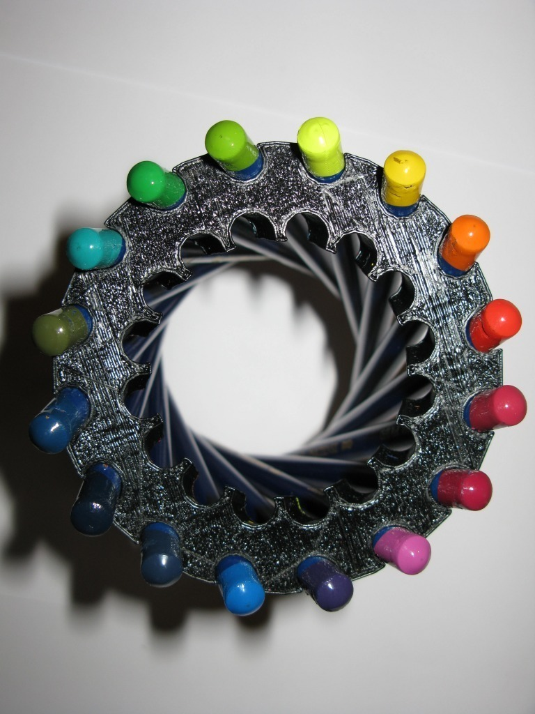
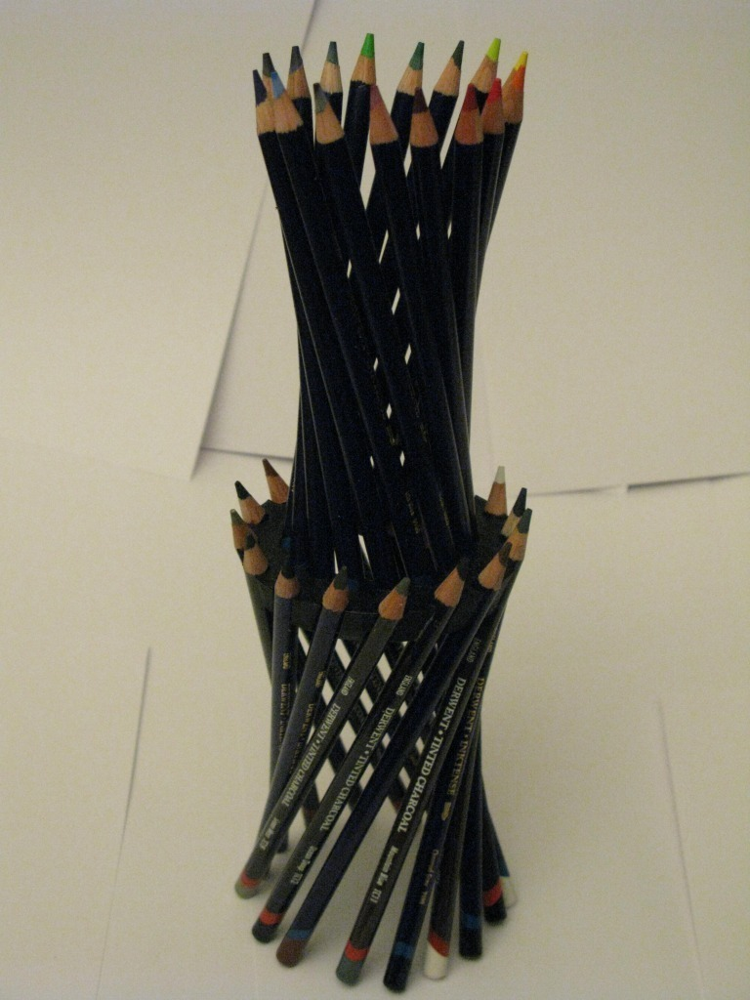

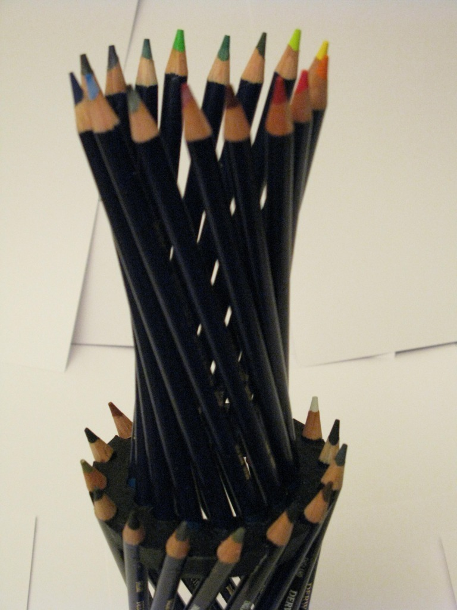
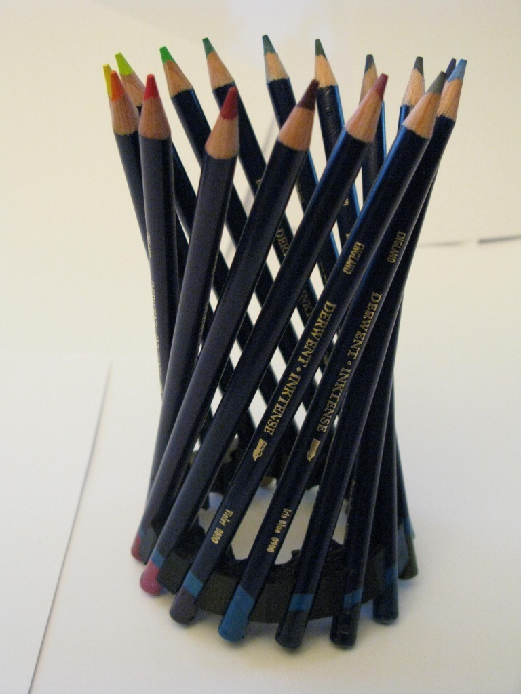
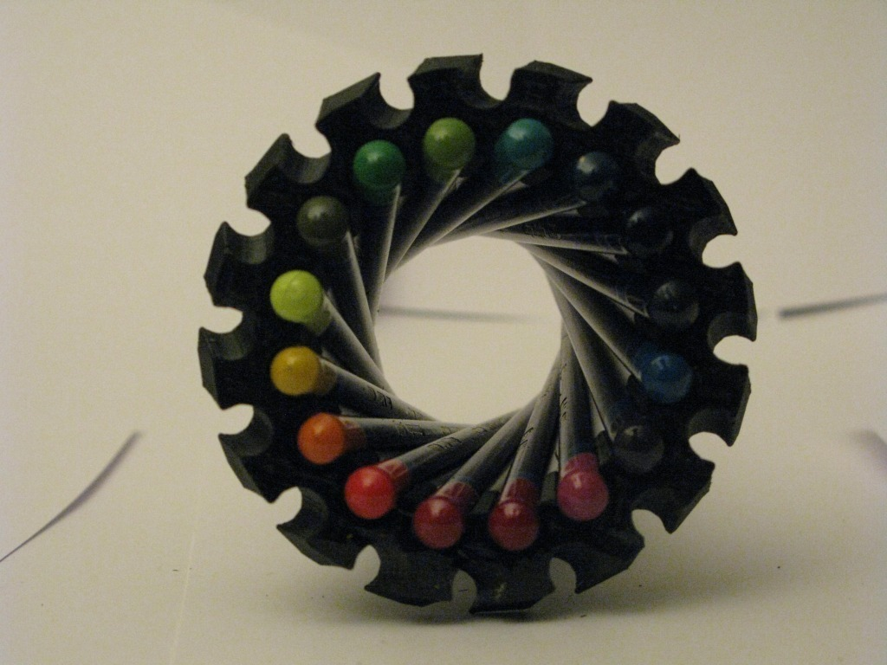
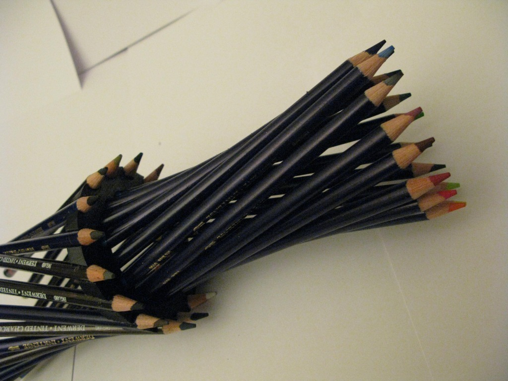
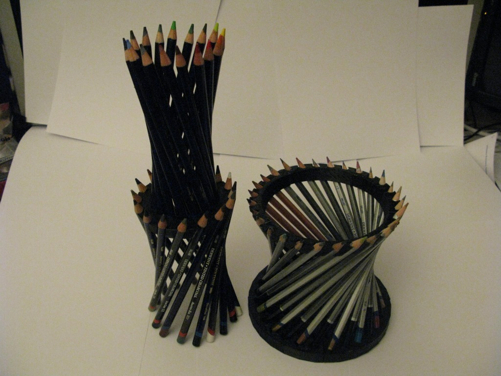
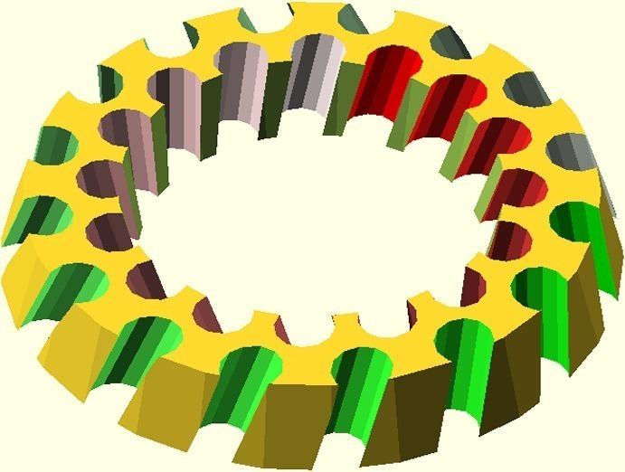

Tags
--------
desktop , holder , Fushigi , Geometry , Hyperboloid , Math , openscad , pencil , pencil holder  

  

License
--------
Hyperboloid pencil holder by MakeALot is licensed under the Creative Commons - Attribution - Share Alike license.  

By: Mark Durbin (MakeALot)
--------
<http://NestedCube.com/>