Hyperboloid with base, desktop pencil holder
===============
**Please note: This thing is part of a list that was [automatically generated](https://github.com/carlosgs/export-things) and may have been updated since then. Make sure to check for the current license and authorship.**  

Hyperboloid with base, desktop pencil holder  by MakeALot , published Apr 28, 2011

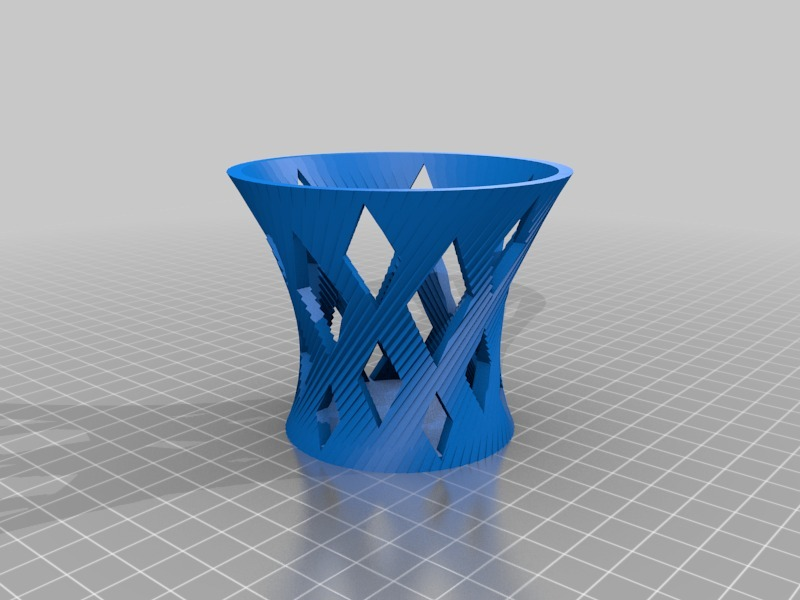

Description
--------
A couple of variations on MiseryBot's Hyperboloid container using shapes other than cylinders.

Instructions
--------
Print and fill with, er ...more pencils! 
 
I've printed versions of everything here now apart from PencilPot.stl I expect that will be a challenge to print. 
 
<i>I still expect to make a 4 part pencil holder base that looks like the original image.</i>

Files
--------

 [ rods.scad](rods.scad)  

[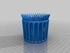](pencilPot.stl)
 [ pencilPot.stl](pencilPot.stl)  

[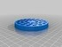](pencilHolder3.stl)
 [ pencilHolder3.stl](pencilHolder3.stl)  

[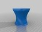](pencils.stl)
 [ pencils.stl](pencils.stl)  

 [ pencilholder.scad](pencilholder.scad)  

[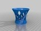](cone.stl)
 [ cone.stl](cone.stl)  

 [ pencils.scad](pencils.scad)  

 [ pencilpot.scad](pencilpot.scad)  

Pictures
--------
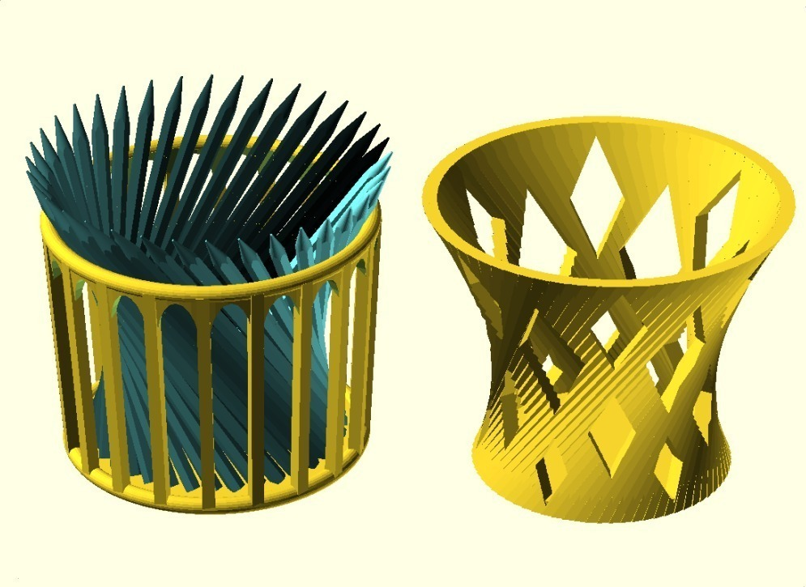
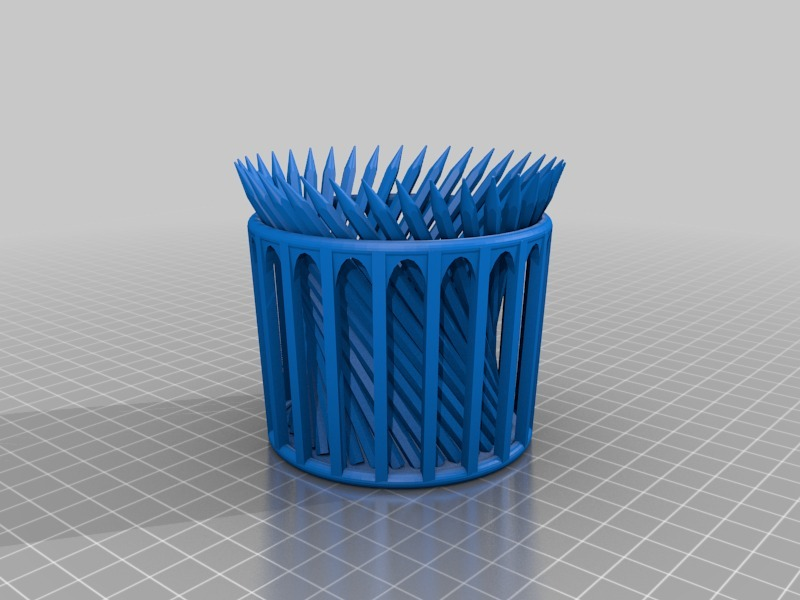
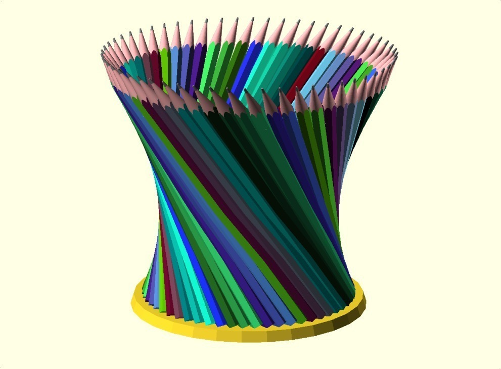
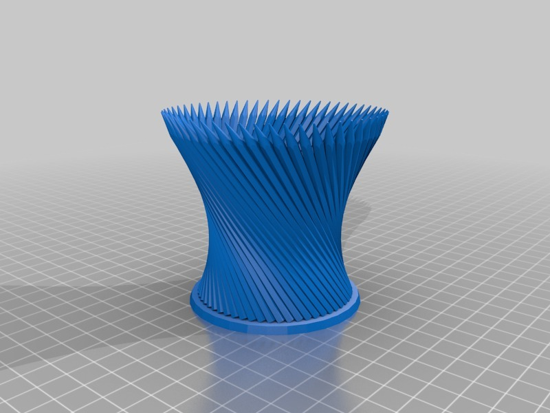
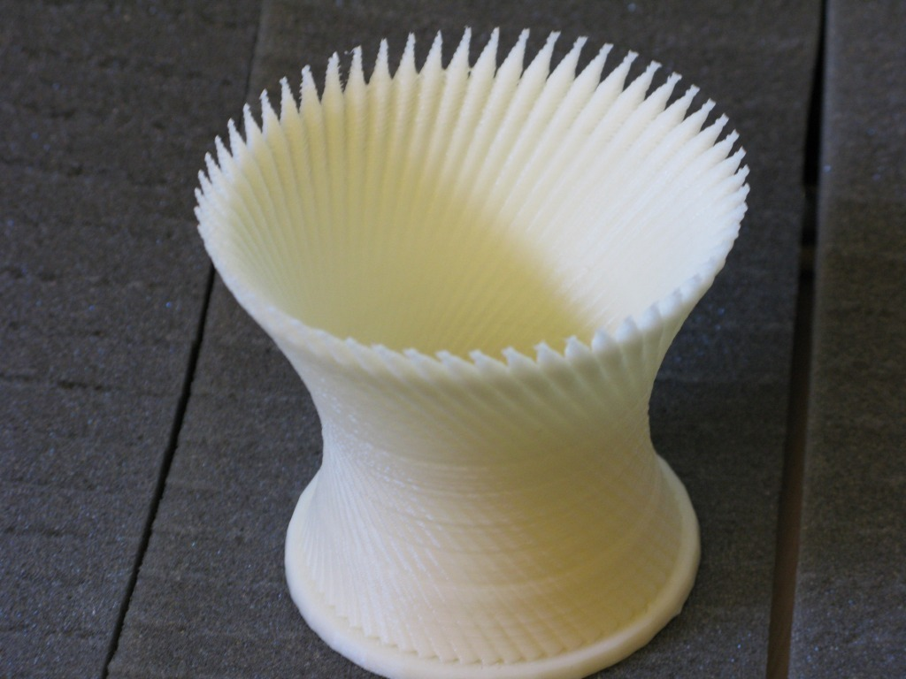
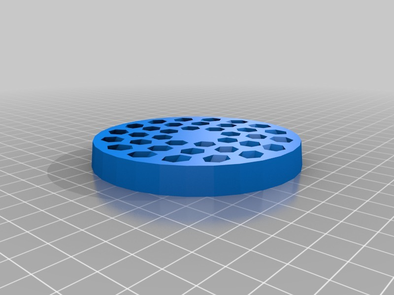
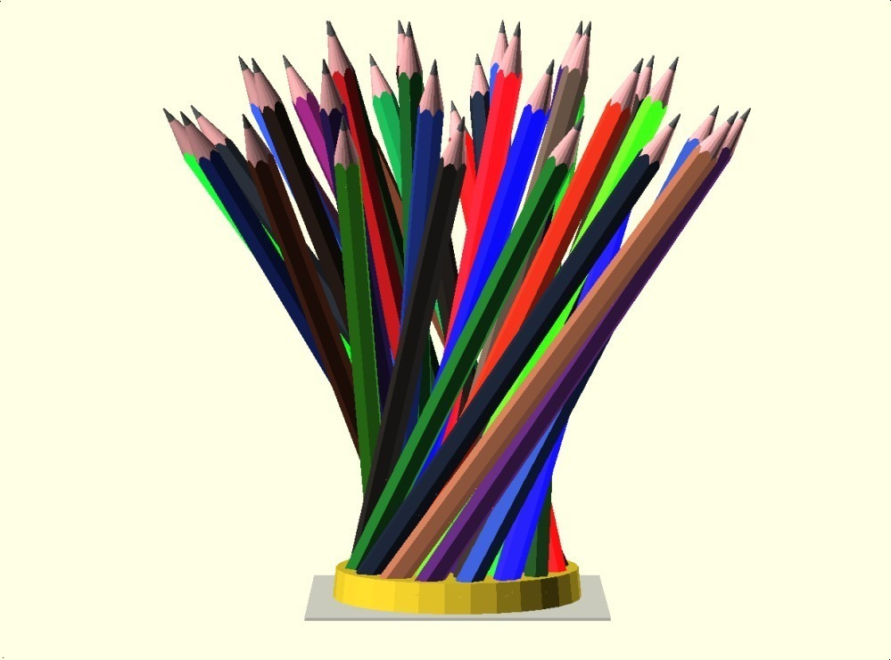
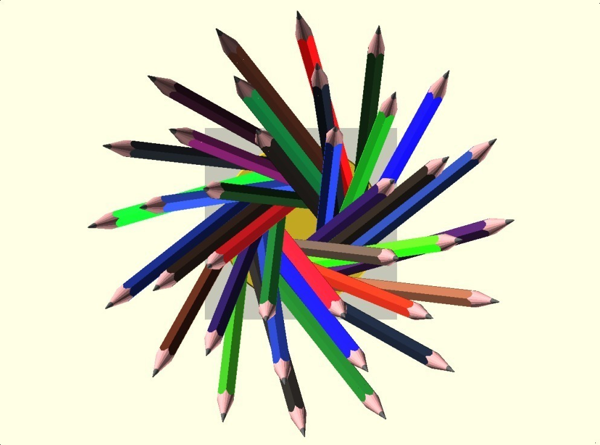
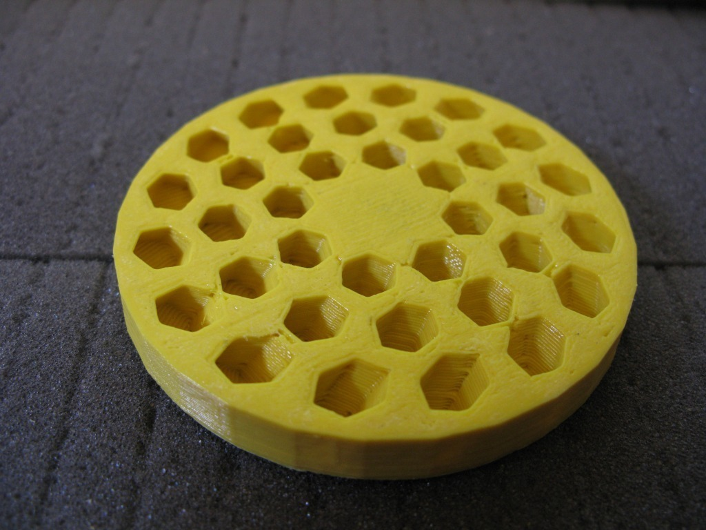
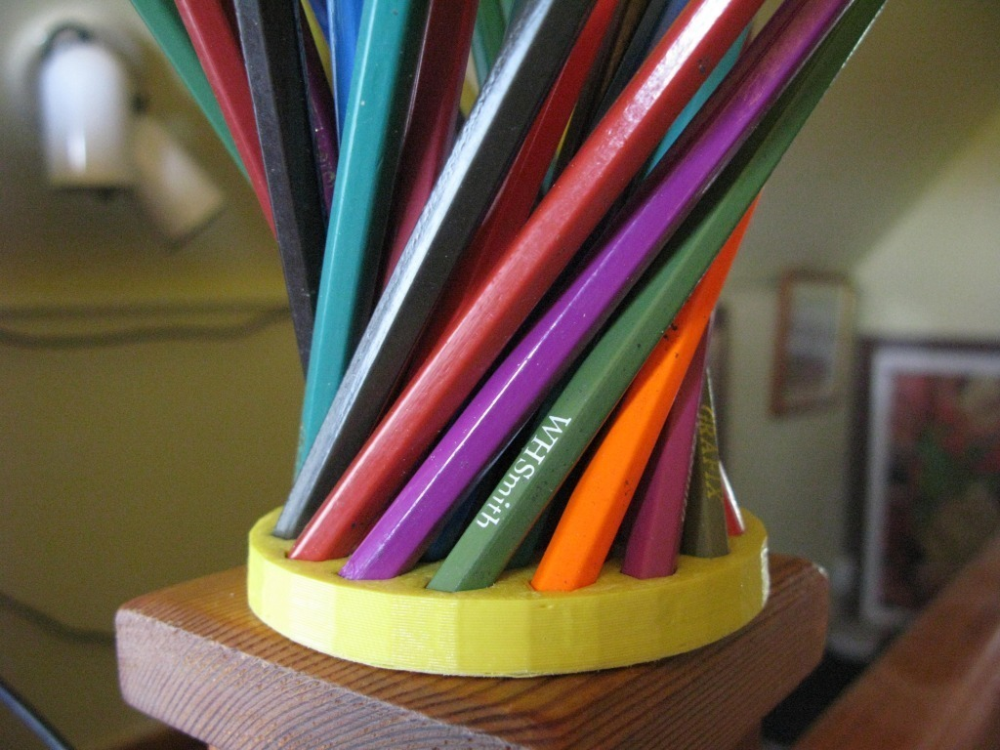
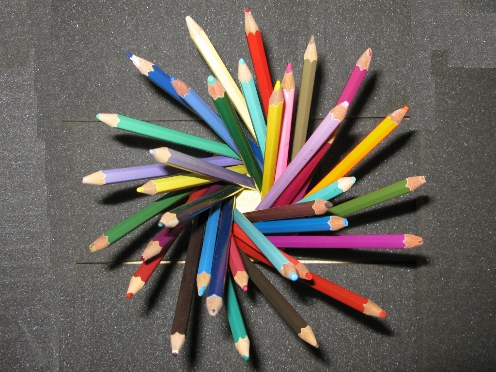
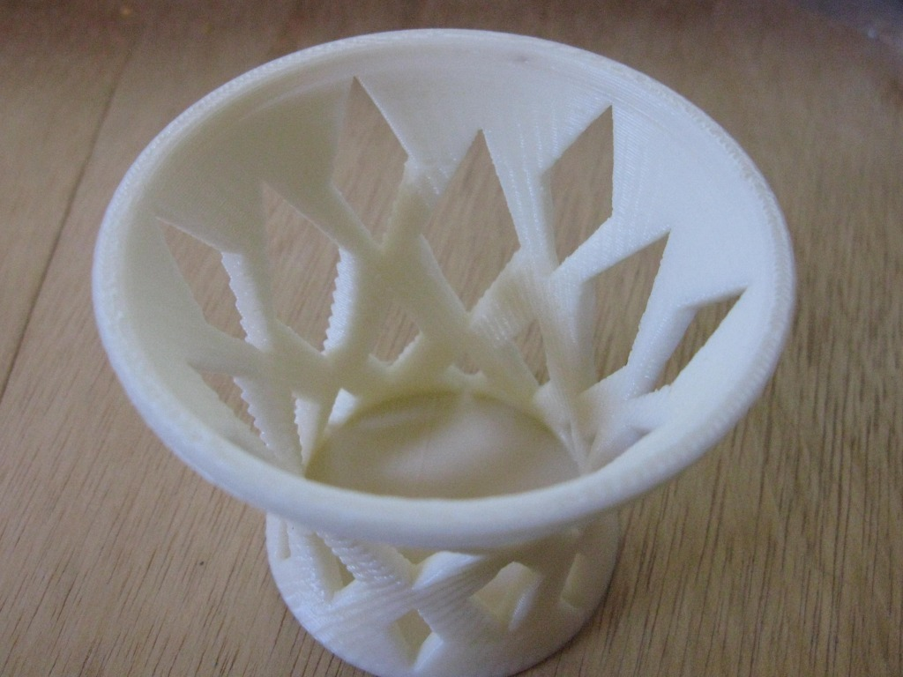
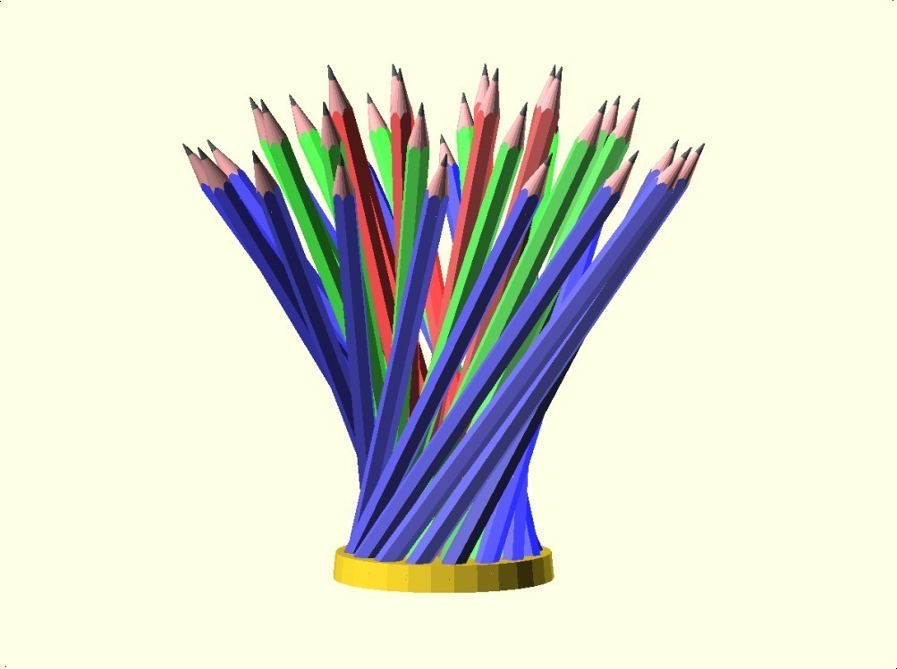
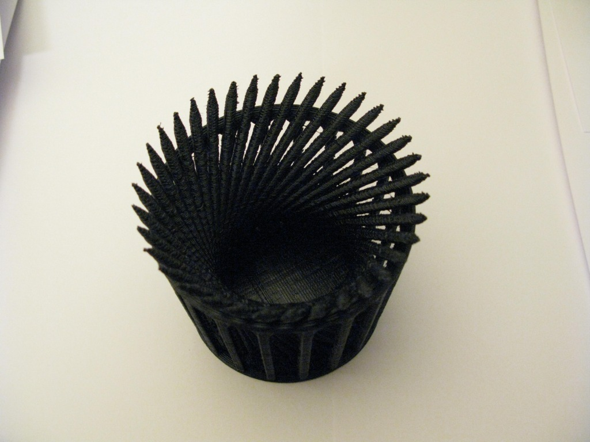

Tags
--------
container , Geometry , Hyperboloid , openscad , pen , pencil , pencil cup , pencil holder , pot  

  

License
--------
Hyperboloid with base, desktop pencil holder by MakeALot is licensed under the Creative Commons - Attribution - Share Alike license.  

By: Mark Durbin (MakeALot)
--------
<http://NestedCube.com/>