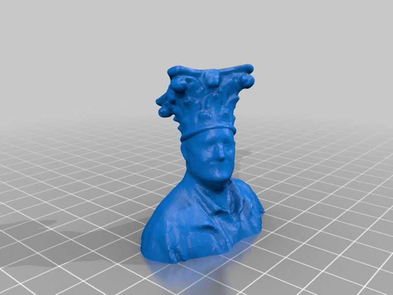
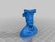
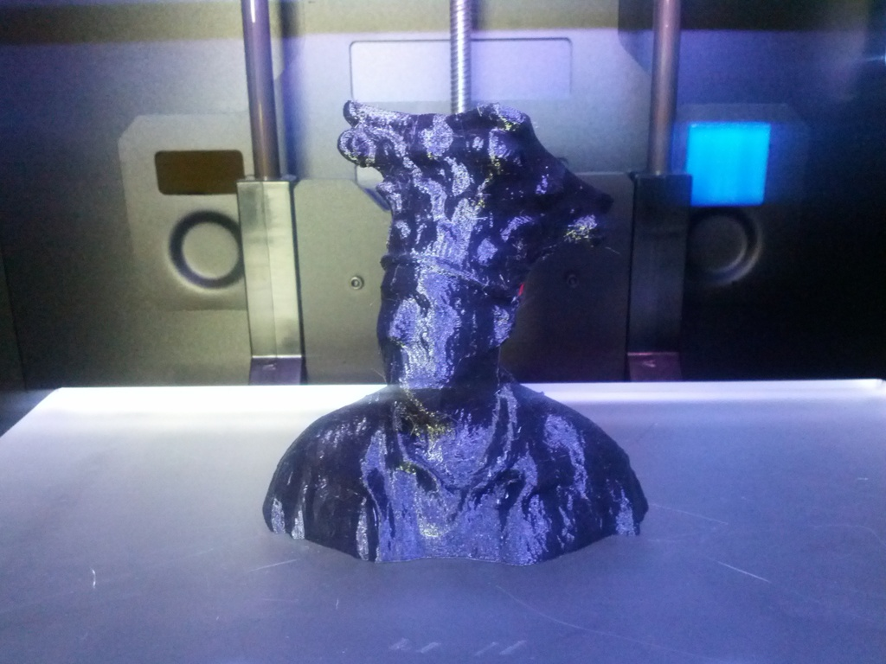

Jester's hat from column
===============
**Please note: This thing is part of a list that was [automatically generated](https://github.com/carlosgs/export-things) and may have been updated since then. Make sure to check for the current license and authorship.**  

Jester's hat from column  by MakeALot , published Oct 16, 2013

Description
--------
A quick mash up in TinkerCAD for my own amusement.   
I love the fact that I look so pompous!

Instructions
--------
None

Files
--------

 [ makealotjestershat.stl](makealotjestershat.stl)  

Pictures
--------

Tags
--------
None  

  

License
--------
Jester's hat from column by MakeALot is licensed under the Creative Commons - Attribution license.  

By: Mark Durbin (MakeALot)
--------
<http://NestedCube.com/>