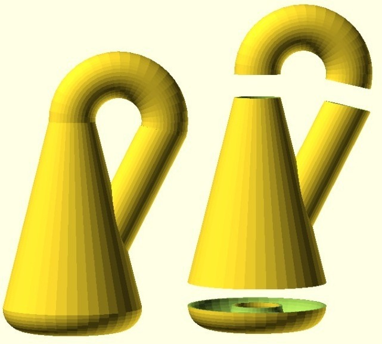
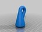
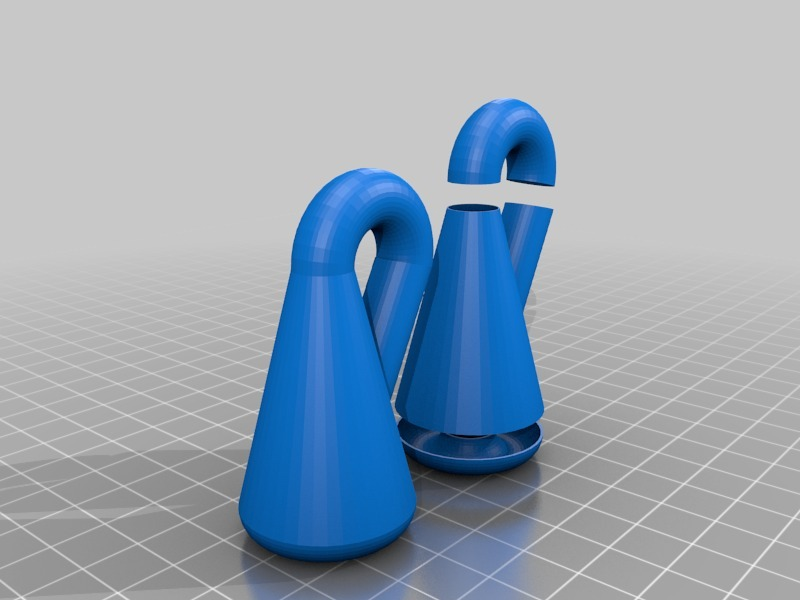
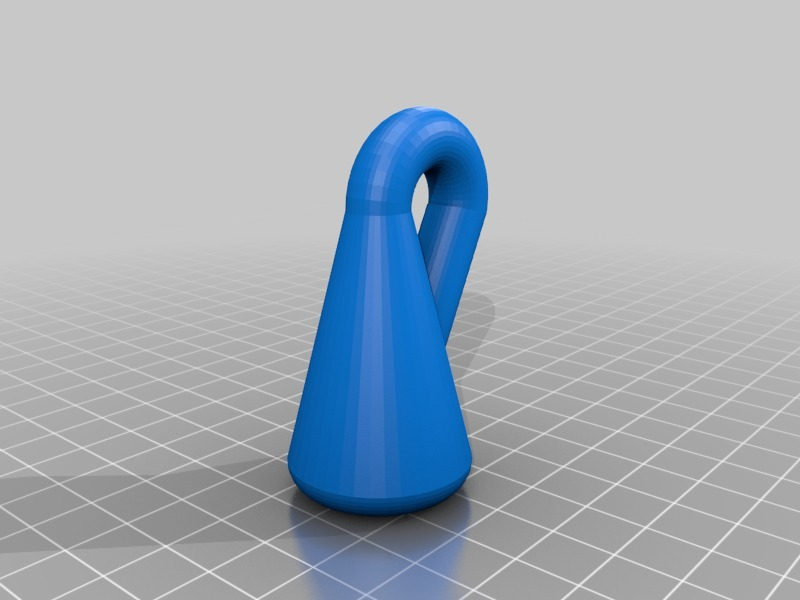

Klein Bottle from simple primitives
===============
**Please note: This thing is part of a list that was [automatically generated](https://github.com/carlosgs/export-things) and may have been updated since then. Make sure to check for the current license and authorship.**  

Klein Bottle from simple primitives  by MakeALot , published Oct 11, 2011

Description
--------
A more traditional looking Klein bottle made from torus halves and tubes. 
 

Instructions
--------
If you'd like to print it, it will probably need support on the bottom radius.

Files
--------

 [ KleinBottle_Fixed.scad](KleinBottle_Fixed.scad)  

 [ KleinBottleAlone.stl](KleinBottleAlone.stl)  

 [ KleinBottle.scad](KleinBottle.scad)  

 [ KleinBottleAlone_Fixed.stl](KleinBottleAlone_Fixed.stl)  

 [ KleinBottle.stl](KleinBottle.stl)  

Pictures
--------

Tags
--------
design challenge , klein bottle , openscad , openscad klein bottle , challenge , featured , featured  

  

License
--------
Klein Bottle from simple primitives by MakeALot is licensed under the Creative Commons - Attribution license.  

By: Mark Durbin (MakeALot)
--------
<http://NestedCube.com/>