Knotted Chalice #Chess
===============
**Please note: This thing is part of a list that was [automatically generated](https://github.com/carlosgs/export-things) and may have been updated since then. Make sure to check for the current license and authorship.**  

Knotted Chalice #Chess  by MakeALot , published Mar 30, 2012

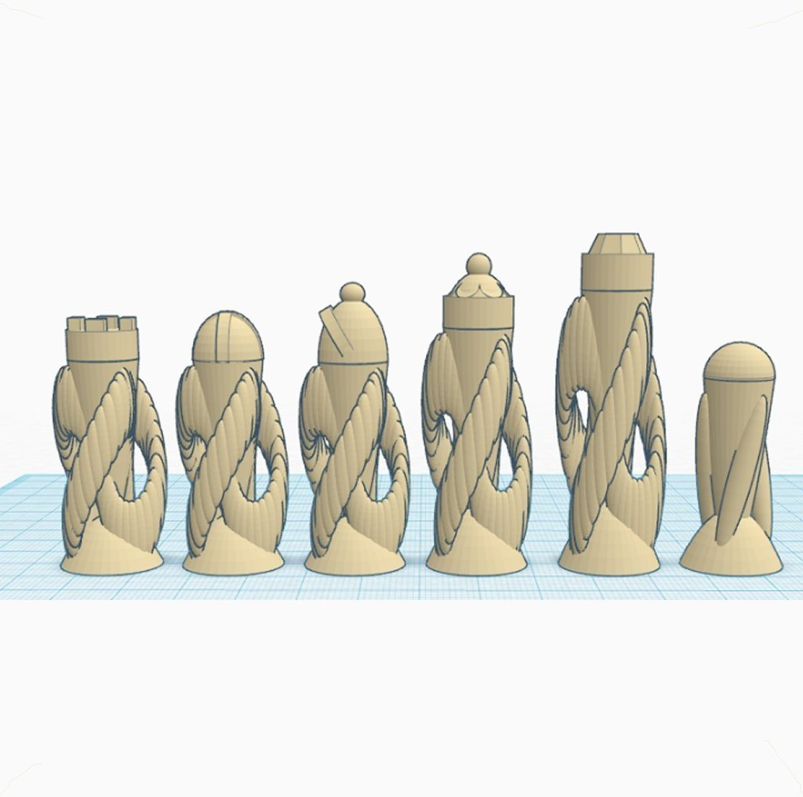

Description
--------
This part was made with Tinkercad. Edit the part online at: <a href="https://tinkercad.com/things/7kDR7km4yqx" target="_blank" rel="nofollow">tinkercad.com/things/7kDR7km4yqx</a>

Instructions
--------
Print, play.

Files
--------
[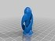](knight.stl)
 [ knight.stl](knight.stl)  

[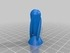](pawn.stl)
 [ pawn.stl](pawn.stl)  

[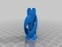](rook.stl)
 [ rook.stl](rook.stl)  

[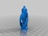](queen.stl)
 [ queen.stl](queen.stl)  

[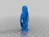](king.stl)
 [ king.stl](king.stl)  

[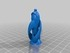](bishop.stl)
 [ bishop.stl](bishop.stl)  

Pictures
--------
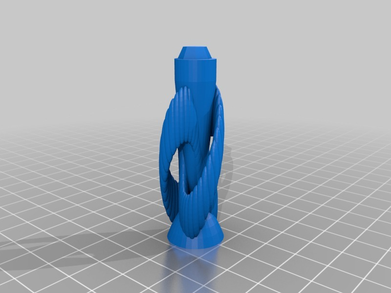
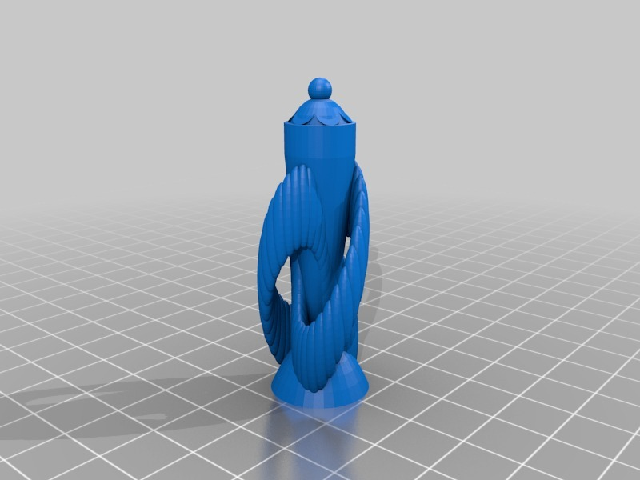
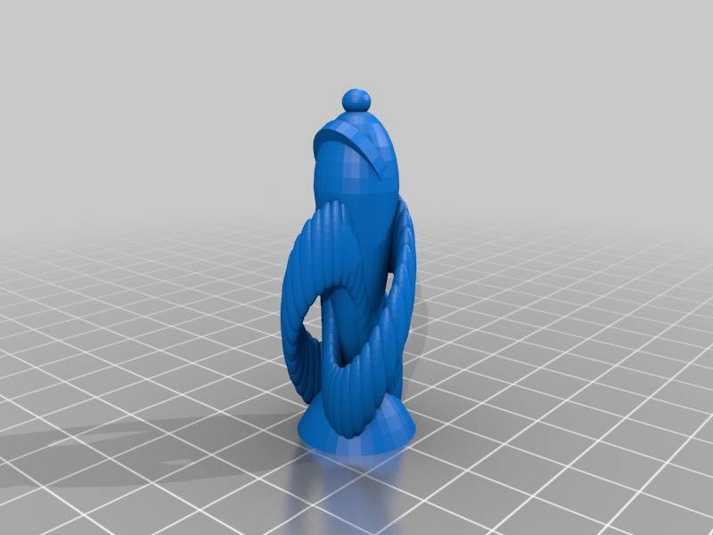
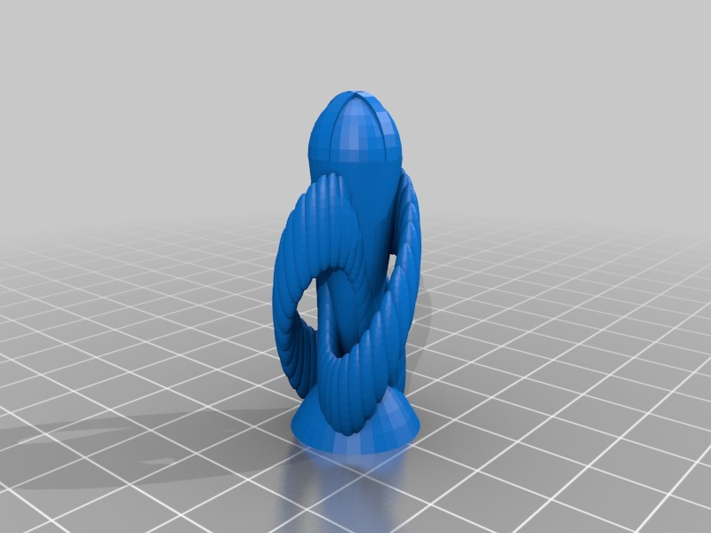
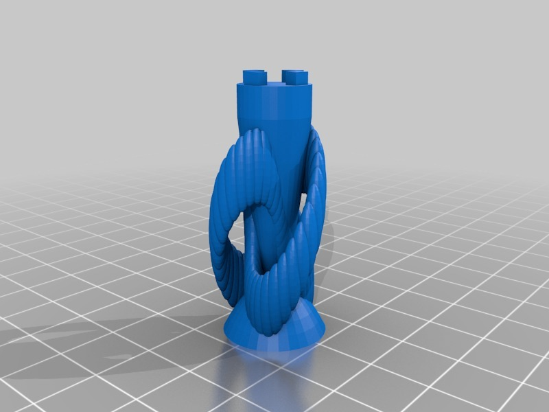
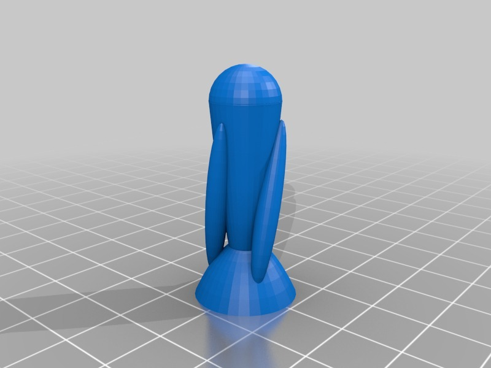
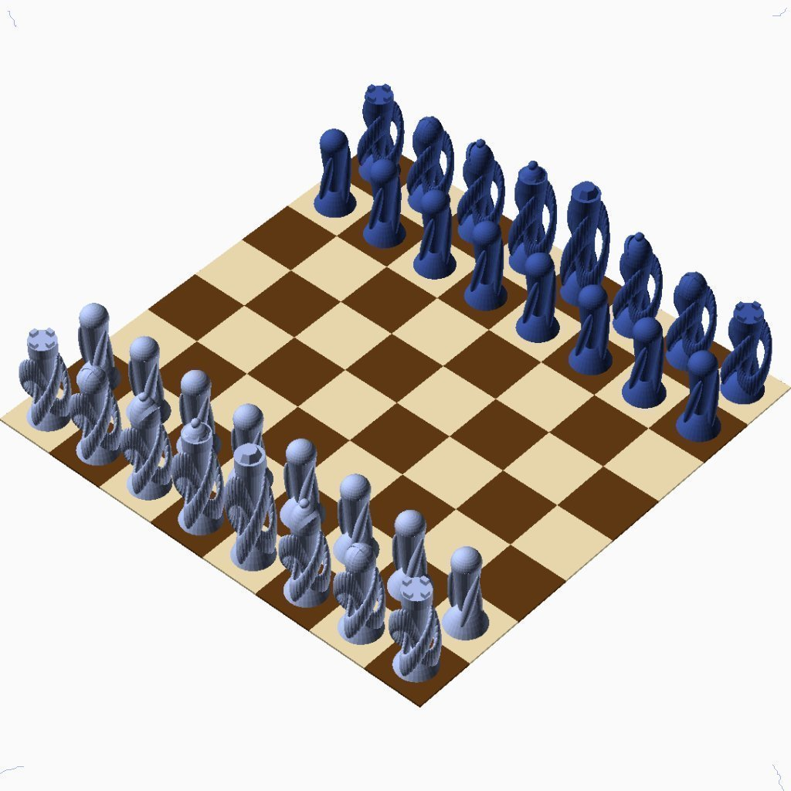
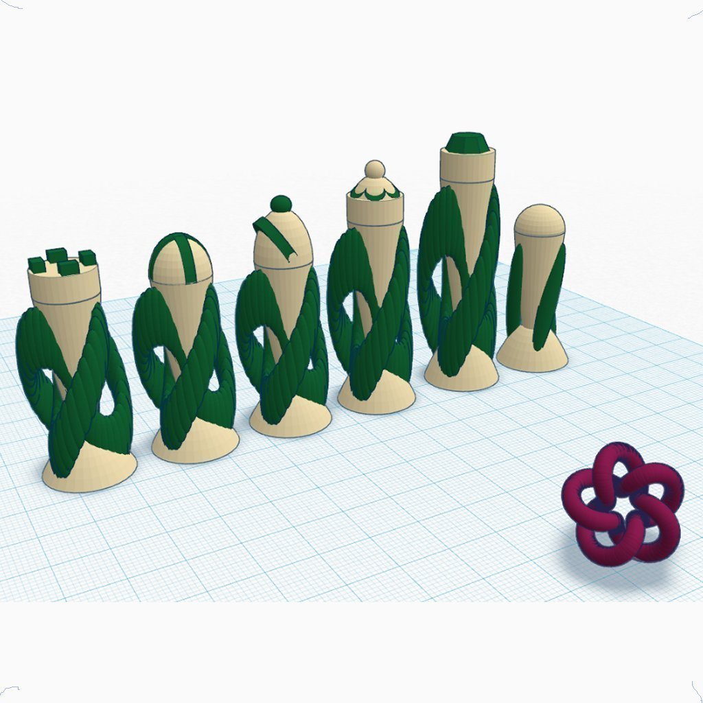
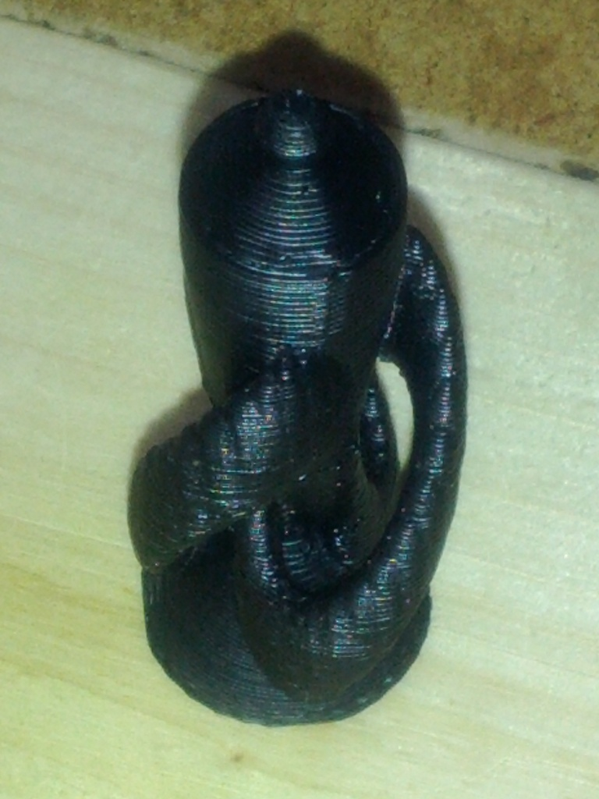

Tags
--------
Chess , TinkerCAD  

  

License
--------
Knotted Chalice #Chess by MakeALot is licensed under the Creative Commons - Attribution license.  

By: Mark Durbin (MakeALot)
--------
<http://NestedCube.com/>