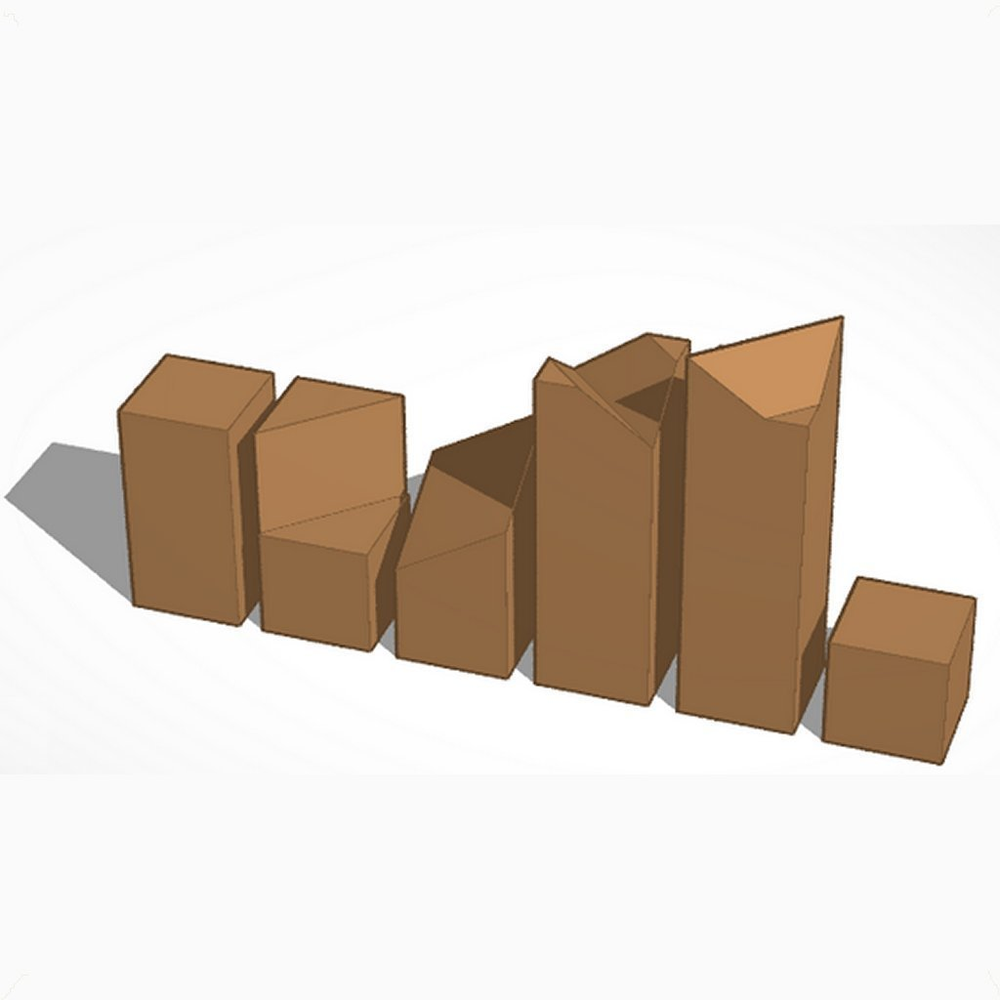
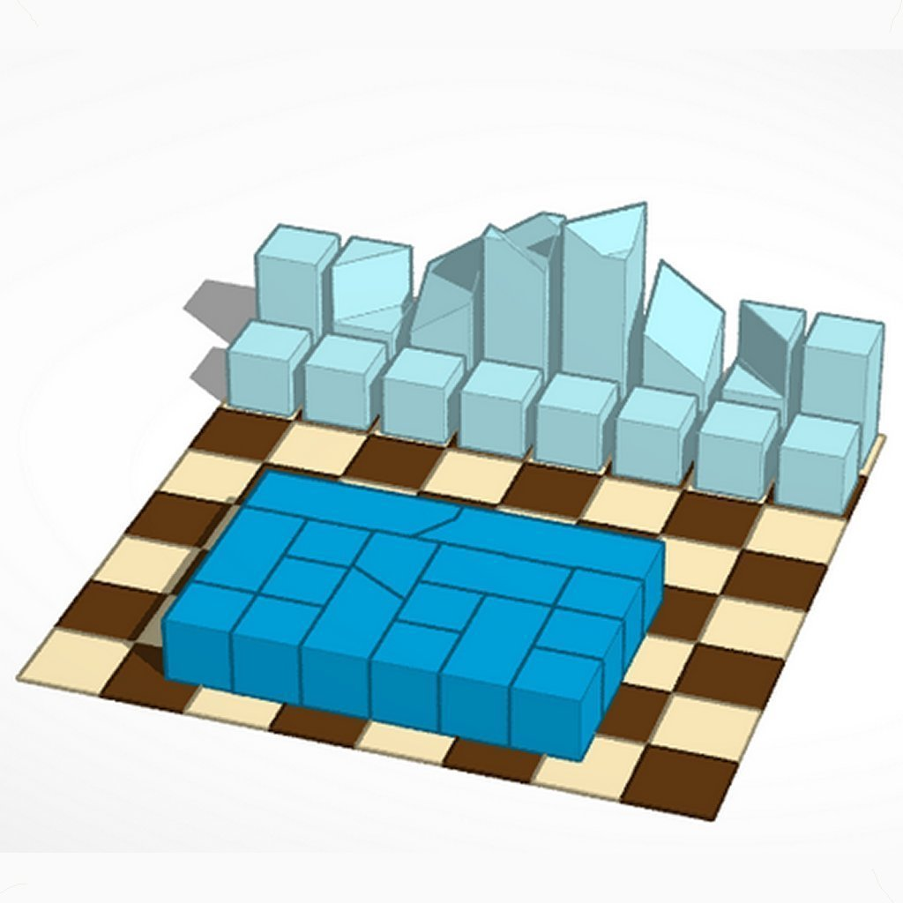
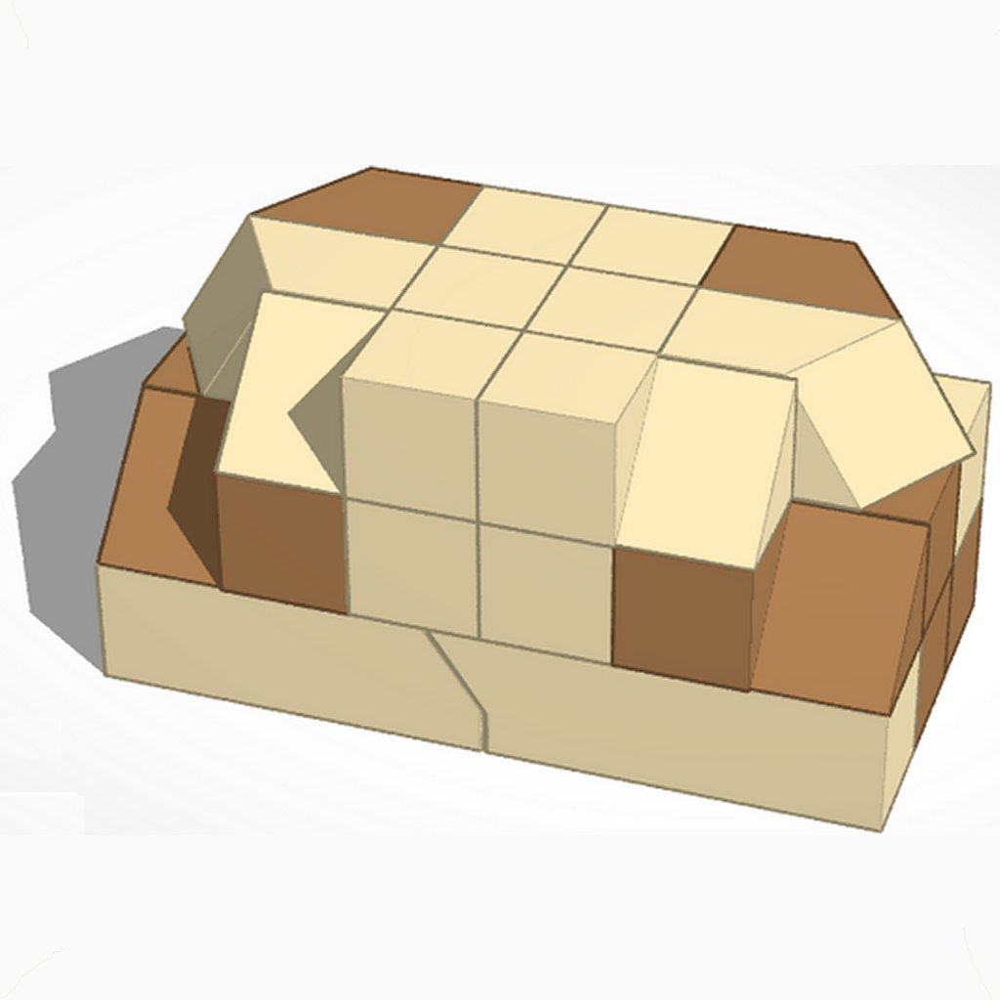
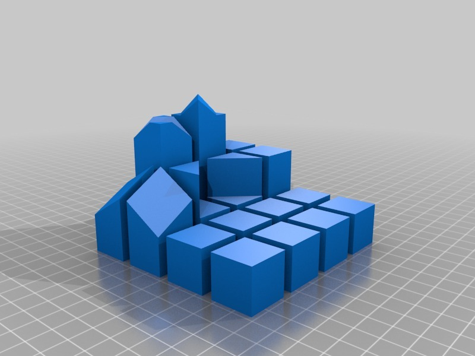

LG Inspired #Chess
===============
**Please note: This thing is part of a list that was [automatically generated](https://github.com/carlosgs/export-things) and may have been updated since then. Make sure to check for the current license and authorship.**  

LG Inspired #Chess  by MakeALot , published Mar 28, 2012

Description
--------
This part was made with Tinkercad. Edit the part online at: <a href="https://tinkercad.com/things/gyJjgQ1jUWV" target="_blank" rel="nofollow">tinkercad.com/things/gyJjgQ1jUWV</a> 
 
Lowest poly count home grown chess set on Thingiverse? 
 
BTW, this can be printed with zero fill, super light and super fast.

Instructions
--------
Print, play.

Files
--------

 [ polysoup.stl](polysoup.stl)  

 [ LGiChessBlock.stl](LGiChessBlock.stl)  

Pictures
--------

Tags
--------
Chess , TinkerCAD  

  

License
--------
LG Inspired #Chess by MakeALot is licensed under the Creative Commons - Attribution license.  

By: Mark Durbin (MakeALot)
--------
<http://NestedCube.com/>