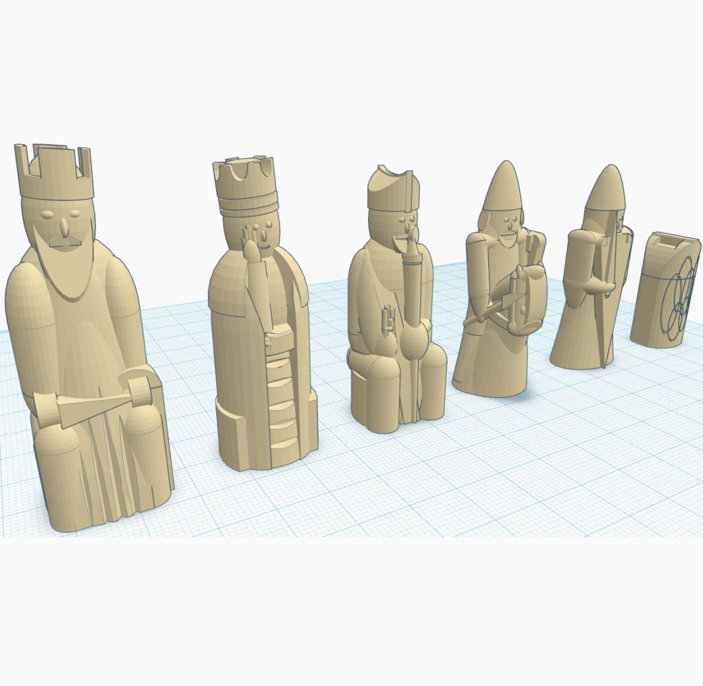

Lewis #Chess
===============
**Please note: This thing is part of a list that was [automatically generated](https://github.com/carlosgs/export-things) and may have been updated since then. Make sure to check for the current license and authorship.**  

Lewis #Chess  by MakeALot , published Mar 31, 2012

Description
--------
This part was made with Tinkercad. Edit the part online at: <a href="https://tinkercad.com/things/c5S1XUkAMJC" target="_blank" rel="nofollow">tinkercad.com/things/c5S1XUkAMJC</a> 
and 
<a href="http://tinkercad.com/things/ajCtOXu3nXz" target="_blank" rel="nofollow">tinkercad.com/things/ajCtOXu3nXz</a> 
 
The Lewis chessmen  are a group of 78 12th-century chess pieces

Instructions
--------
Please see <a href="http://en.wikipedia.org/wiki/Lewis_chessmen" target="_blank" rel="nofollow">en.wikipedia.org/wiki/Lewis_chessmen</a> for more info. 
 
I have made two different knights, one that most represents the original shown in the picture but adjusted for support-less printing and the other to comply with the competition rules regarding maximum dimensions. 
 
I think they both look OK and reasonably represent the original style.

Files
--------

 [ lewis_bishop.stl](lewis_bishop.stl)  

 [ lewis_small_knight.stl](lewis_small_knight.stl)  

 [ LewisChess.stl](LewisChess.stl)  

 [ lewischessfullplate.stl](lewischessfullplate.stl)  

 [ Lewis_FullSide.stl](Lewis_FullSide.stl)  

 [ lewis_rook.stl](lewis_rook.stl)  

 [ lewis_queen.stl](lewis_queen.stl)  

 [ lewis_pawn.stl](lewis_pawn.stl)  

 [ lewis_knight.stl](lewis_knight.stl)  

 [ lewis_king.stl](lewis_king.stl)  

 [ smallknightlewischess.stl](smallknightlewischess.stl)  

 [ Lewis_FullSet.stl](Lewis_FullSet.stl)  

Pictures
--------

Tags
--------
Chess , Lewis , TinkerCAD  

  

License
--------
Lewis #Chess by MakeALot is licensed under the Creative Commons - Attribution license.  

By: Mark Durbin (MakeALot)
--------
<http://NestedCube.com/>