Linear Bearing  X Axis Carriage for ToM
===============
**Please note: This thing is part of a list that was [automatically generated](https://github.com/carlosgs/export-things) and may have been updated since then. Make sure to check for the current license and authorship.**  

Linear Bearing  X Axis Carriage for ToM  by MakeALot , published Jun 17, 2011

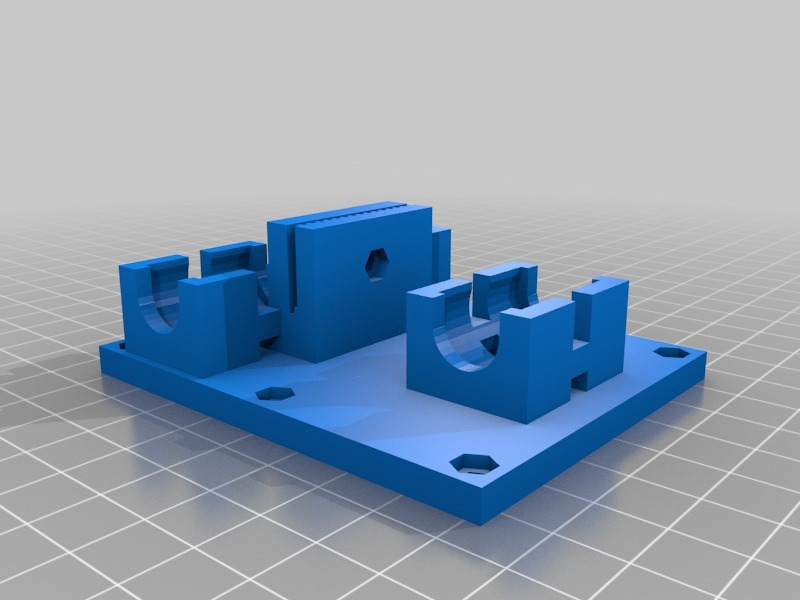

Description
--------
Linear Bearing Carriage X Axis LMB6UU <b>NOT LM8UU as I originally put here</b> 
I found some <b>LMB6UU (SW06UU in US)</b> linear bearings for 4.50 each, so tried them as a direct replacement for the bushes on the Y Axis based on thing <a href="http://www.thingiverse.com/thing:9114" target="_blank" rel="nofollow">thingiverse.com/thing:9114</a> by <b>splod</b>, they worked so well that I created an X Axis carriage for them and here it is if anyone would like to try it. 
 
People in the UK can get them from <a href="http://www.worldofcnc.com/products.asp?recnumber=167" target="_blank" rel="nofollow">worldofcnc.com/products.asp?recnumber=167</a> <b>or get them from eBay ALOT cheaper</b> 
 
<b><big>Update:</big> 
I printed the ABP version and found a miscalculation in the end bolt holes; these are corrected in the _FIXED versions of the STL and SCAD files</b> 

Instructions
--------
Print carriage, press 7 @ M3 nuts into the captive holes, insert an 8mm M3 bolt into the belt grip and loosely tighten. 
 
Insert 6 @ 12mm M3 bolts into the supplied HBP part and affix base. 
 
Press 3 linear bearings into the carriage, you may put zip ties round each if you prefer, mine is running happily without. 
 
Insert X Axis belt into slot and slide it down until it is just touching the bolt, gently tighten the bolt so that the belt is just held, but not pinched. 
 
On the Y Axis, I removed the right hand rod and the bushes, inserted the bearings up to the grove and replaced the rod, I let them bed in for a couple of prints before I added the spot of glue to fix them more permanently. 

Files
--------
[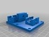](LM8UUY_X_Base.stl)
 [ LM8UUY_X_Base.stl](LM8UUY_X_Base.stl)  

 [ ToM_xAxis_LM8UU_Base.scad](ToM_xAxis_LM8UU_Base.scad)  

[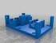](LM8UUY_X_Base_ABP.stl)
 [ LM8UUY_X_Base_ABP.stl](LM8UUY_X_Base_ABP.stl)  

 [ ToM_xAxis_LM8UU_Base_FIXED.scad](ToM_xAxis_LM8UU_Base_FIXED.scad)  

 [ LM8UUY_X_Base_ABP_FIXED.stl](LM8UUY_X_Base_ABP_FIXED.stl)  

Pictures
--------
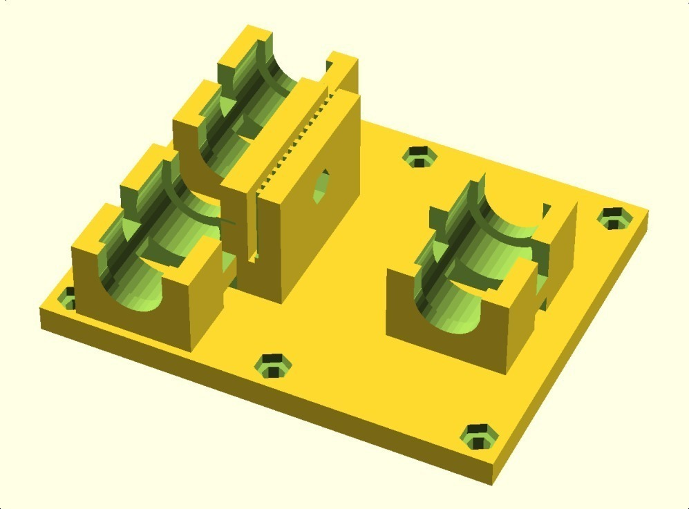
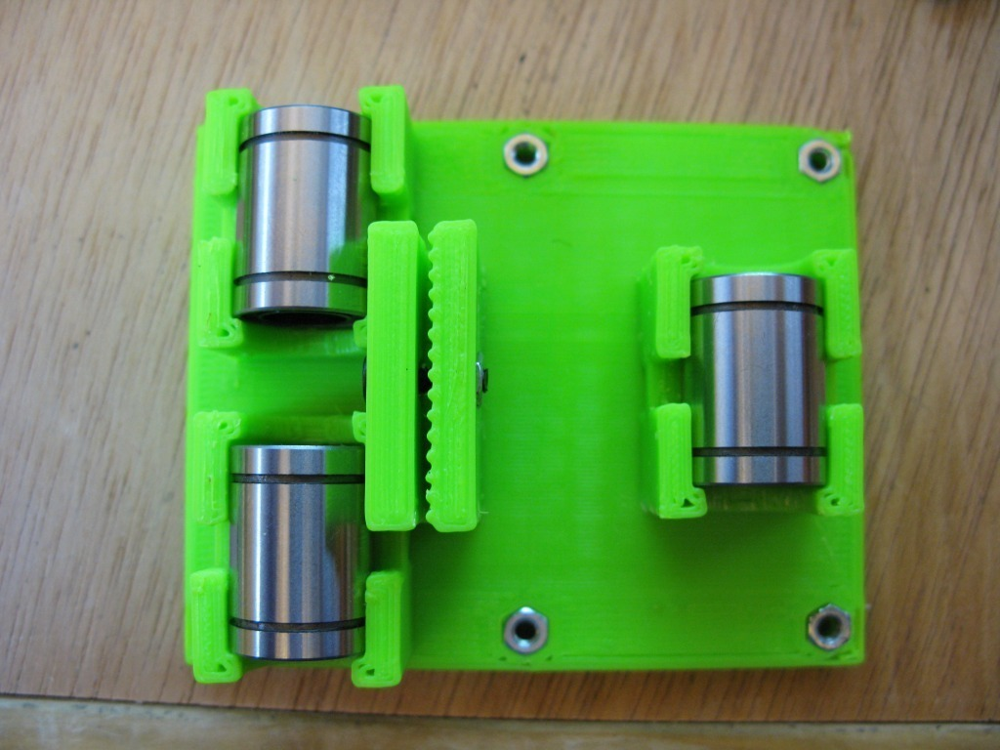
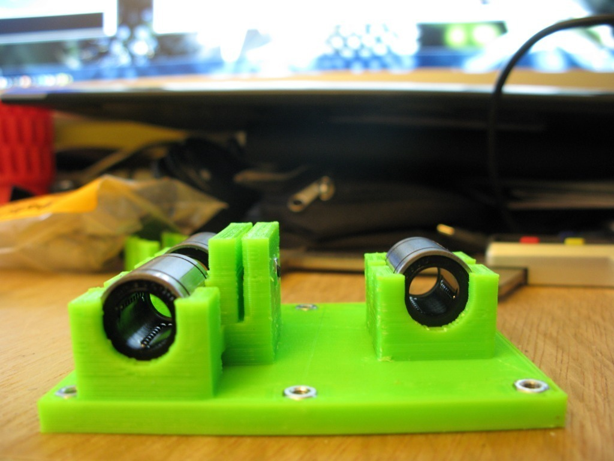
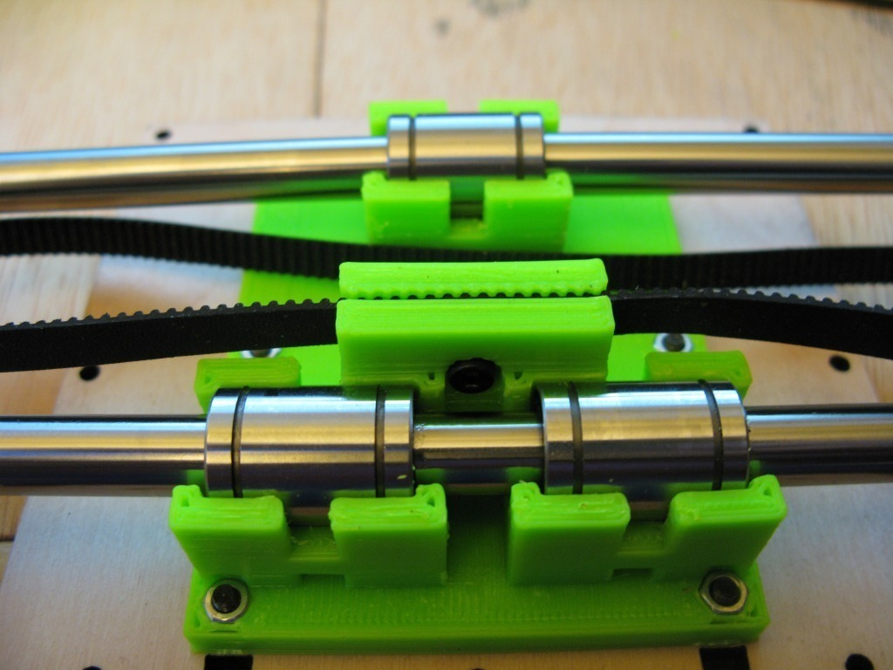
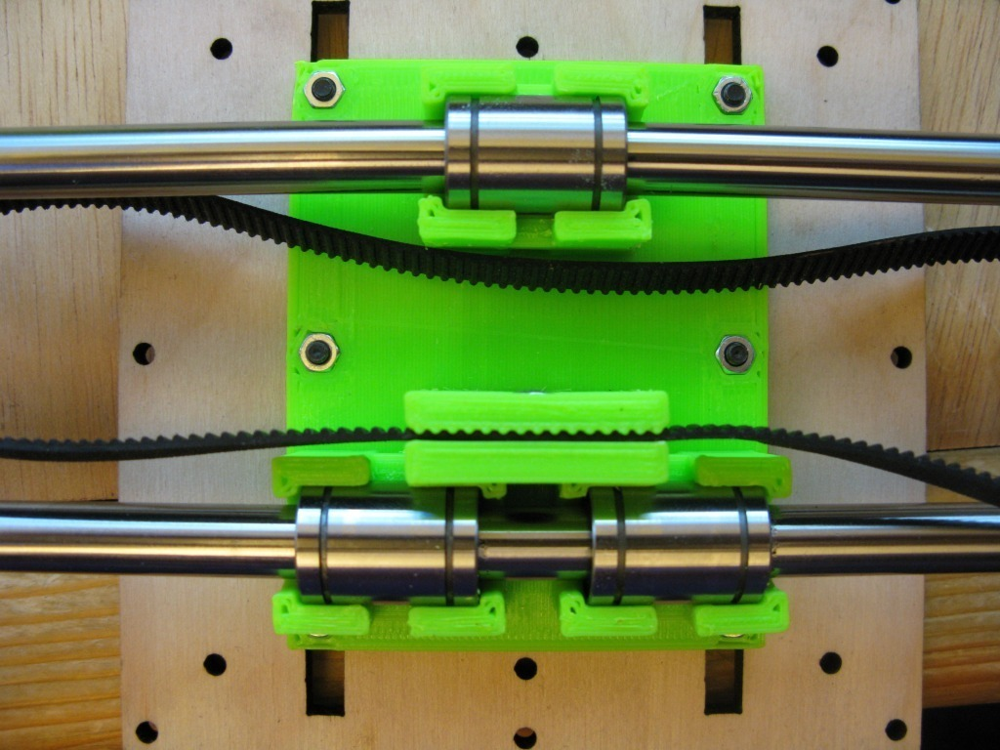
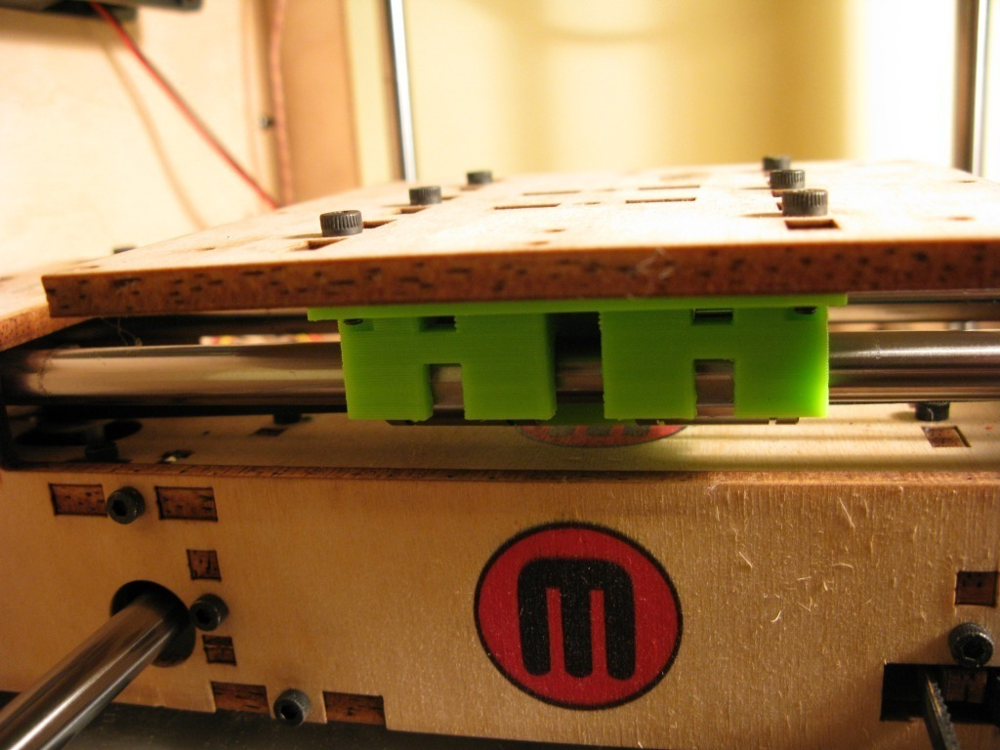
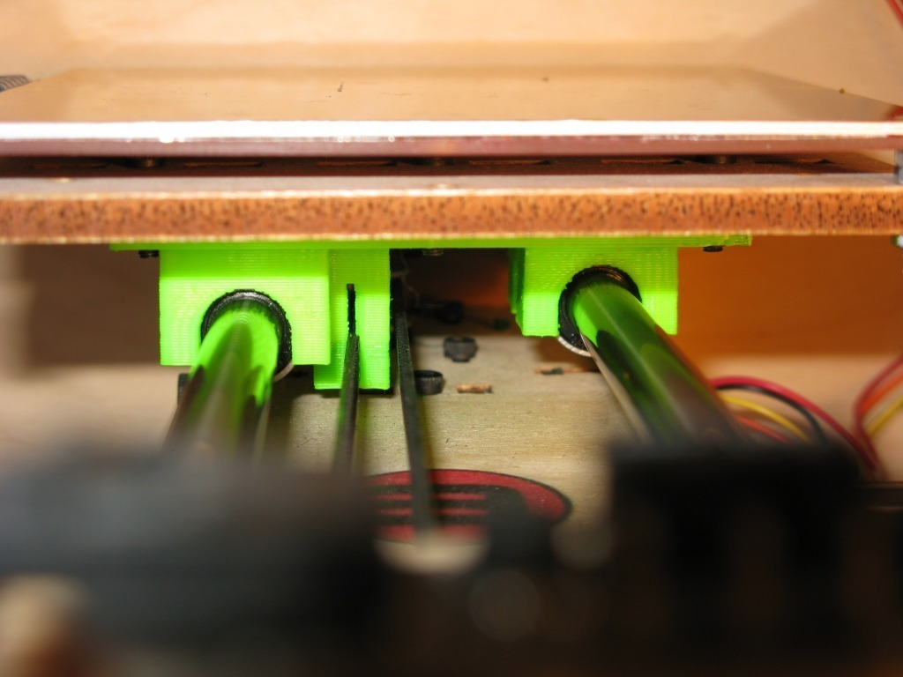

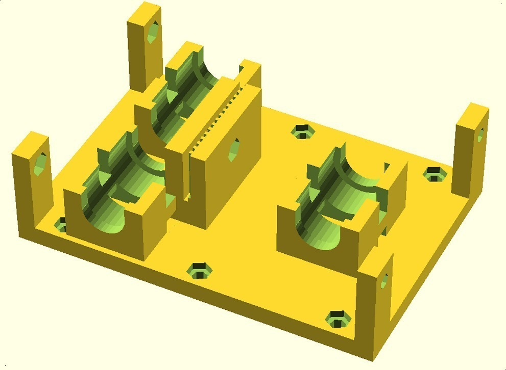
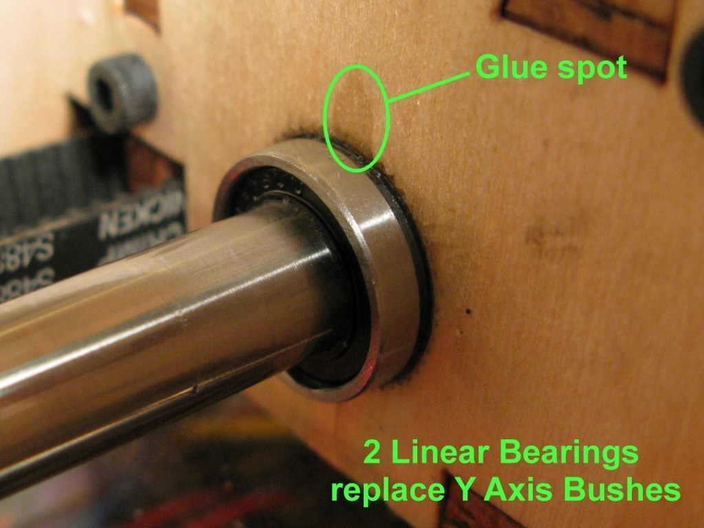
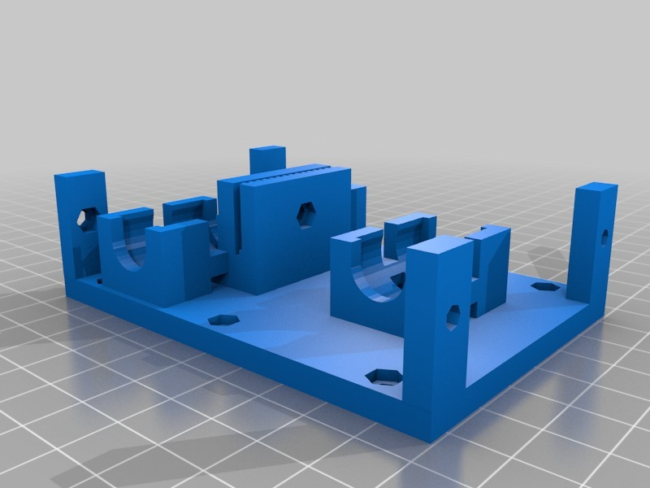
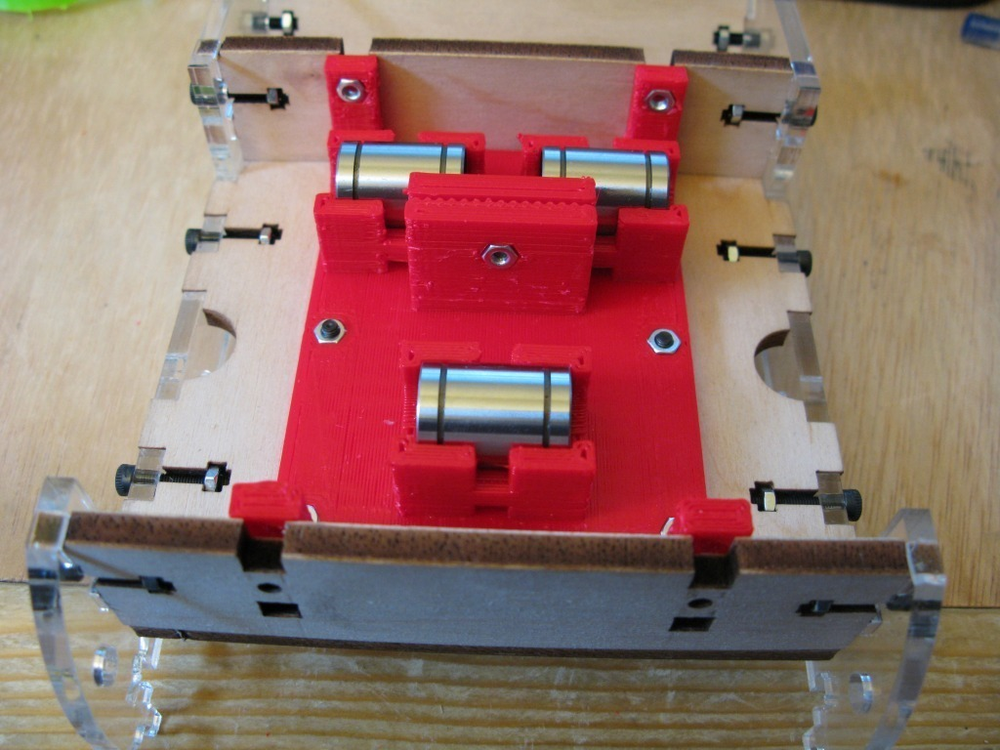

Tags
--------
Carriage , HBP , ToM , Upgrade , X Axis , ABP , Linear Bearing , LMB6UU , openscad , SW06UU , Thing-o-Matic , X-Axis  

  

License
--------
Linear Bearing  X Axis Carriage for ToM by MakeALot is licensed under the Creative Commons - Attribution license.  

By: Mark Durbin (MakeALot)
--------
<http://NestedCube.com/>