Lutyens bench
===============
**Please note: This thing is part of a list that was [automatically generated](https://github.com/carlosgs/export-things) and may have been updated since then. Make sure to check for the current license and authorship.**  

Lutyens bench  by MakeALot , published Apr 28, 2012

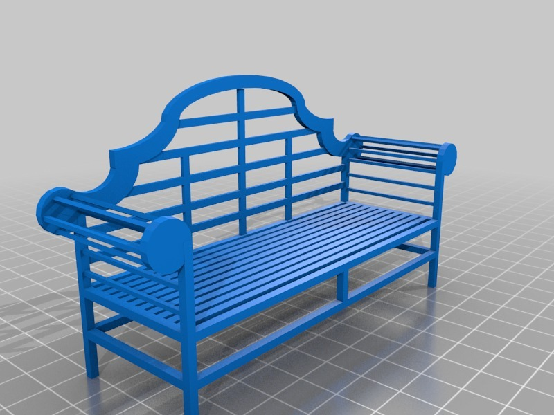

Description
--------
This thing was made with Tinkercad. Edit it online <a href="https://tinkercad.com/things/4HG31uphhbu" target="_blank" rel="nofollow">tinkercad.com/things/4HG31uphhbu</a>

Instructions
--------
I don't know if this will be printable, but as the summer approaches, we're going to need some miniature outdoor furniture.

Files
--------
[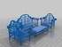](lutyens_garden_set.stl)
 [ lutyens_garden_set.stl](lutyens_garden_set.stl)  

[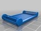](lutyens_tray.stl)
 [ lutyens_tray.stl](lutyens_tray.stl)  

[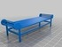](lutyens_table.stl)
 [ lutyens_table.stl](lutyens_table.stl)  

[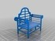](lutyens_chair.stl)
 [ lutyens_chair.stl](lutyens_chair.stl)  

[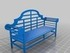](polysoup.stl)
 [ polysoup.stl](polysoup.stl)  

[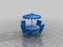](picnic_table.stl)
 [ picnic_table.stl](picnic_table.stl)  

Pictures
--------
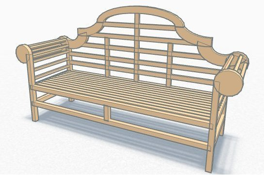
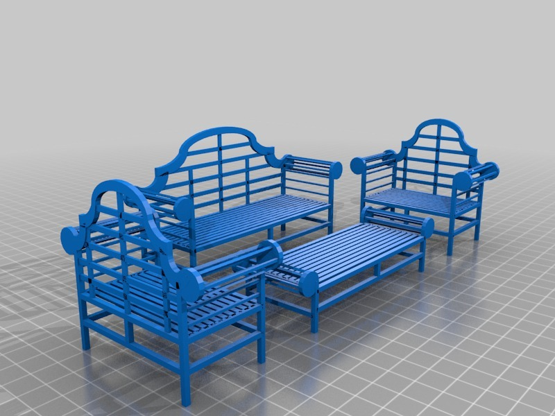
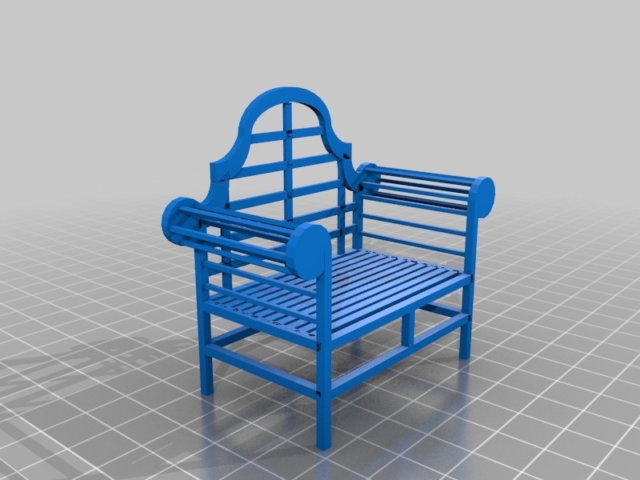
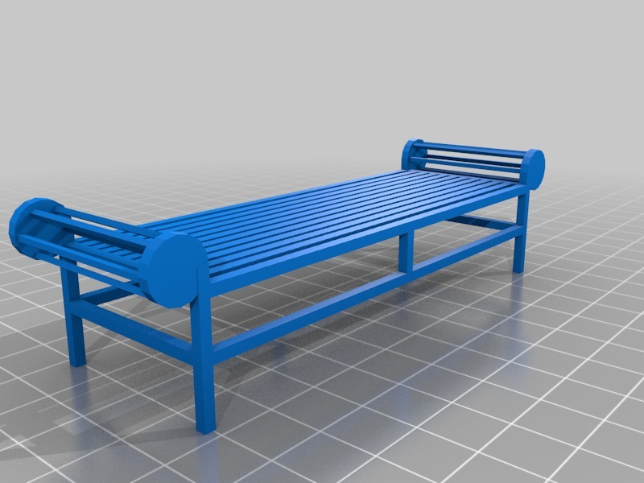
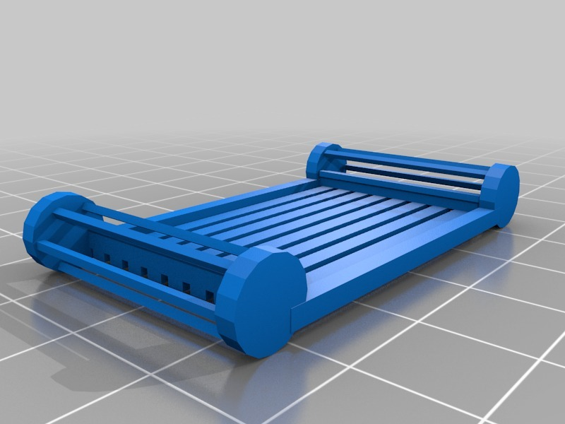
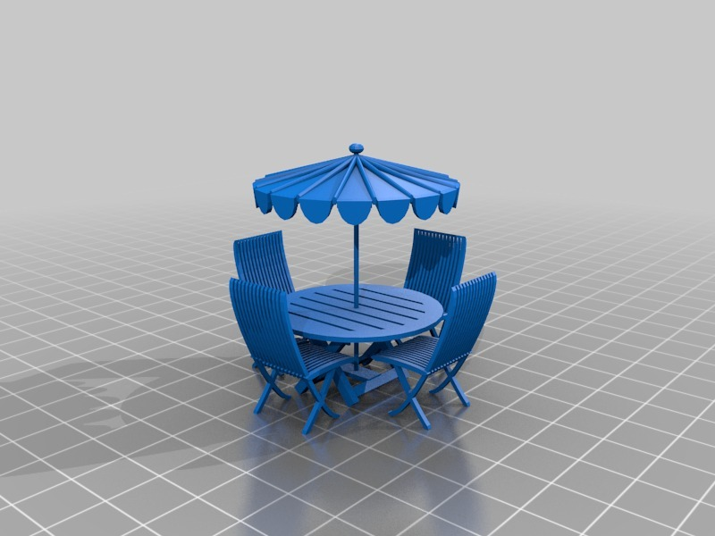

Tags
--------
bench , furniture , garden , lutyens , yard  

  

License
--------
Lutyens bench by MakeALot is licensed under the Creative Commons - Attribution license.  

By: Mark Durbin (MakeALot)
--------
<http://NestedCube.com/>