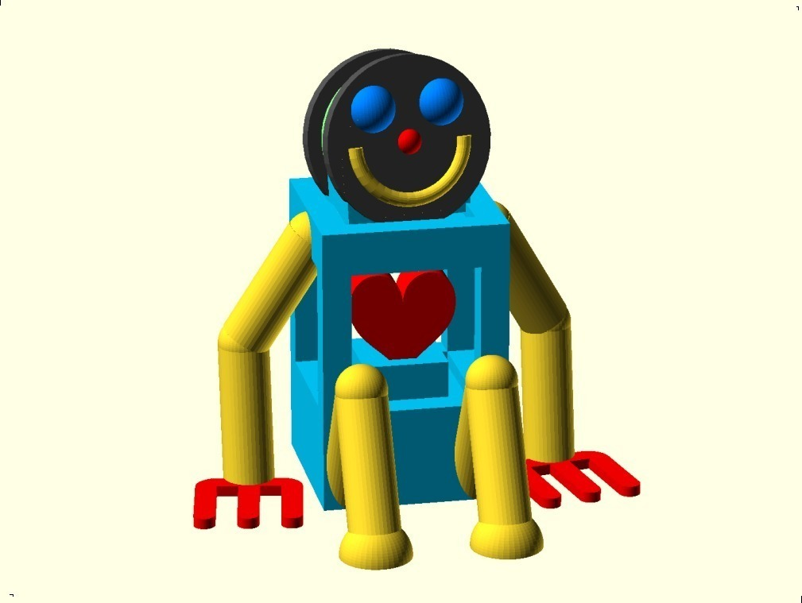
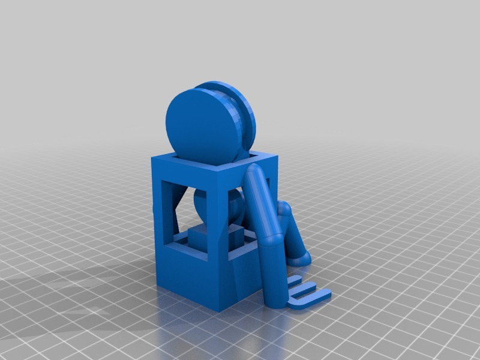
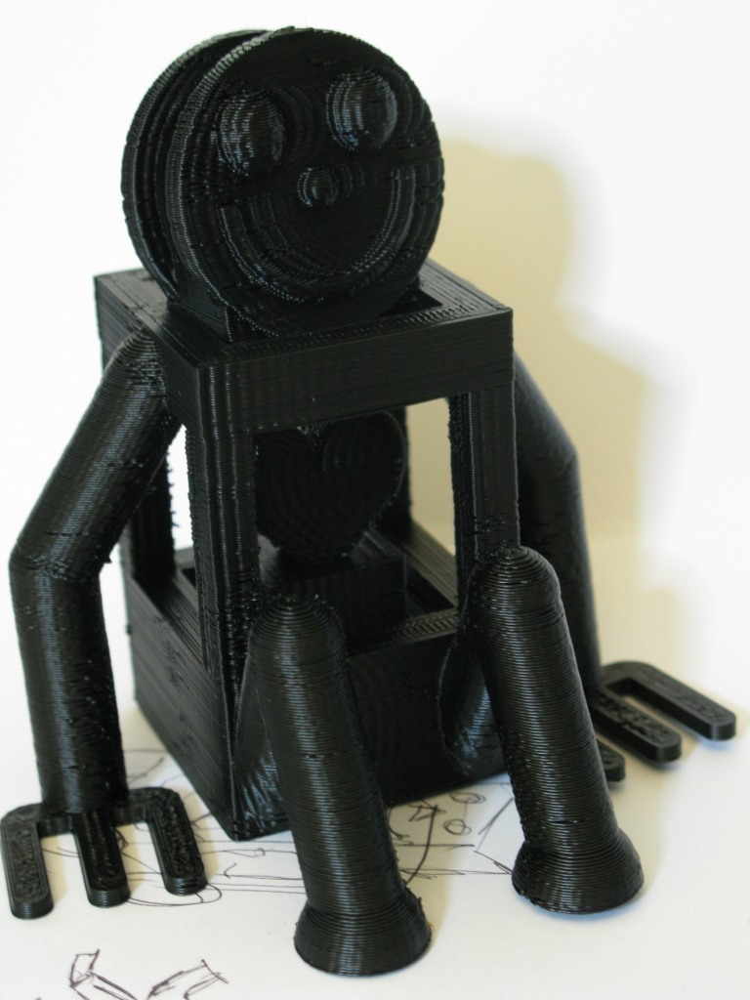

MB Robot #1
===============
**Please note: This thing is part of a list that was [automatically generated](https://github.com/carlosgs/export-things) and may have been updated since then. Make sure to check for the current license and authorship.**  

MB Robot #1  by MakeALot , published Sep 8, 2011

Description
--------
Happy guy with maker hands and a big heart. 
 
<b>All sing together:</b> 
<i>"I could while away the hours,  
Printing little flowers, 
Designing in the attic, 
 
I could fix the shower curtain,  
I could make some gifts for certain, 
If I had a Thing-o-Matic.  
 
tra-la, la-la, la-la-la"</i>

Instructions
--------
Print, smile... 
 
 
 

Files
--------

 [ mbRobot1_Revised.stl](mbRobot1_Revised.stl)  

 [ mbRobot_Revised.scad](mbRobot_Revised.scad)  

Pictures
--------

Tags
--------
cute , grabcad , mascot , openscad , Robot  

  

License
--------
MB Robot #1 by MakeALot is licensed under the Creative Commons - Attribution license.  

By: Mark Durbin (MakeALot)
--------
<http://NestedCube.com/>