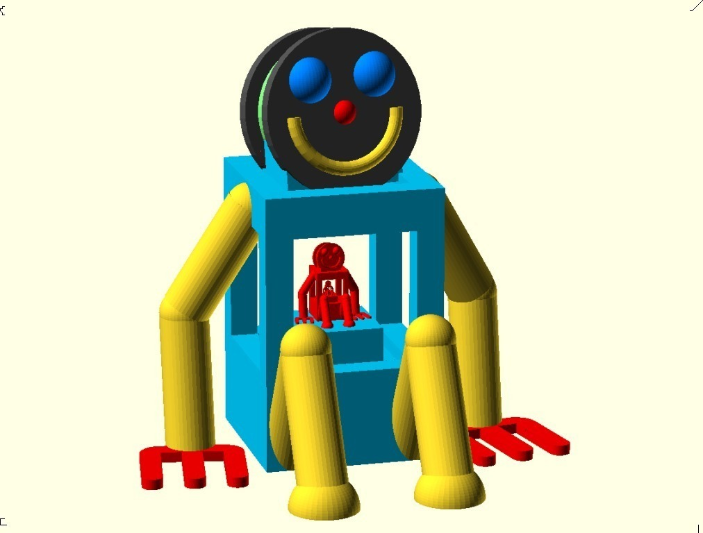
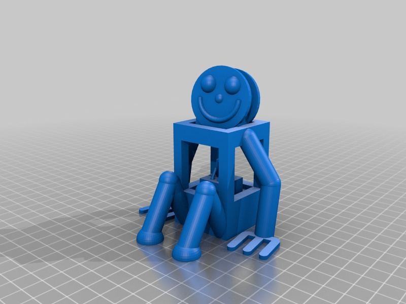
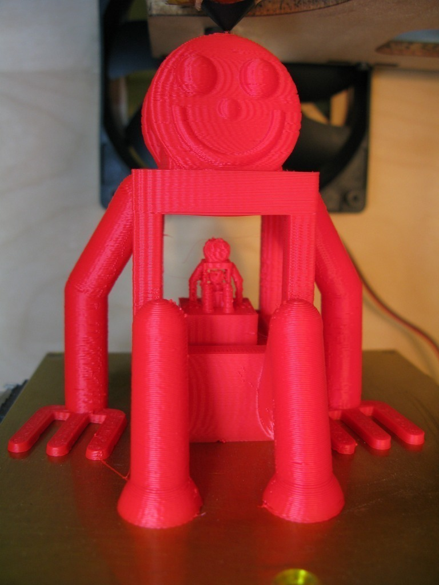

MB Robot #2,#3,#4....
===============
**Please note: This thing is part of a list that was [automatically generated](https://github.com/carlosgs/export-things) and may have been updated since then. Make sure to check for the current license and authorship.**  

MB Robot #2,#3,#4....  by MakeALot , published Sep 9, 2011

Description
--------
Oh no! It's started, what have I done....

Instructions
--------
Try and stop them printing their own little buddies.

Files
--------

 [ mbRobot2r.stl](mbRobot2r.stl)  

Pictures
--------

Tags
--------
mascot , robot , toy  

  

License
--------
MB Robot #2,#3,#4.... by MakeALot is licensed under the Creative Commons - Attribution license.  

By: Mark Durbin (MakeALot)
--------
<http://NestedCube.com/>