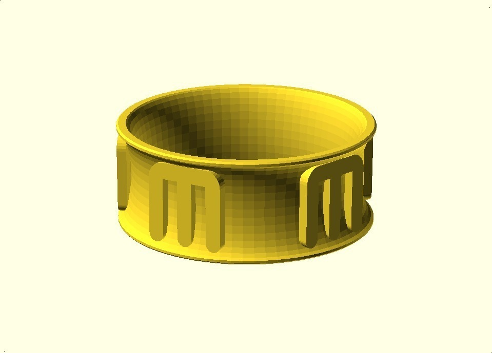
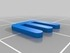
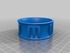
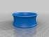
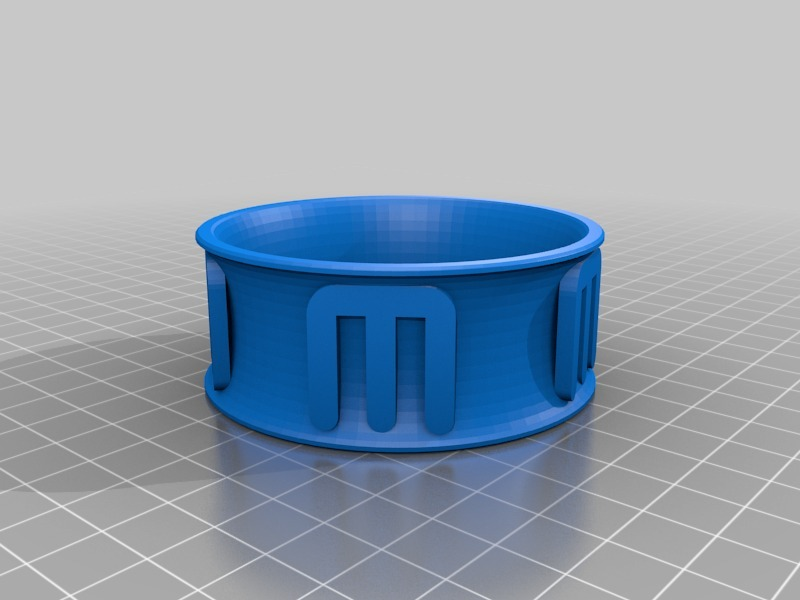
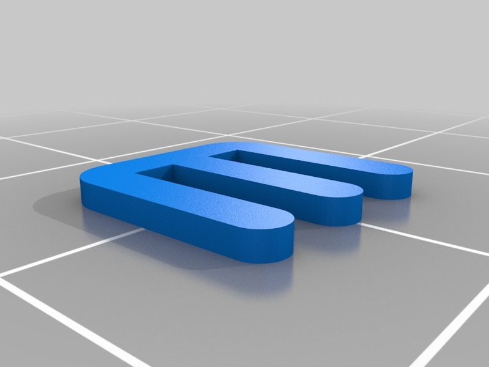
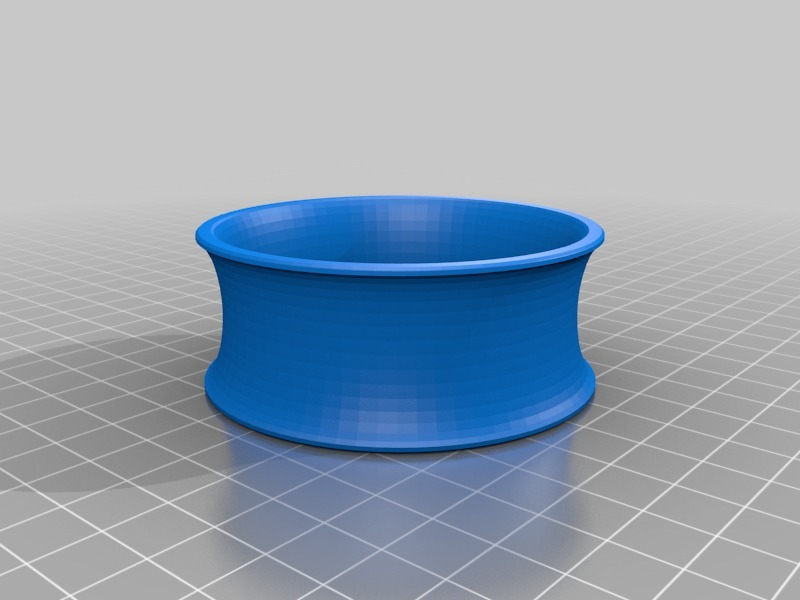

Maker Logo Bracelet IX
===============
**Please note: This thing is part of a list that was [automatically generated](https://github.com/carlosgs/export-things) and may have been updated since then. Make sure to check for the current license and authorship.**  

Maker Logo Bracelet IX  by MakeALot , published Mar 27, 2011

Description
--------
Bracelet with MakerBot Industries Logo. 
 
Homage to the Exsteptional, nay Exstrudinary MakerBot. 
 

Instructions
--------
Unprinted as yet..

Files
--------

 [ makerLogo.stl](makerLogo.stl)  

 [ MakerLogoBracelet.scad](MakerLogoBracelet.scad)  

 [ makerLogoBracelet.stl](makerLogoBracelet.stl)  

 [ makerlogo.scad](makerlogo.scad)  

 [ plainBracelet_FlatEdges.stl](plainBracelet_FlatEdges.stl)  

Pictures
--------

Tags
--------
bracelet , jewelry , Makerbot logo , openscad , wearable  

  

License
--------
Maker Logo Bracelet IX by MakeALot is licensed under the BSD License license.  

By: Mark Durbin (MakeALot)
--------
<http://NestedCube.com/>