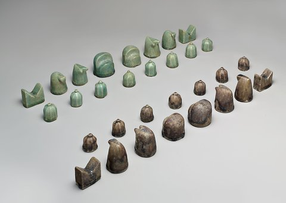

Nishapur #Chess
===============
**Please note: This thing is part of a list that was [automatically generated](https://github.com/carlosgs/export-things) and may have been updated since then. Make sure to check for the current license and authorship.**  

Nishapur #Chess  by MakeALot , published Mar 25, 2012

Description
--------
This part was made with Tinkercad. Edit the part online at: <a href="https://tinkercad.com/things/isTUoZPmbJP" target="_blank" rel="nofollow">tinkercad.com/things/isTUoZPmbJP</a> 
 
<a href="http://artsbeat.blogs.nytimes.com/2011/10/19/an-ancient-chess-set-at-the-met-or-close-enough/" target="_blank" rel="nofollow">artsbeat.blogs.nytimes.com/2011/10/19/an-ancient-chess-set-at-the-met-or-close-enough/</a> 
 
"The set has been dated to the 12th century, is made of stone paste and was found in Nishapur, a city in Northeastern Iran. It resembles todays sets in most respects, but two of the pieces are different, so the set is actually a precursor of the modern version of the game, whose rules mostly arose in the late 15th century. 
 
In the museums set, instead of queens, there are viziers, and instead of bishops, there are elephants, which were called fils, according to Masterpieces From the Department of Islamic Art in the Metropolitan Museum of Art, a book about the exhibition that is being published by the museum. 
 
The viziers and the elephants moved differently, and were less powerful, than their modern counterparts, which probably made the game slower and less exciting. The viziers could only move or capture diagonally one square at a time; the modern queen is allowed unlimited movement in any direction. The elephants moved diagonally two squares at a time, while modern bishops can move any number of diagonal squares. The viziers could never attack each other. 
 
Chess had started to spread to Europe a couple of centuries before the Metropolitans Persian set was made and had already moved closer to the modern game there. The Lewis Chessmen, a trove of 93 pieces found in 1831 on the Isle of Lewis, in Scotland, which are believed to have been carved between 1150 and 1200 A.D., contain queens and bishops. (Thirty of the pieces will be on loan from the British Museum from Nov. 15 through April 22, 2012 at The Cloisters in Washington Heights.)"

Instructions
--------
For those of us that can't visit the MET. Print and admire 
 
Print and play by old or new rules. 

Files
--------

 [ nishapurchessfullplate.stl](nishapurchessfullplate.stl)  

 [ polysoup.stl](polysoup.stl)  

Pictures
--------

Tags
--------
Chess , TinkerCAD  

  

License
--------
Nishapur #Chess by MakeALot is licensed under the Creative Commons - Attribution license.  

By: Mark Durbin (MakeALot)
--------
<http://NestedCube.com/>