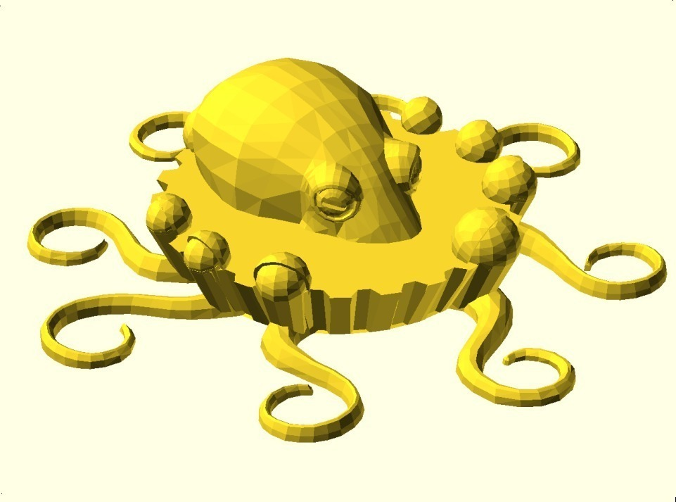
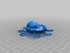
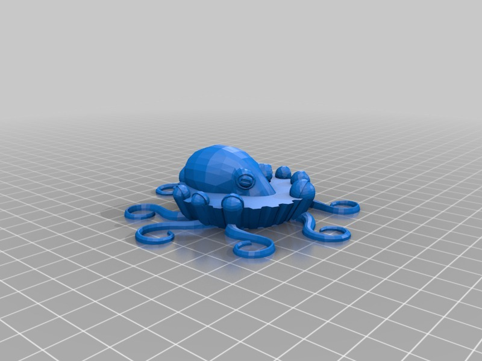

Octo(pie and mash)up
===============
**Please note: This thing is part of a list that was [automatically generated](https://github.com/carlosgs/export-things) and may have been updated since then. Make sure to check for the current license and authorship.**  

Octo(pie and mash)up  by MakeALot , published Apr 21, 2011

Description
--------
It's not an octagon, but it is a Pie

Instructions
--------
Season well...

Files
--------

 [ octopie.stl](octopie.stl)  

Pictures
--------

Tags
--------
animal , octopi , octopus , pie , seafood , sick squid , tentacle , bucket  

  

License
--------
Octo(pie and mash)up by MakeALot is licensed under the Creative Commons - Attribution - Share Alike license.  

By: Mark Durbin (MakeALot)
--------
<http://NestedCube.com/>