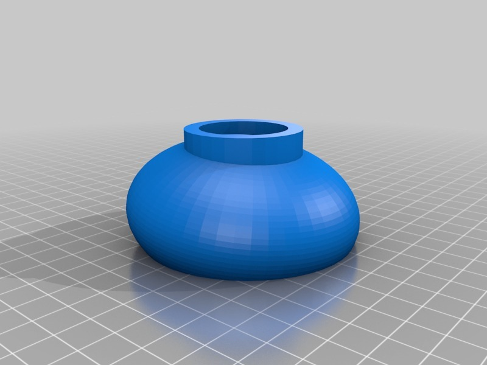
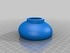
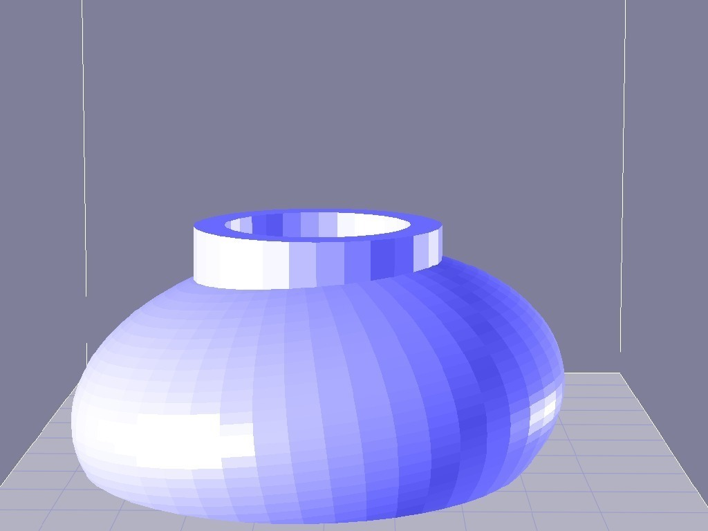
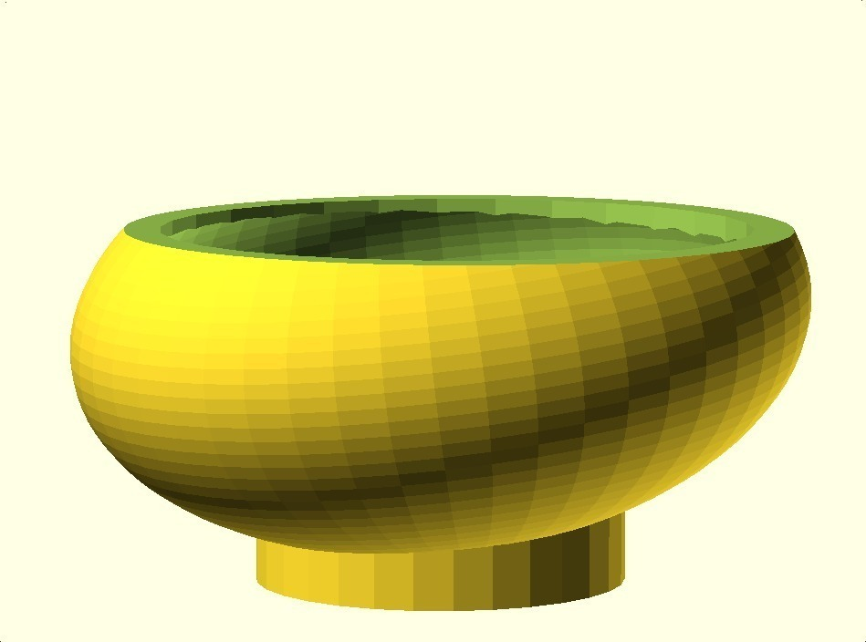

Offset Bowl
===============
**Please note: This thing is part of a list that was [automatically generated](https://github.com/carlosgs/export-things) and may have been updated since then. Make sure to check for the current license and authorship.**  

Offset Bowl  by MakeALot , published Mar 14, 2011

Description
--------
Bowl for bits and pieces

Instructions
--------
print and fill

Files
--------

 [ bowl.scad](bowl.scad)  

 [ Bowl.stl](Bowl.stl)  

Pictures
--------

Tags
--------
openscad  

  

License
--------
Offset Bowl by MakeALot is licensed under the BSD License license.  

By: Mark Durbin (MakeALot)
--------
<http://NestedCube.com/>