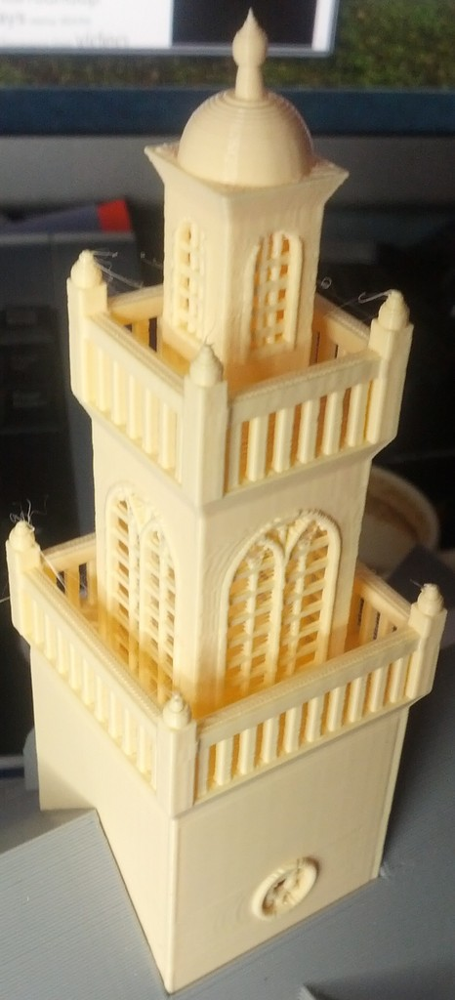

Old State House Boston
===============
**Please note: This thing is part of a list that was [automatically generated](https://github.com/carlosgs/export-things) and may have been updated since then. Make sure to check for the current license and authorship.**  

Old State House Boston  by MakeALot , published Nov 25, 2013

Description
--------
Given the opening of the Makerbot store in Boston, I thought I'd model one of the city's historic buildings.   
 
from Wikipedia <a href="http://en.wikipedia.org/wiki/Old_State_House_" target="_blank" rel="nofollow">en.wikipedia.org/wiki/Old_State_House_</a>(Boston)   
 
"On July 18, 1776, the Declaration of Independence was proclaimed from the east side balcony to jubilant crowds by Col. Thomas Crafts (one of the Sons of Liberty). At one o'clock Col. Crafts rose in the Council Chamber and read it to the members.[8] Then, fellow patriot Sheriff William Greenleaf attempted to read it from the balcony, but he could only muster a whisper. Col. Crafts then stood next to the sheriff and read it from the balcony in a stentorian tone. For most people, it was a festive occasion, as about two-thirds of Boston residents supported the revolution. The lion and the unicorn on top of the building were removed and burned in a bonfire"

Instructions
--------
Make the roof from a slate colour, the walls from a brick colour , the side door wood in black and the rest of the parts for a white/yellow.   
 
The balcony and side door will need to be printed with supports, all the other parts print without.   
 
All STLs should be in the correct position for printing.   
 
I printed this on a Replicator 2 at low quality in Makerware i.e. 0.3mm  layer height, 10% fill, 2 perimeters, at 90 mm/s &amp; 230 degrees C.

Files
--------

 [ OldStateHouseWindows3.stl](OldStateHouseWindows3.stl)  

 [ OldStateHouseBalcony.stl](OldStateHouseBalcony.stl)  

 [ OldStateHouseWindows1.stl](OldStateHouseWindows1.stl)  

 [ OldStateHouseRoofInnerTower.stl](OldStateHouseRoofInnerTower.stl)  

 [ OldStateHouse.scad](OldStateHouse.scad)  

 [ OldStateHouseSideDoor.stl](OldStateHouseSideDoor.stl)  

 [ OldStateHouseWindows2.stl](OldStateHouseWindows2.stl)  

 [ OldStateHouseWindows4.stl](OldStateHouseWindows4.stl)  

 [ OldStateHouseRoof.stl](OldStateHouseRoof.stl)  

 [ OldStateHouseWalls.stl](OldStateHouseWalls.stl)  

 [ OldStateHouseSideDoorWood.stl](OldStateHouseSideDoorWood.stl)  

 [ OldStateHouseRoofInnerBase.stl](OldStateHouseRoofInnerBase.stl)  

 [ OldStateHouseComplete.stl](OldStateHouseComplete.stl)  

Pictures
--------

Tags
--------
Boston , Boston_Massacre , Declaration_of_Independence , Old_State_House  

  

License
--------
Old State House Boston by MakeALot is licensed under the Creative Commons - Attribution license.  

By: Mark Durbin (MakeALot)
--------
<http://NestedCube.com/>