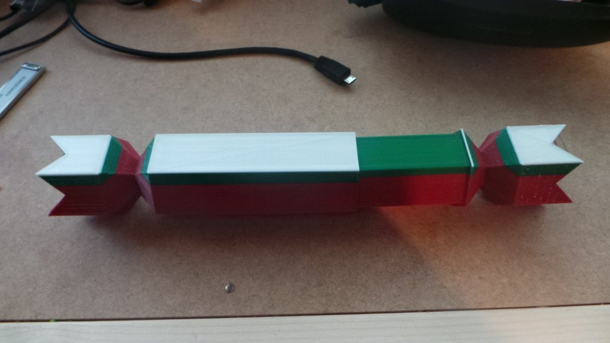

Open-able Cracker
===============
**Please note: This thing is part of a list that was [automatically generated](https://github.com/carlosgs/export-things) and may have been updated since then. Make sure to check for the current license and authorship.**  

Open-able Cracker  by MakeALot , published Dec 14, 2012

Description
--------
I saw the original and thought what a great idea.  I just needed to make a hole in the middle and a mechanism for opening it.

Instructions
--------
For people in the US who don't know, I'm sure some of you do already, a Cracker is a paper tube containing a paper hat, a joke and a small toy, when the ends are pulled between two people, a crack is heard and the contents claimed by the person holding the middle section.  This is normally done at the start of Christmas dinner (the jokes are read and you all wear your hats during the meal). 
 
Print Cracker.stl, the others are just the individual parts, but have not been oriented to the platform for printing.

Files
--------

 [ Cracker_Part2.stl](Cracker_Part2.stl)  

 [ Cracker_Part1.stl](Cracker_Part1.stl)  

 [ Cracker.stl](Cracker.stl)  

Pictures
--------

Tags
--------
box , Christmas , Cracker , Gift  

  

License
--------
Open-able Cracker by MakeALot is licensed under the Creative Commons - Attribution license.  

By: Mark Durbin (MakeALot)
--------
<http://NestedCube.com/>