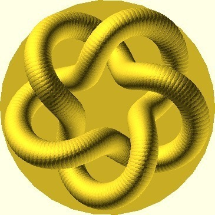
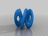
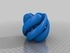
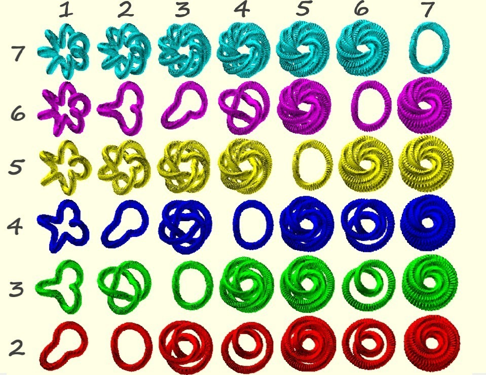

Parametric Knot
===============
**Please note: This thing is part of a list that was [automatically generated](https://github.com/carlosgs/export-things) and may have been updated since then. Make sure to check for the current license and authorship.**  

Parametric Knot  by MakeALot , published Mar 8, 2011

Description
--------
An adjustable printable knot on a plinth 
 
The first image is a 2,5 knot the other individual one is a 2,3 knot, the other images show some of the knots you can achieve. 

Instructions
--------
I've updated the scad file to allow setting more of the internal parameters to help with building on Windows. 
 
If you imagine an invisible torus (donut) with a string going around it,  the axisRotation is the number of times the string goes around the top and the radialRotation is the number of times the string goes into the hole and out again. 
 
<b>axisRotation</b> 	= the number of times around the top of the torus 
<b>radialRotation</b> 	= the number of times rotated into the hole 
<b>baseHeight</b>	= the height of the plinth (0 for no plinth) 
<b>numberOfSpheres</b>	= the number of spheres used to complete the knot 
<b>sphereQuality</b> 	= larger number = lower the quality see $fs 
 
if you would like to produce a series of STL files, you can use the command line options to set the parameters and output file e.g. 
 
openscad -s knot15.stl -D "axisRotation = 1" -D "radialRotation = 5" -D "baseHeight = 5" varKnot.scad 
 
<b>win32</b> I had to reduce the resolution of the knots to generate STL files under Windows, the otherwise <b>excellent</b> OpenSCAD couldn't quite manage the originals. This now uses 750Mb or RAM and takes about 3 hours <b>:)</b> 
 
I've generated 10 or so STL files so that people without the inclination to use OpenSCAD can still print one.  Obviously, I can't generate every possible combination, so please let me know if you'd like some particular combination and I'll see if I can generate the STL file for you.

Files
--------

 [ knotNB56.stl](knotNB56.stl)  

 [ knot56.stl](knot56.stl)  

 [ knot15.stl](knot15.stl)  

 [ knot_2_3.stl](knot_2_3.stl)  

 [ knot35.stl](knot35.stl)  

 [ knot45.stl](knot45.stl)  

 [ knotNB15.stl](knotNB15.stl)  

 [ knot25.stl](knot25.stl)  

 [ knotNB25.stl](knotNB25.stl)  

 [ varKnot.scad](varKnot.scad)  

 [ knotNB45.stl](knotNB45.stl)  

 [ knotNB35.stl](knotNB35.stl)  

Pictures
--------

Tags
--------
3D , art , Geometry , knot , Knot Theory , openscad , parameter , parametric  

  

License
--------
Parametric Knot by MakeALot is licensed under the BSD License license.  

By: Mark Durbin (MakeALot)
--------
<http://NestedCube.com/>