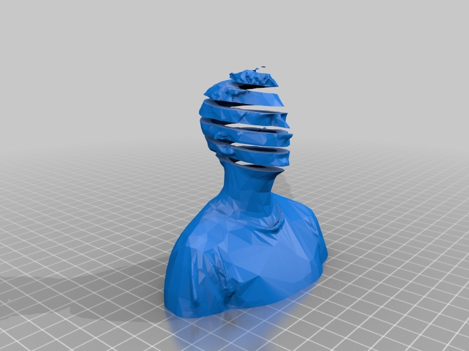
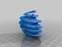
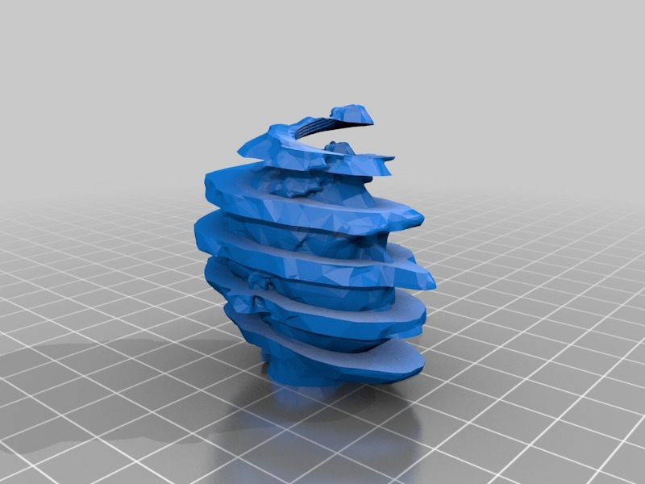
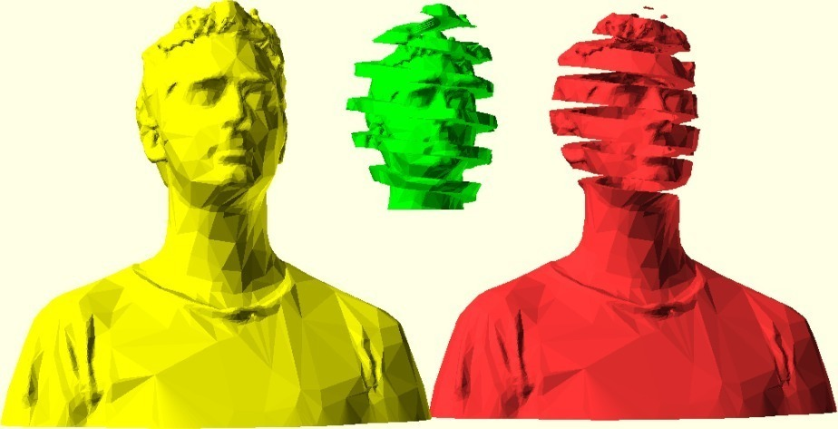

Peeled Bre
===============
**Please note: This thing is part of a list that was [automatically generated](https://github.com/carlosgs/export-things) and may have been updated since then. Make sure to check for the current license and authorship.**  

Peeled Bre  by MakeALot , published Sep 19, 2011

Description
--------
I have always liked Peeled Faces by M.C. Escher. But I couldn't think of a reasonable way to print a version before. Seeing that some can use (or at least plan to use) support material, I have included this first test. 
 
We can print peeled oranges, sliced eggs, coiled springs, rotating mobile toys - all manner of useless but fascinating things. 
 
As well as inspiration from Escher, I should also note the prior art of OhadReiter <a href="http://www.thingiverse.com/thing:9224" target="_blank" rel="nofollow">thingiverse.com/thing:9224</a>, thanks to both (and Bre for the subject matter!).

Instructions
--------
Print using one solid material and one soluble material.  
Then dissolve away - magic. 
 

Files
--------

 [ PeeledBre.stl](PeeledBre.stl)  

 [ supportedHead.scad](supportedHead.scad)  

 [ PeeledBre_support.stl](PeeledBre_support.stl)  

Pictures
--------

Tags
--------
Bre Pettis , dual , dual extruder , dual material , dualstrusion , soluble support , 2color , dual extrusion , Escher , openscad  

  

License
--------
Peeled Bre by MakeALot is licensed under the Creative Commons - Attribution license.  

By: Mark Durbin (MakeALot)
--------
<http://NestedCube.com/>