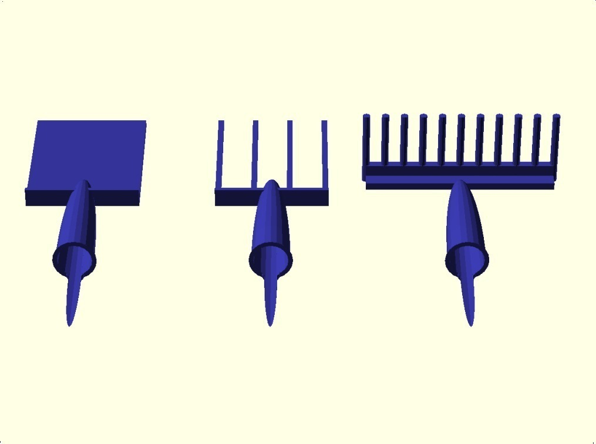
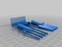
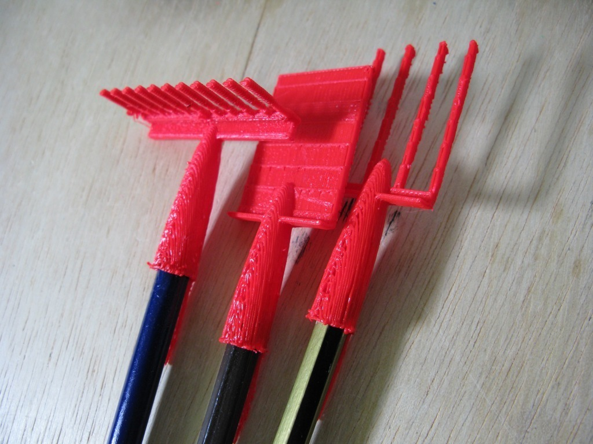
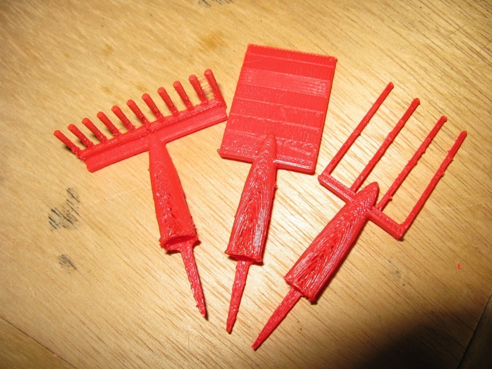
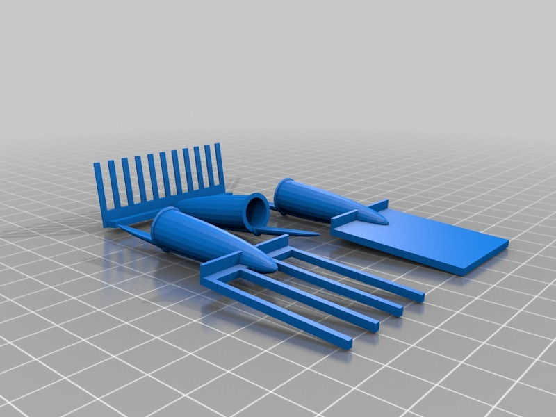

Pen lid Garden set
===============
**Please note: This thing is part of a list that was [automatically generated](https://github.com/carlosgs/export-things) and may have been updated since then. Make sure to check for the current license and authorship.**  

Pen lid Garden set  by MakeALot , published Jun 30, 2011

Description
--------
Show how much you love your garden, wear your tools with pride on the end of your pocketful of pens. 
 
inspired by <a href="http://www.thingiverse.com/thing:9603" target="_blank" rel="nofollow">thingiverse.com/thing:9603</a> 
 
 

Instructions
--------
I couldn't resist adding to the pen-top accessory range (or in this case the pencil-top range). 
 
<b>Update</b> 
Well, I had to thicken the lid (lidThickness=1.5) but apart from that they printed. Probably not the most useful of my tools, but I think a bickaxe might be...

Files
--------

 [ ThickerPenGardenSet.scad](ThickerPenGardenSet.scad)  

 [ ThickerPenGardenSet.stl](ThickerPenGardenSet.stl)  

Pictures
--------

Tags
--------
fork , garden , lid , toy , bic , openscad , pen , Pencil , rake , spade  

  

License
--------
Pen lid Garden set by MakeALot is licensed under the Creative Commons - Attribution - Share Alike license.  

By: Mark Durbin (MakeALot)
--------
<http://NestedCube.com/>