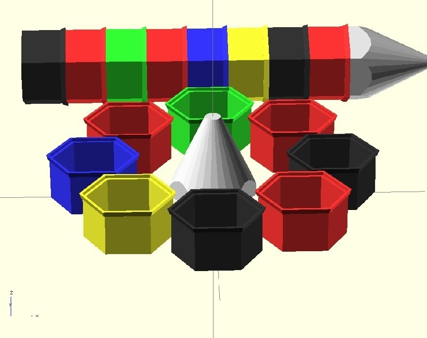
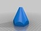
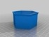
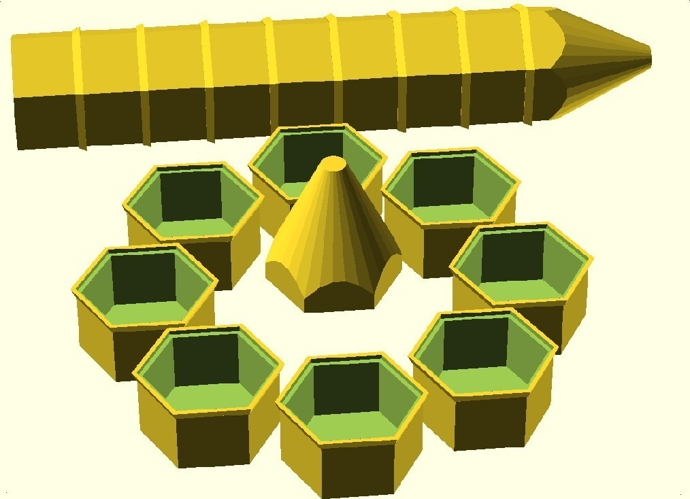
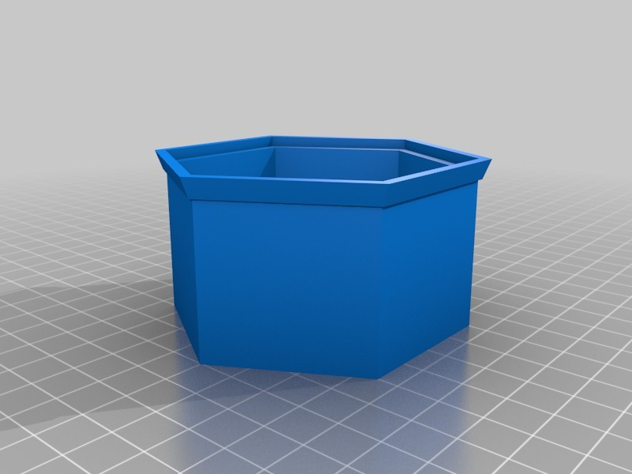
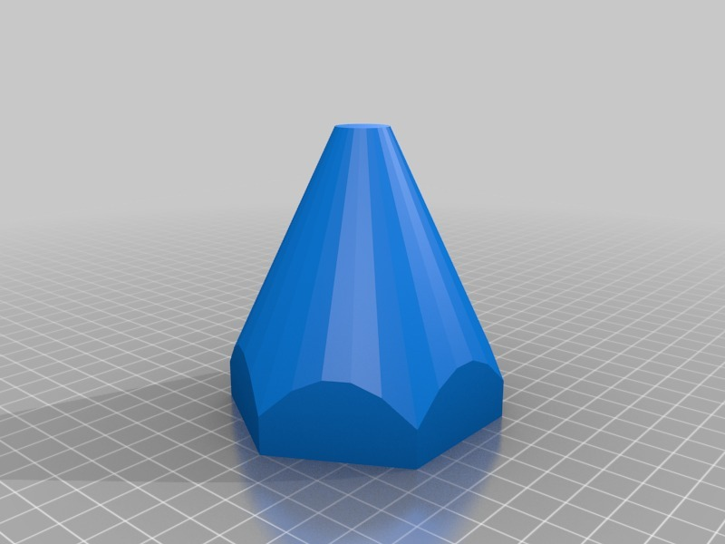

Pencil Bolt Case
===============
**Please note: This thing is part of a list that was [automatically generated](https://github.com/carlosgs/export-things) and may have been updated since then. Make sure to check for the current license and authorship.**  

Pencil Bolt Case  by MakeALot , published Mar 14, 2011

Description
--------
A series of stacking cases that join together to make a pencil. 
I couldn't resist (http://www.thingiverse.com/thing:7025)

Instructions
--------
Fill 'em and Stack 'em

Files
--------

 [ BoltCaseTip.stl](BoltCaseTip.stl)  

 [ BoltCaseSection.stl](BoltCaseSection.stl)  

Pictures
--------

Tags
--------
Bolt , Case , Pencil  

  

License
--------
Pencil Bolt Case by MakeALot is licensed under the BSD License license.  

By: Mark Durbin (MakeALot)
--------
<http://NestedCube.com/>