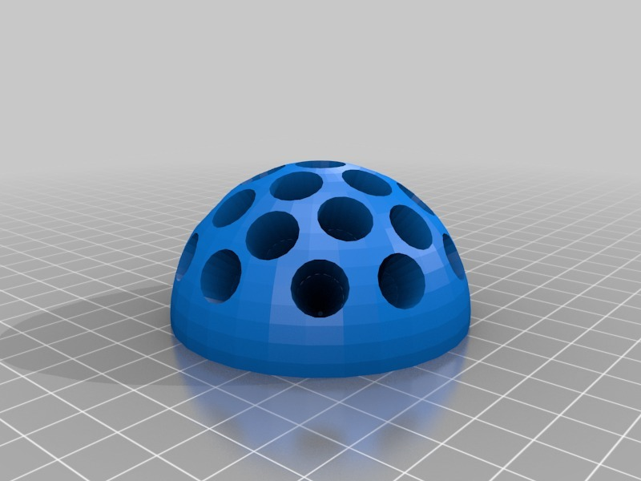
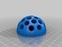
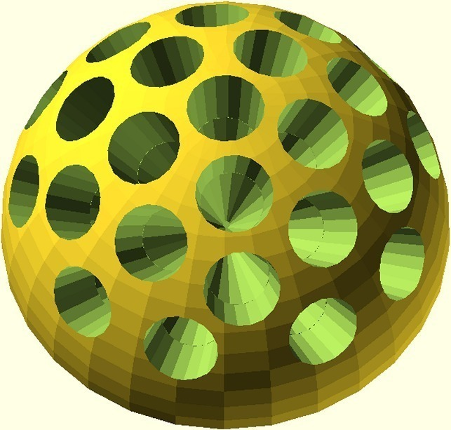
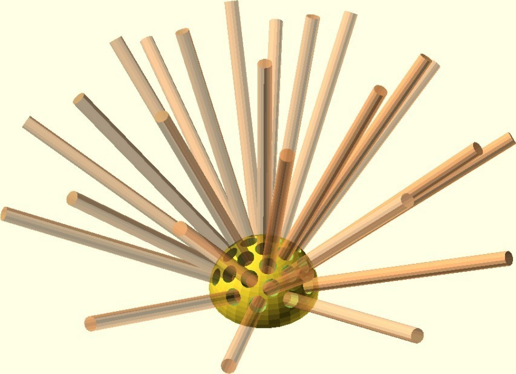
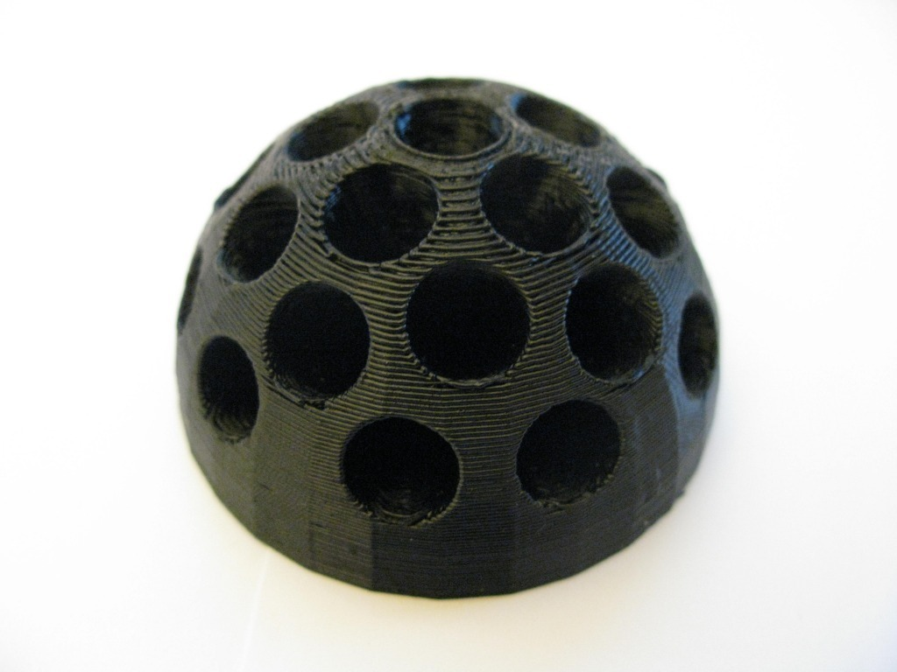
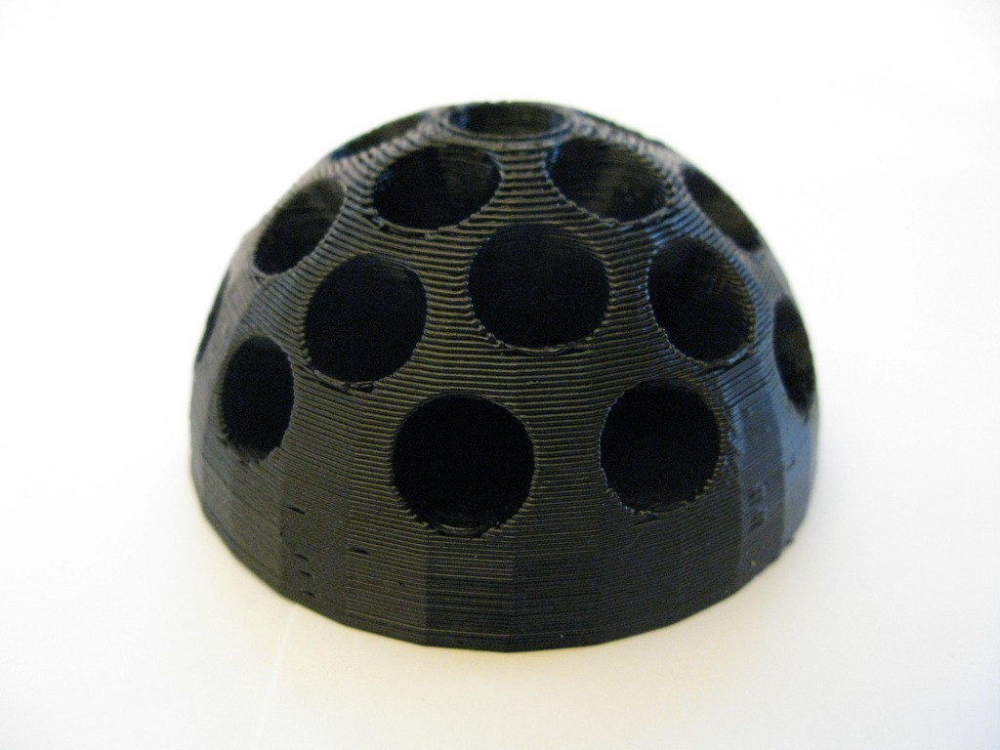
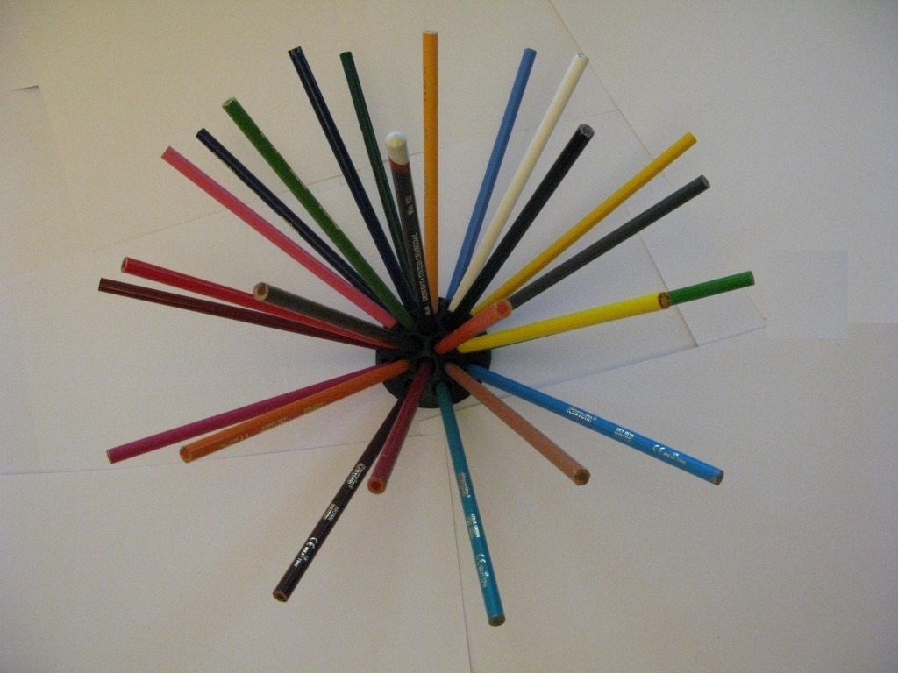

Pencil holder dome (safety reversible)
===============
**Please note: This thing is part of a list that was [automatically generated](https://github.com/carlosgs/export-things) and may have been updated since then. Make sure to check for the current license and authorship.**  

Pencil holder dome (safety reversible)  by MakeALot , published May 11, 2011

Description
--------
spikes out - trip hazard, spikes in - artwork. 
 
Especially for ScribbleJ, I hate to think of him missing out on the graphite goodness that is pencil art for fear of his life. (you could still take an eye out with this design, but it's much harder to do :)

Instructions
--------
Print, insert pencils (or razor edged spikes depending on deployment) and enjoy. 
 
For the safety conscious (or accident prone) points can be inserted into dome.  For those who care not a jot and are throwing caution to the wind insert with points out. 
 
I should probably have included a sharpening slot (as it looks like the largest multi-sharpener in history).  This object may prove a little frustrating for those with a propensity to over sharpen pencils. Who knows, it may even prove therapeutic...

Files
--------

 [ pencildome.stl](pencildome.stl)  

Pictures
--------

Tags
--------
desktop , holder , Geometry , pencil , pencil holder  

  

License
--------
Pencil holder dome (safety reversible) by MakeALot is licensed under the Creative Commons - Attribution - Share Alike license.  

By: Mark Durbin (MakeALot)
--------
<http://NestedCube.com/>