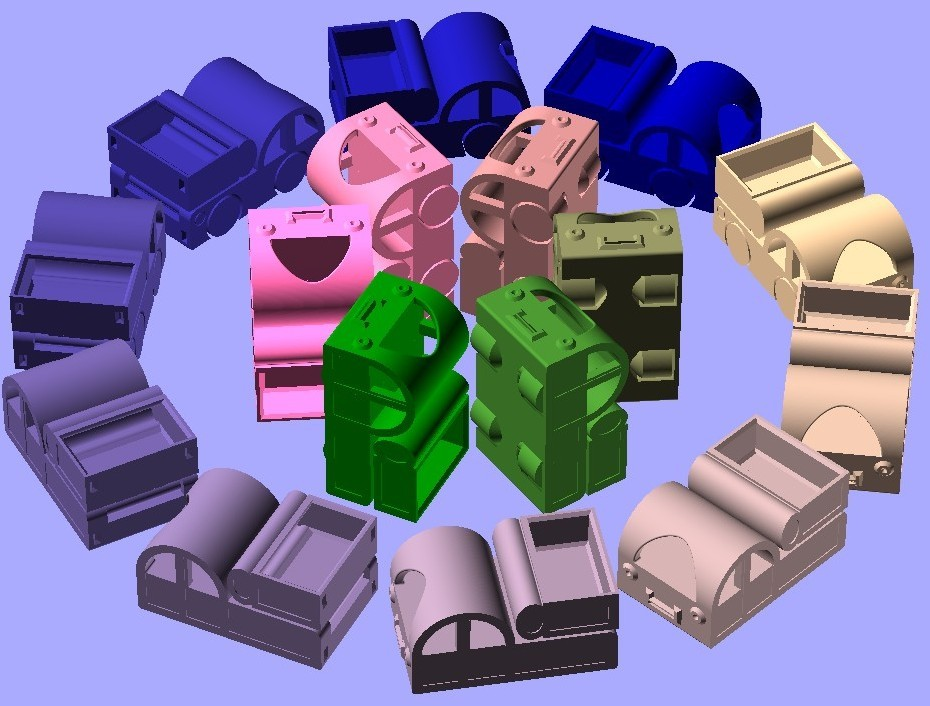
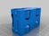
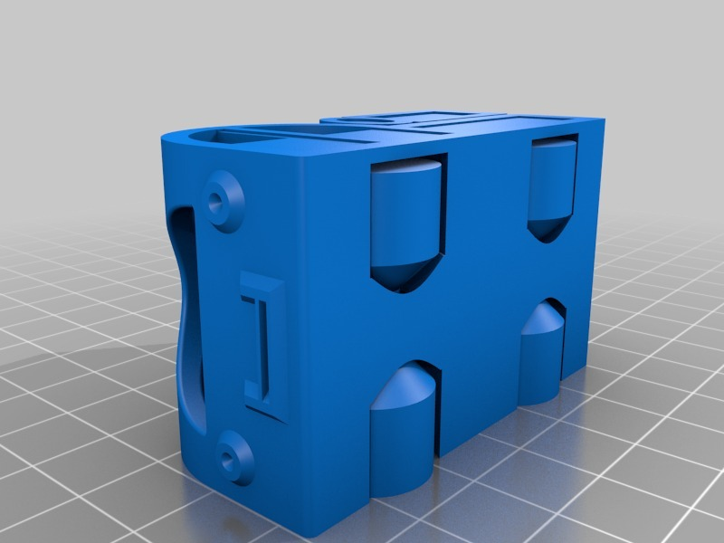
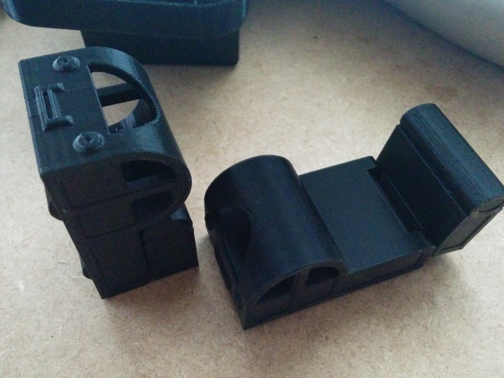
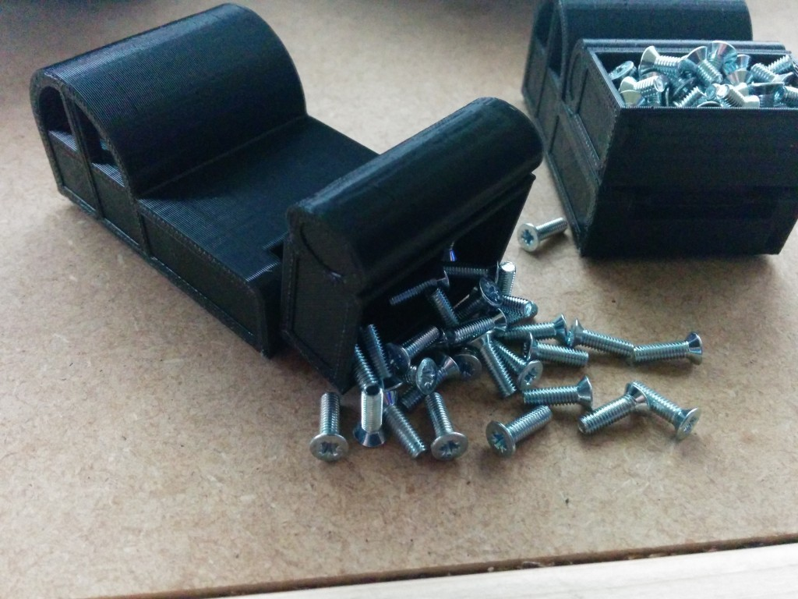

Pi Dump Truck
===============
**Please note: This thing is part of a list that was [automatically generated](https://github.com/carlosgs/export-things) and may have been updated since then. Make sure to check for the current license and authorship.**  

Pi Dump Truck  by MakeALot , published Mar 13, 2014

Description
--------
I visited a colleague at home recently and as I was going to be meeting his six year old son Pi, I created a small model for him and took it along as a gift.   
 
Although I modelled it from scratch to look like the name Pi when stood on its end, I took inspiration from madscifi's excellent Tiny Toy Dump Truck <a href="http://www.thingiverse.com/thing:9710" target="_blank" rel="nofollow">thingiverse.com/thing:9710</a>  
 
As it is apparently PI day tomorrow, I thought that others might like a copy.   
 
It prints in about an hour with no assembly required.   
So far, I've printed it a Makerware "Low" which is 0.3mm, 2 shells, 10% infill, 90mm/s, NO SUPPORT, no raft.   

Instructions
--------
None

Files
--------

 [ PiTruck.stl](PiTruck.stl)  

Pictures
--------

Tags
--------
All_In_One_Print , Dump_Truck , One_piece_print , Pi , Pi_Day  

  

License
--------
Pi Dump Truck by MakeALot is licensed under the Creative Commons - Attribution license.  

By: Mark Durbin (MakeALot)
--------
<http://NestedCube.com/>