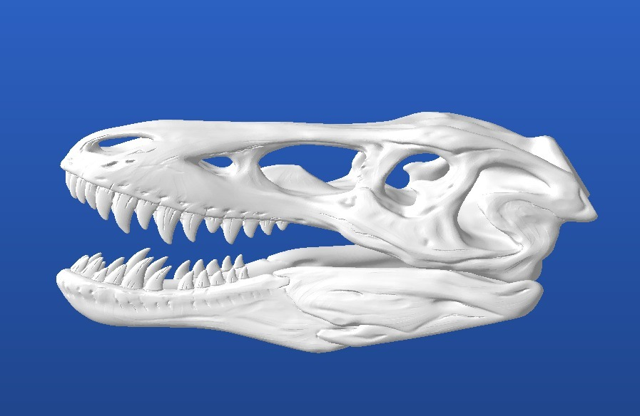
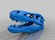
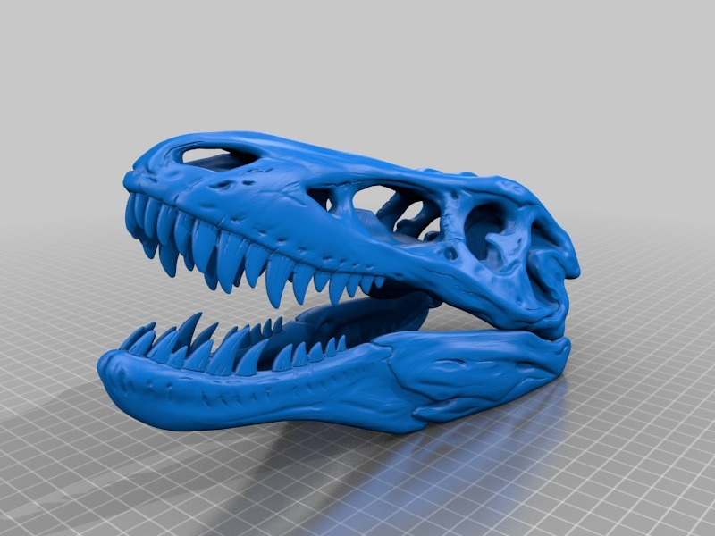
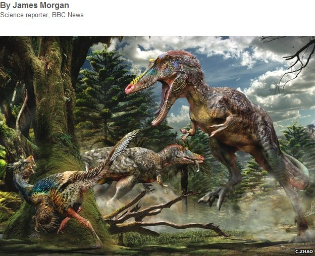
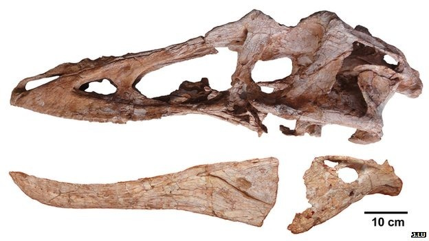

Pinocchio Rex (Qianzhousaurus sinensis)
===============
**Please note: This thing is part of a list that was [automatically generated](https://github.com/carlosgs/export-things) and may have been updated since then. Make sure to check for the current license and authorship.**  

Pinocchio Rex (Qianzhousaurus sinensis)  by MakeALot , published May 7, 2014

Description
--------
Today, The BBC reports new Tyrannosaur named Pinocchio Rex (Qianzhousaurus sinensis)   
<a href="http://www.bbc.co.uk/news/science-environment-27296357" target="_blank" rel="nofollow">bbc.co.uk/news/science-environment-27296357</a>  
Given the serendipity of the timing , I couldn't resist modelling it (well, stretching the T-Rex head!)   
 
I included a couple of images courtesy of the BBC website.

Instructions
--------
None

Files
--------

 [ P-RexSkull.stl](P-RexSkull.stl)  

Pictures
--------

Tags
--------
PRex , TRexRemix  

  

License
--------
Pinocchio Rex (Qianzhousaurus sinensis) by MakeALot is licensed under the Creative Commons - Attribution license.  

By: Mark Durbin (MakeALot)
--------
<http://NestedCube.com/>