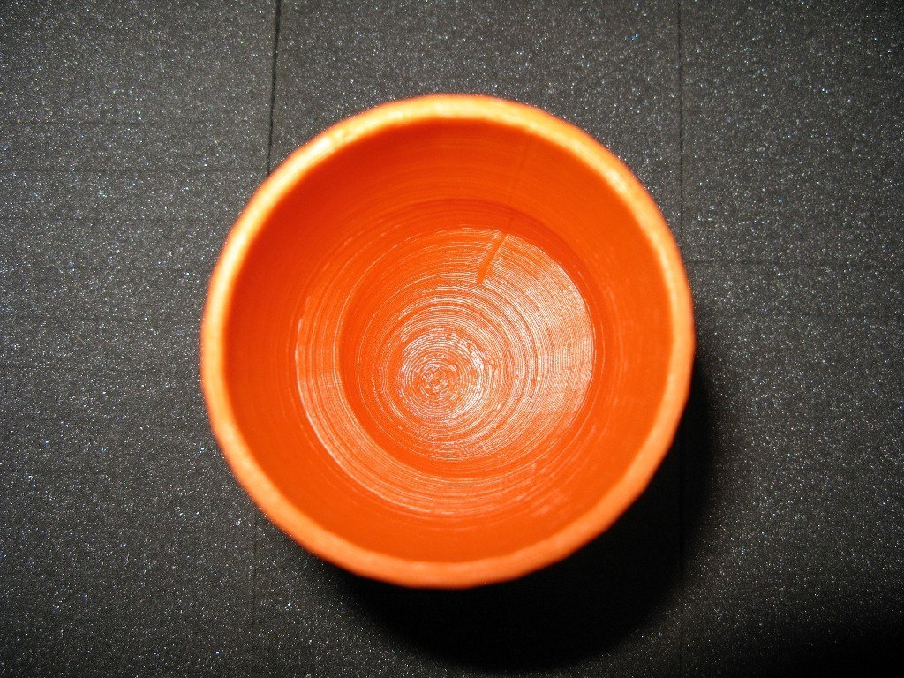

Plain Goblet
===============
**Please note: This thing is part of a list that was [automatically generated](https://github.com/carlosgs/export-things) and may have been updated since then. Make sure to check for the current license and authorship.**  

Plain Goblet  by MakeALot , published Apr 4, 2011

Description
--------
Plain Goblet - full hight of ToM build platform. 
Then a slightly bent one 
Followed by a seriously wonky one.

Instructions
--------
As your guests become more intoxicated, supply them with a more appropriate drinking vestibule - one that matches their posture. 
 
I thought of "the unstackable ones", of "the evolution of intoxication", but then everything just went cup shaped... 
 
You will need support for the most wonky one.

Files
--------

 [ WonkyGoblet.stl](WonkyGoblet.stl)  

 [ Plain_Goblet.stl](Plain_Goblet.stl)  

 [ Wonky_Goblet.stl](Wonky_Goblet.stl)  

 [ Goblet.scad](Goblet.scad)  

Pictures
--------

Tags
--------
openscad  

  

License
--------
Plain Goblet by MakeALot is licensed under the BSD License license.  

By: Mark Durbin (MakeALot)
--------
<http://NestedCube.com/>