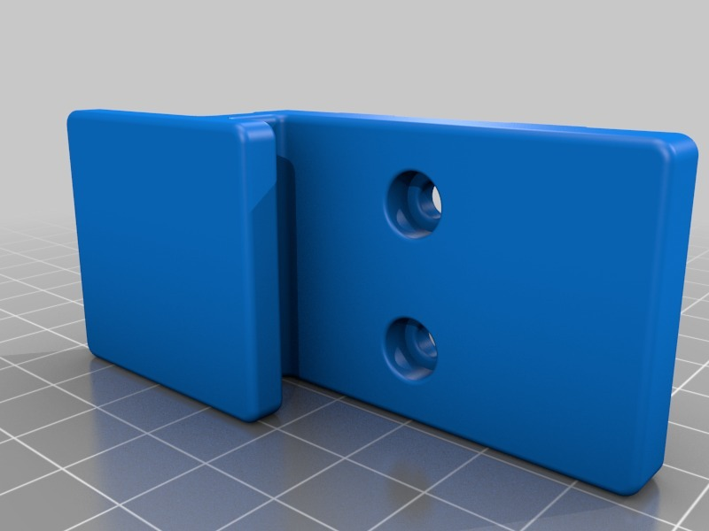
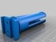
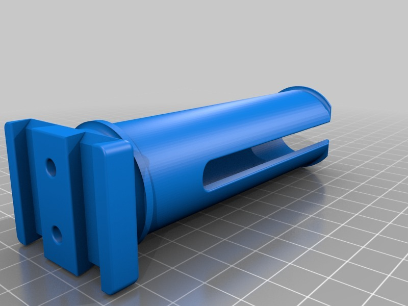
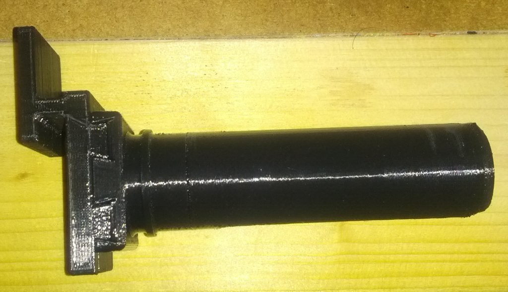
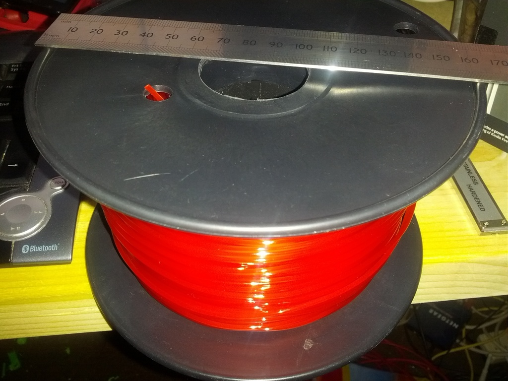
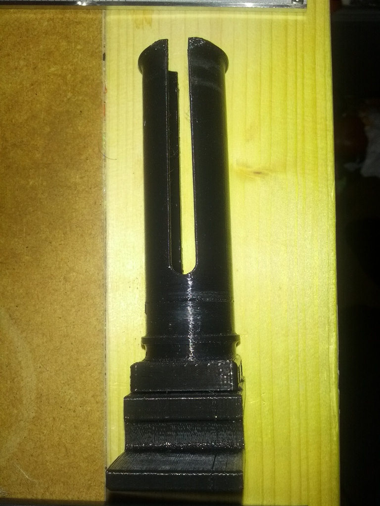

Replicator 2 small spool holder
===============
**Please note: This thing is part of a list that was [automatically generated](https://github.com/carlosgs/export-things) and may have been updated since then. Make sure to check for the current license and authorship.**  

Replicator 2 small spool holder  by MakeALot , published Nov 7, 2012

Description
--------
I've recently found some filament suppliers providing a small spool with their 1 Kg filament (approx. 90 mm x 160 mm diameter with a 35/30 mm hole).  
 
I assume these come from Europe or  China, anyway, they don't fit on the standard spool holder, so here is an additional one.

Instructions
--------
Print both parts and press together. 
 
You should find them quite a tight fit and I don't expect you'll need the screws. 
 
I made it small enough to fit the 30mm spools as well.

Files
--------

 [ SG3_Medium_Replicator2SpoolMount.zip](SG3_Medium_Replicator2SpoolMount.zip)  

 [ Replicator2SpoolMountPartB.stl](Replicator2SpoolMountPartB.stl)  

 [ Replicator2SpoolMount.thing](Replicator2SpoolMount.thing)  

 [ SG3_High_Replicator2SpoolMount.zip](SG3_High_Replicator2SpoolMount.zip)  

 [ Replicator2SpoolMountPartA.stl](Replicator2SpoolMountPartA.stl)  

Pictures
--------

Tags
--------
filament , makerbot , Replicator , Replicator2 , spindle , spool  

  

License
--------
Replicator 2 small spool holder by MakeALot is licensed under the Creative Commons - Attribution - Share Alike license.  

By: Mark Durbin (MakeALot)
--------
<http://NestedCube.com/>