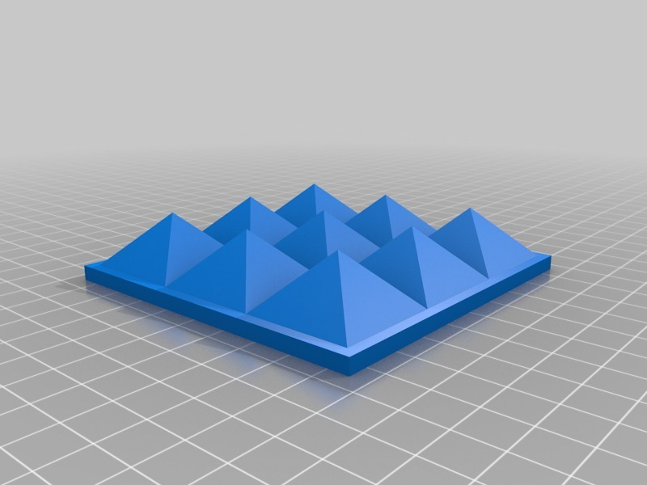
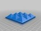
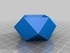
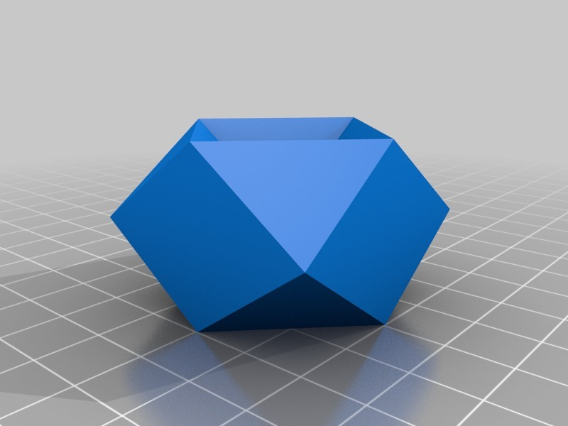
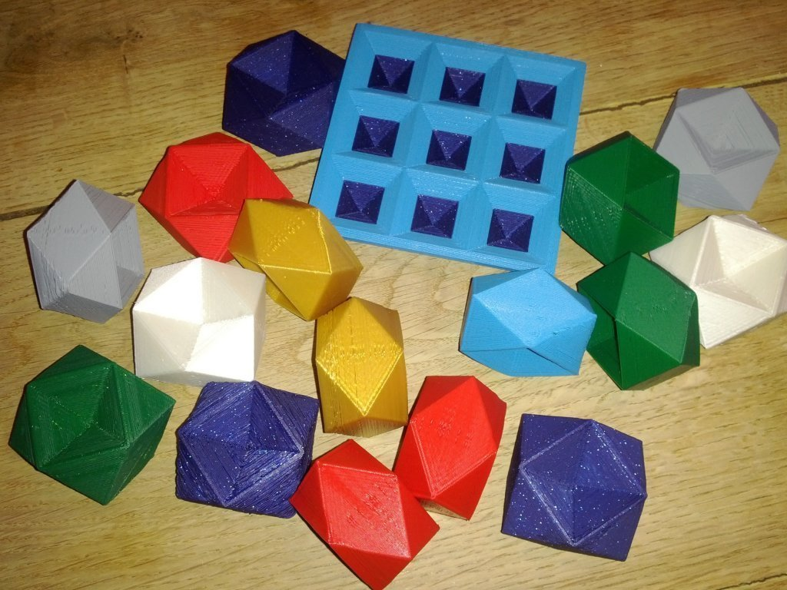
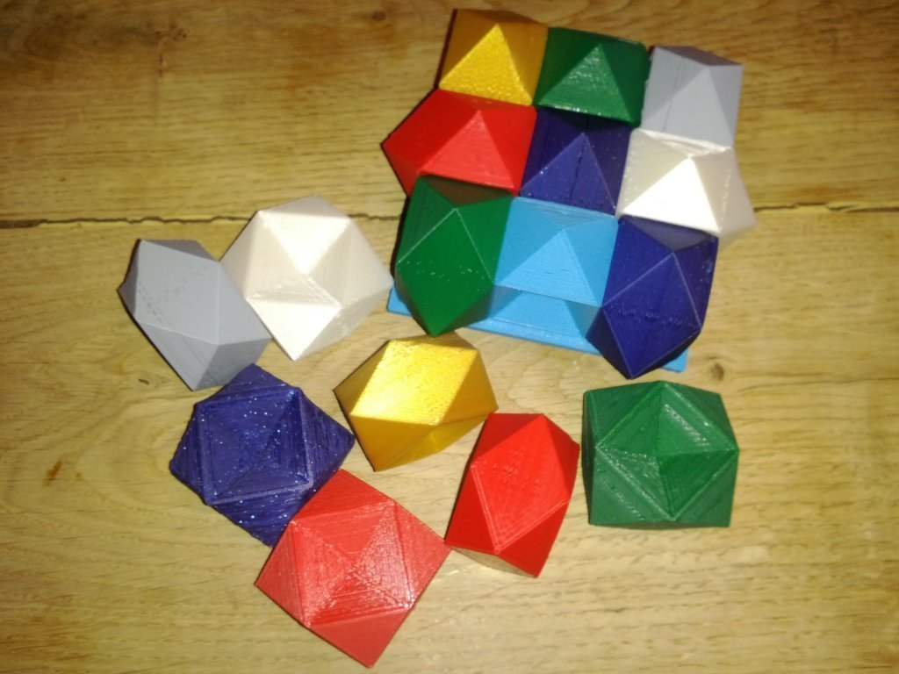
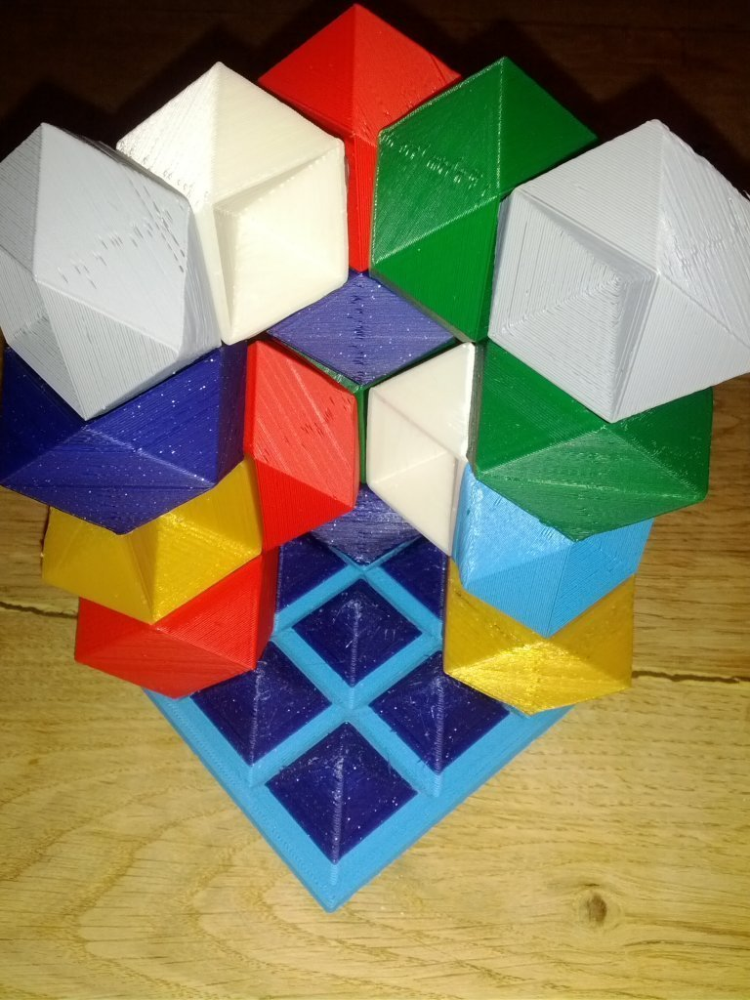
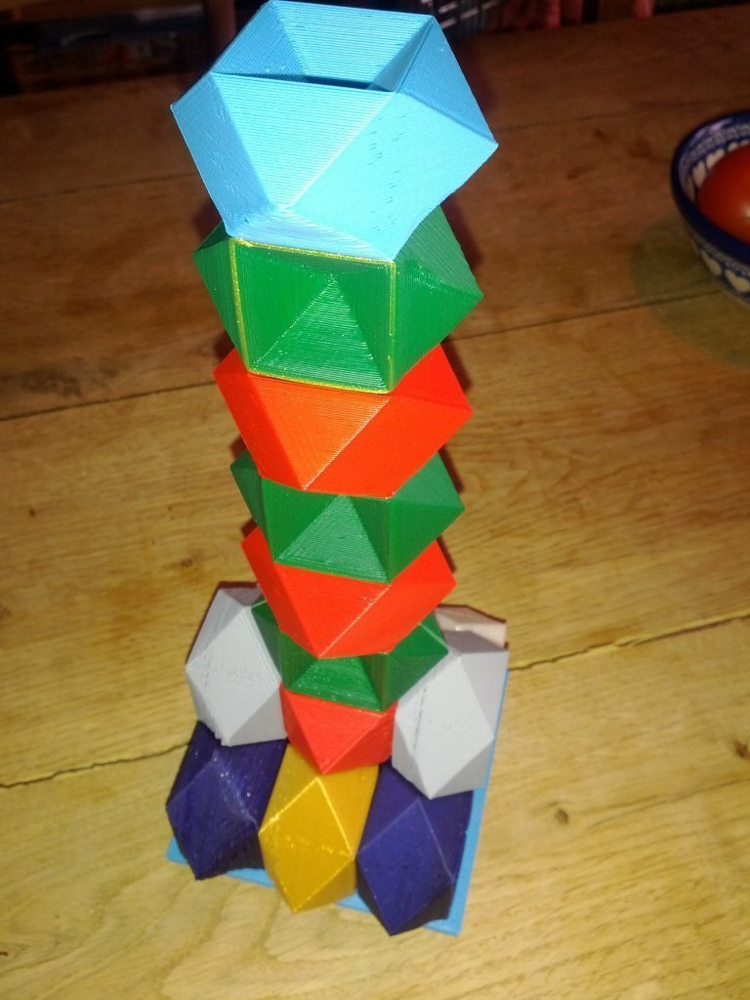

Rhombic dodecahemioctahedron play set
===============
**Please note: This thing is part of a list that was [automatically generated](https://github.com/carlosgs/export-things) and may have been updated since then. Make sure to check for the current license and authorship.**  

Rhombic dodecahemioctahedron play set  by MakeALot , published Mar 4, 2012

Description
--------
A few things drove me to make this play set: 
 
I love the way these shapes fit together. 
 
I needed to get PLA printing correctly on my extended machine as I have increased the build surface without increasing the size of the heater PCB. 
 
I needed a test piece for calibration and testing. 
 
In December, I received a sample set of coloured PLA from Faberdashery and I wanted to make something that showed off the range of colours without needing too much of any particular one. 
 
Each individual piece is difficult to print because of the 45 degree angles, the small corners which tend to curl up if not cooled sufficiently and the initial surface contact with the build platform. 
 
I already have a lot of 20mm cubes...

Instructions
--------
Print the base and then every time you have a spare meter or two of filament, print a new piece and add it to the stack. 
 
You can stack them without a base, but it keeps them nicely together. 
 
I'm sure it wouldn't take much to invent a game where you and an opponent had to get say three touching faces of the same colour at different levels, similar to 3D noughts and crosses (tic-tak-toe). 

Files
--------

 [ RhombicDodecahemioctahedronBase.stl](RhombicDodecahemioctahedronBase.stl)  

 [ RhombicDodecahemioctahedron.stl](RhombicDodecahemioctahedron.stl)  

Pictures
--------

Tags
--------
calibration , Dodecahemioctahedron , faberdashery , Play_Set , polyhedron , test , toy  

  

License
--------
Rhombic dodecahemioctahedron play set by MakeALot is licensed under the Creative Commons - Attribution license.  

By: Mark Durbin (MakeALot)
--------
<http://NestedCube.com/>