Set of Dominoes for printing
===============
**Please note: This thing is part of a list that was [automatically generated](https://github.com/carlosgs/export-things) and may have been updated since then. Make sure to check for the current license and authorship.**  

Set of Dominoes for printing  by MakeALot , published Jun 27, 2011

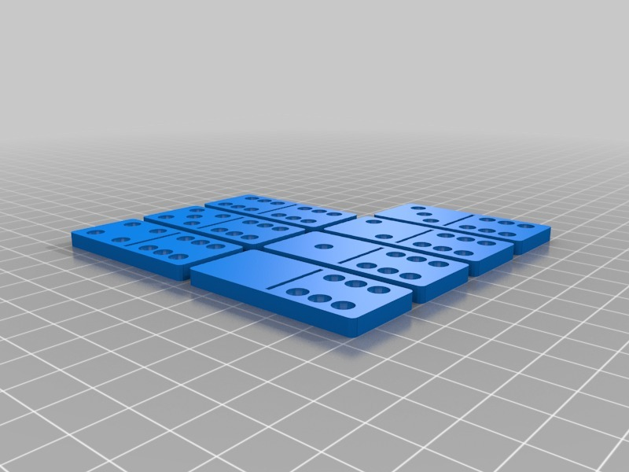

Description
--------
My son wanted to play dominoes and we found our set had one card missing. I looked on Thingiverse and only found a laser cut version <a href="http://www.thingiverse.com/thing:512" target="_blank" rel="nofollow">thingiverse.com/thing:512</a> So I made a set for my ToM. 
 
4 plates of Dominoes making a 6 dot set. 
 
Although I created this yesterday, I didn't publish it until today, I notice in the meantime that Joerg has created another set <a href="http://www.thingiverse.com/thing:9652" target="_blank" rel="nofollow">thingiverse.com/thing:9652</a>.  Great minds think alike Joerg! 
 
Now you have a choice...

Instructions
--------
Print each set and play. 
 
These are scaled for a 100mm x 100mm print size change SCAD file line to resize them. 
setIndex, dotSize, dotSpace, thickness 
 
<b>set(setNumber,2.5,6,4);</b> 
 
If you want to use these for Domino Rally, you should increase the thickness to about 6mm to give yourself a chance to get them standing. 
 
Dominoes is a common Pub game in the UK (although it's dying out) there are several variants of play, my son and I play 5s &amp; 3s. If you'd like to know the rules <a href="http://www.pagat.com/tile/wdom/fives_and_threes.html" target="_blank" rel="nofollow">pagat.com/tile/wdom/fives_and_threes.html</a> is a good introduction. 
 
<big><b>Update:</b></big> 
I have added a set that go up to 9 dots for those who'd like more than 6.

Files
--------
[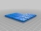](DominoSet3.stl)
 [ DominoSet3.stl](DominoSet3.stl)  

 [ DominoSet9_6.stl](DominoSet9_6.stl)  

[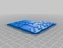](DominoSet2.stl)
 [ DominoSet2.stl](DominoSet2.stl)  

[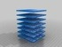](DominoSet9.stl)
 [ DominoSet9.stl](DominoSet9.stl)  

[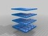](Dominoes.stl)
 [ Dominoes.stl](Dominoes.stl)  

[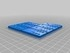](DominoSet1.stl)
 [ DominoSet1.stl](DominoSet1.stl)  

[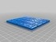](DominoSet9_5.stl)
 [ DominoSet9_5.stl](DominoSet9_5.stl)  

[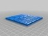](DominoSet9_4.stl)
 [ DominoSet9_4.stl](DominoSet9_4.stl)  

 [ DominoSet4.stl](DominoSet4.stl)  

[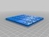](DominoSet9_0.stl)
 [ DominoSet9_0.stl](DominoSet9_0.stl)  

 [ Dominoes.scad](Dominoes.scad)  

[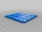](DominoSet9_2.stl)
 [ DominoSet9_2.stl](DominoSet9_2.stl)  

 [ DominoSet9_3.stl](DominoSet9_3.stl)  

[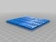](DominoSet9_1.stl)
 [ DominoSet9_1.stl](DominoSet9_1.stl)  

Pictures
--------
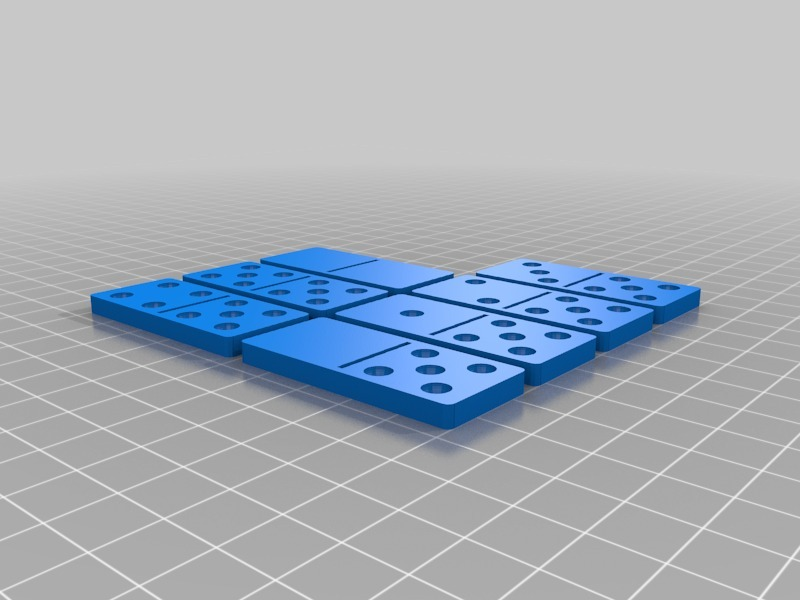

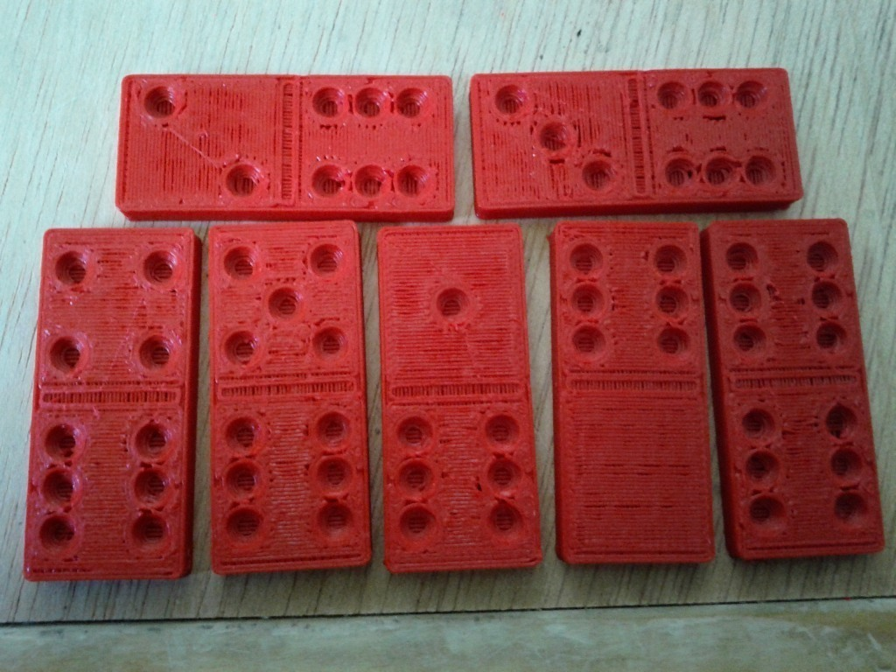
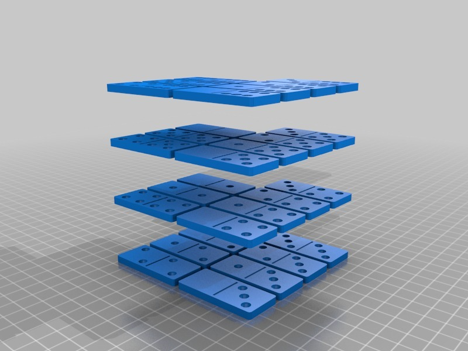
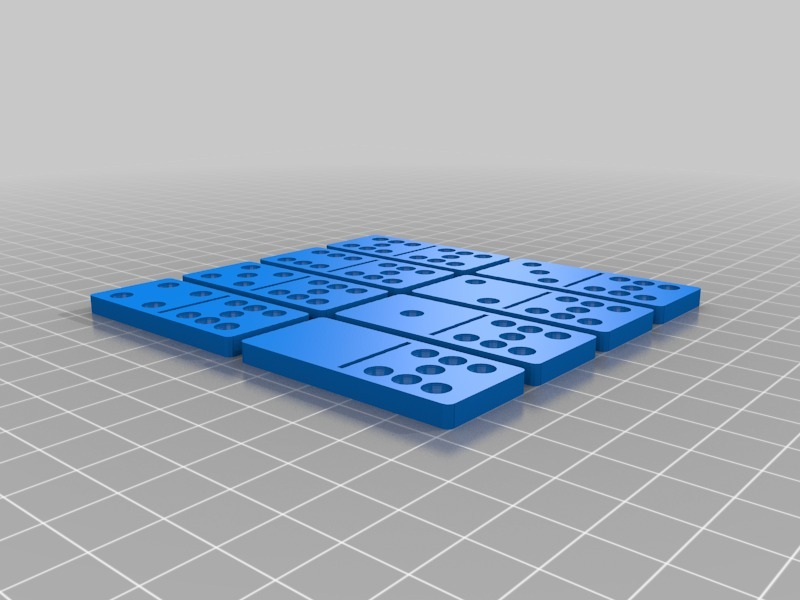

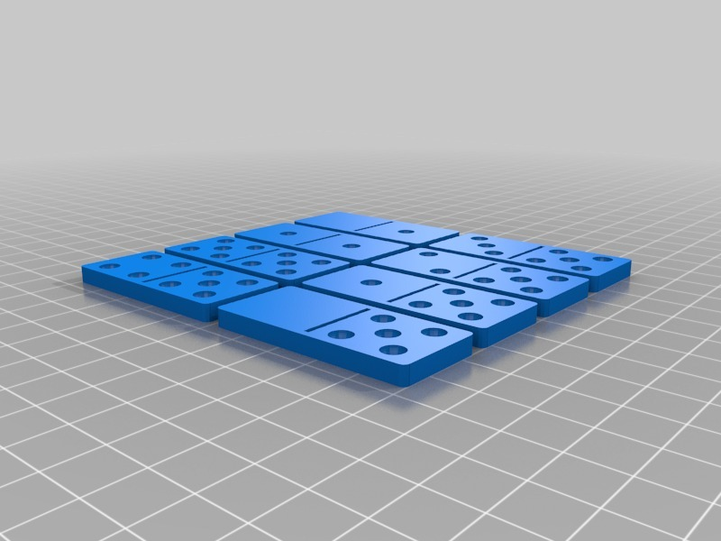
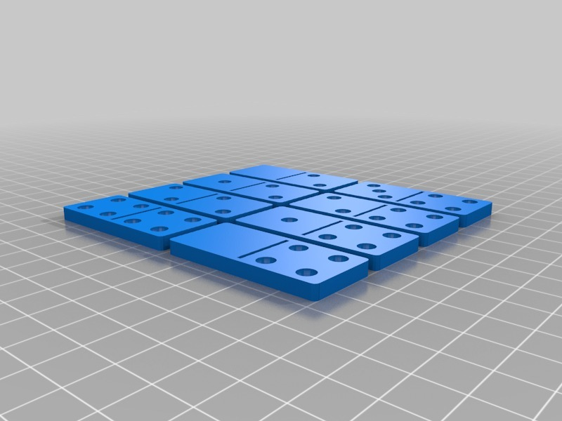
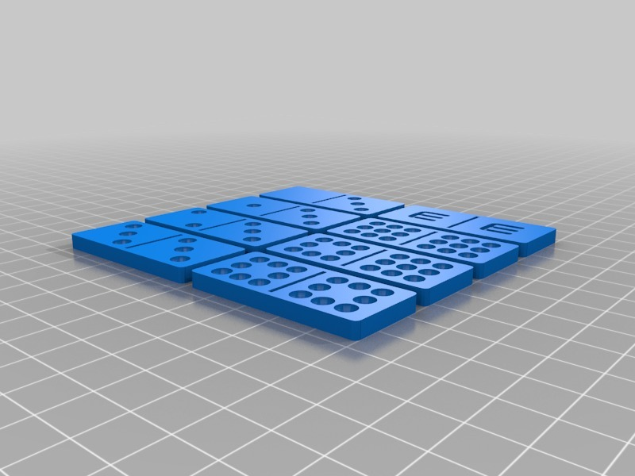

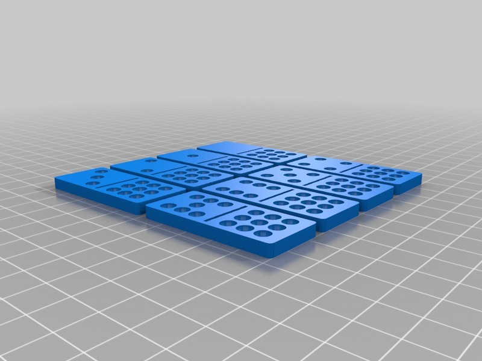
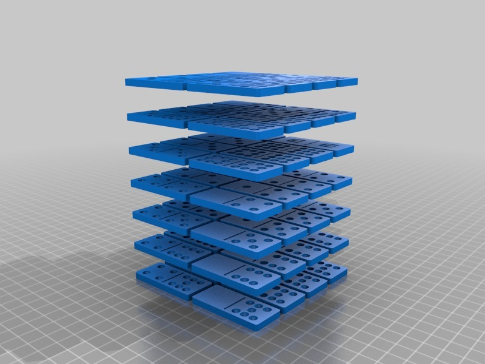

Tags
--------
Domino , Dominoes , Dominos , Not Pizza , openscad  

  

License
--------
Set of Dominoes for printing by MakeALot is licensed under the Creative Commons - Attribution license.  

By: Mark Durbin (MakeALot)
--------
<http://NestedCube.com/>