Spiral Cup II
===============
**Please note: This thing is part of a list that was [automatically generated](https://github.com/carlosgs/export-things) and may have been updated since then. Make sure to check for the current license and authorship.**  

Spiral Cup II  by MakeALot , published Mar 10, 2011

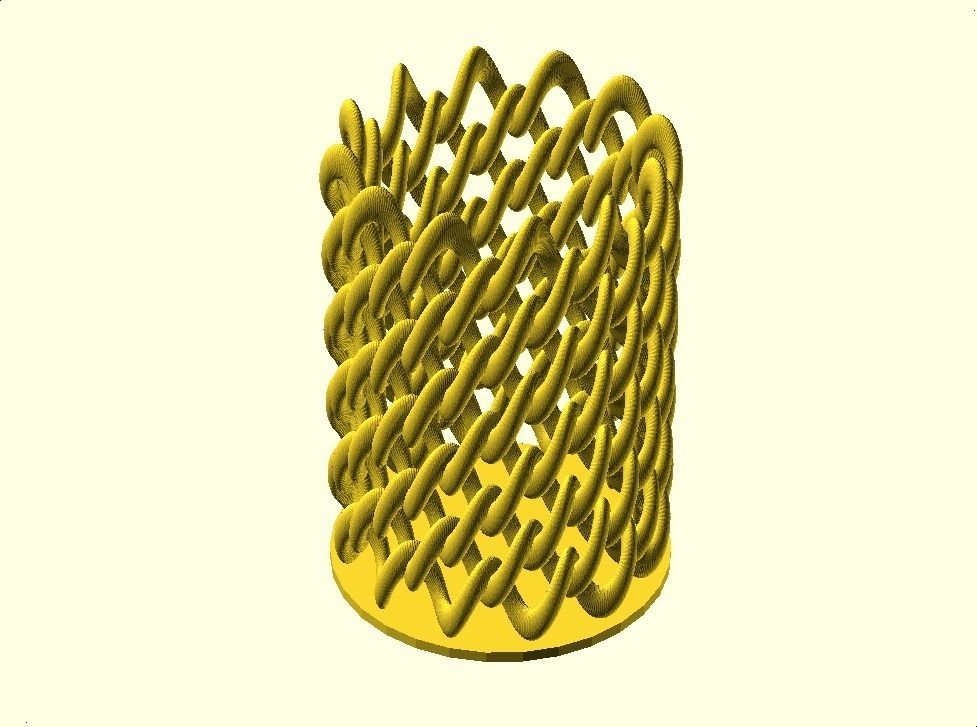

Description
--------
Another Spiral Cup, this one with the links going around the cup

Instructions
--------
Generate an STL using a Mac and then print 
 
<b>Update</b> 
I created a simplified version so that I could generate the STL file, it's a little too large to print, please scale by 0.75 to fit the build platform of a Makerbot. 
 
I also moved the loop up to the mid point to reduce the overhang (that's the blue one printed) 
 
I've tried to use parameters for everything you might want to change: 
 
<b>axisRotation</b> the number of times around the top of the torus 
<b>radialRotation</b> the number of times rotated into the hole in the torus 
<b>baseHeight</b> height of the plinth (0 for no plinth) 
<b>numberOfSpheres</b> number of spheres used to complete the knot 
<b>sphereQuality</b> the larger the number, the lower the quality see $fs 
<b>majorRadius</b> the major radius of the torus 
<b>minorRadius</b> the minor radius of the torus 
<b>sphereSize</b> the size of each dot in the knot 
<b>cupHeight</b> number of links high 
<b>vStretchFor3dPrint</b> how much to stretch it up to help with overhang 
<b>printWidthInMM</b> the width you'd like the finished item to be in millimetres 
 
This is based on the Parametric Knot thing I made previously, ...and the bracelet thing (notice a theme, I promise I'll stop soon :) 
 
I had to do the knot thing before I could produce the cup I wanted, and it turned out nicely, so I published it.

Files
--------
[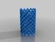](LinkCupII_Simplified.stl)
 [ LinkCupII_Simplified.stl](LinkCupII_Simplified.stl)  

[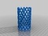](linkCupII_Simple.stl)
 [ linkCupII_Simple.stl](linkCupII_Simple.stl)  

[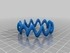](linkCupII_Full.stl)
 [ linkCupII_Full.stl](linkCupII_Full.stl)  

 [ linkCup2.scad](linkCup2.scad)  

[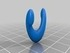](linkCupII_Part.stl)
 [ linkCupII_Part.stl](linkCupII_Part.stl)  

 [ linkCupII_Half_Simple.stl](linkCupII_Half_Simple.stl)  

 [ linkCupII.scad](linkCupII.scad)  

Pictures
--------
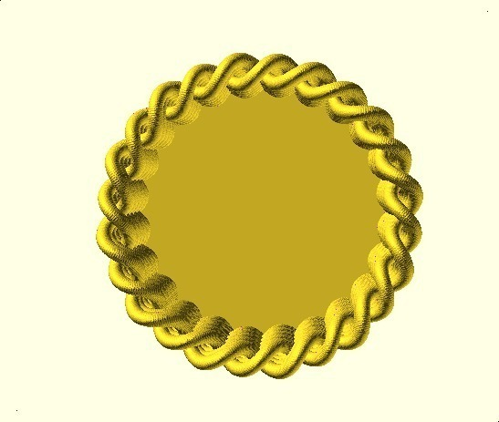
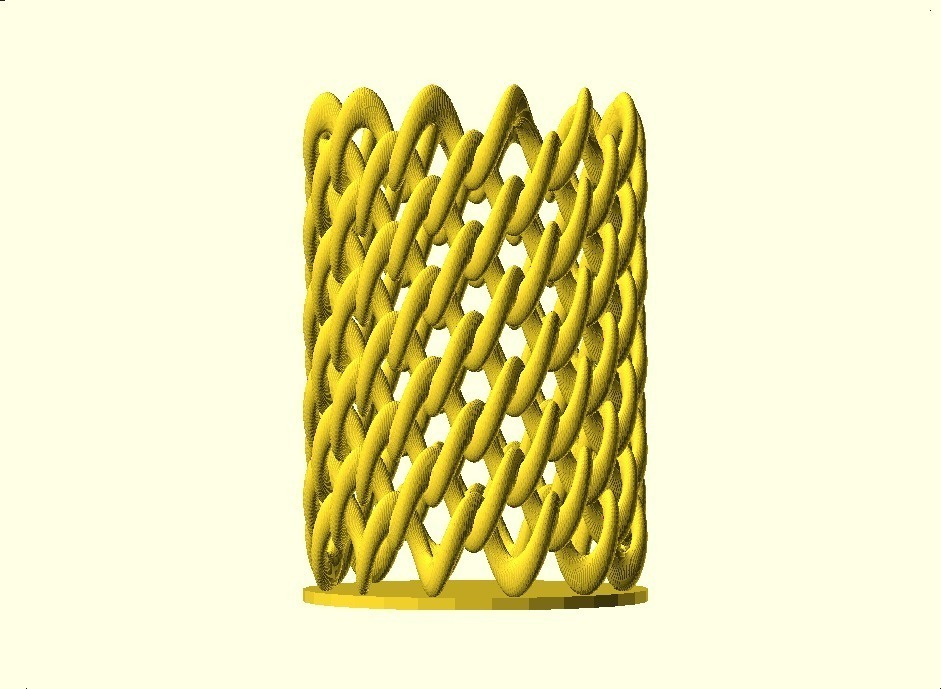
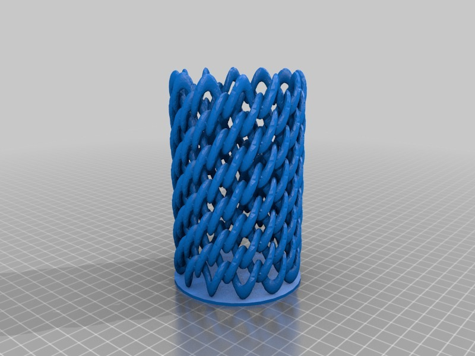
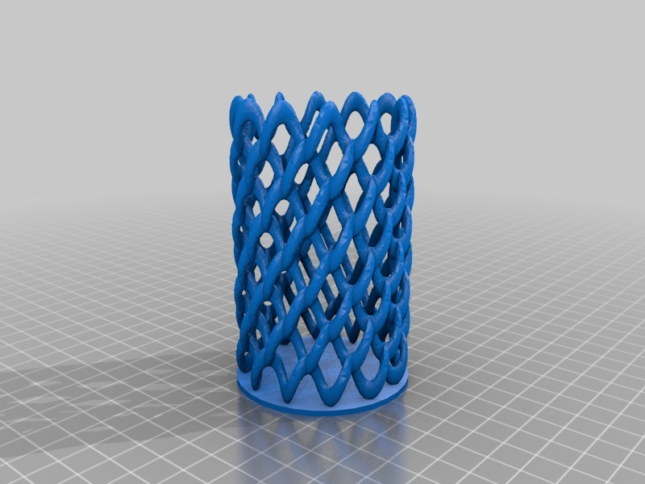
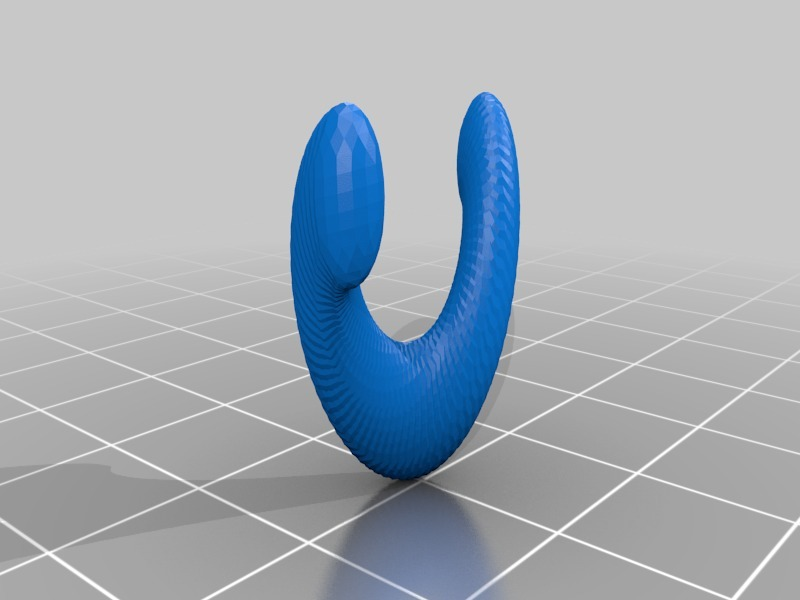
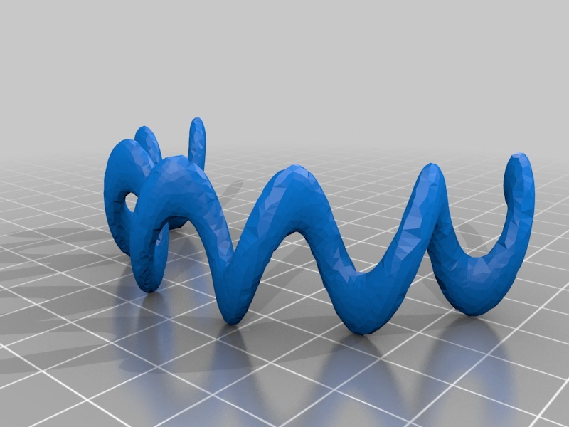
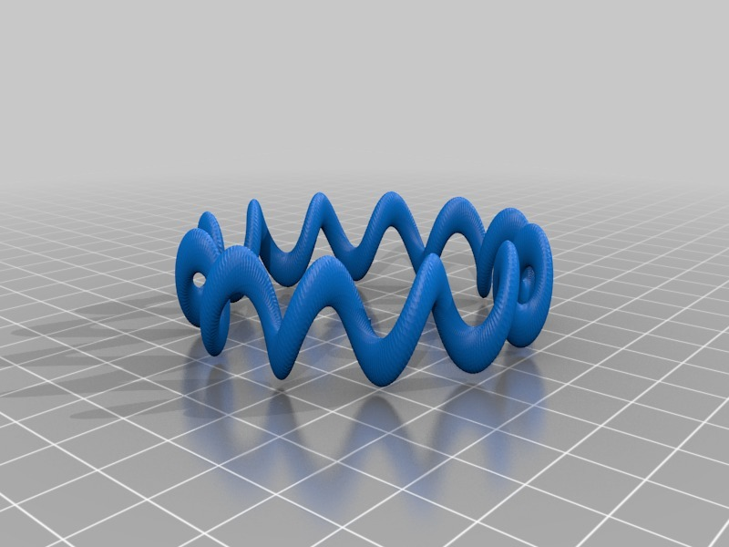
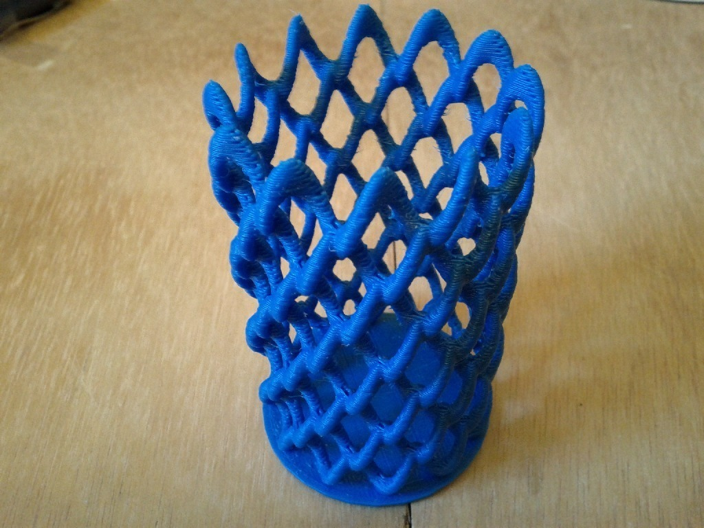
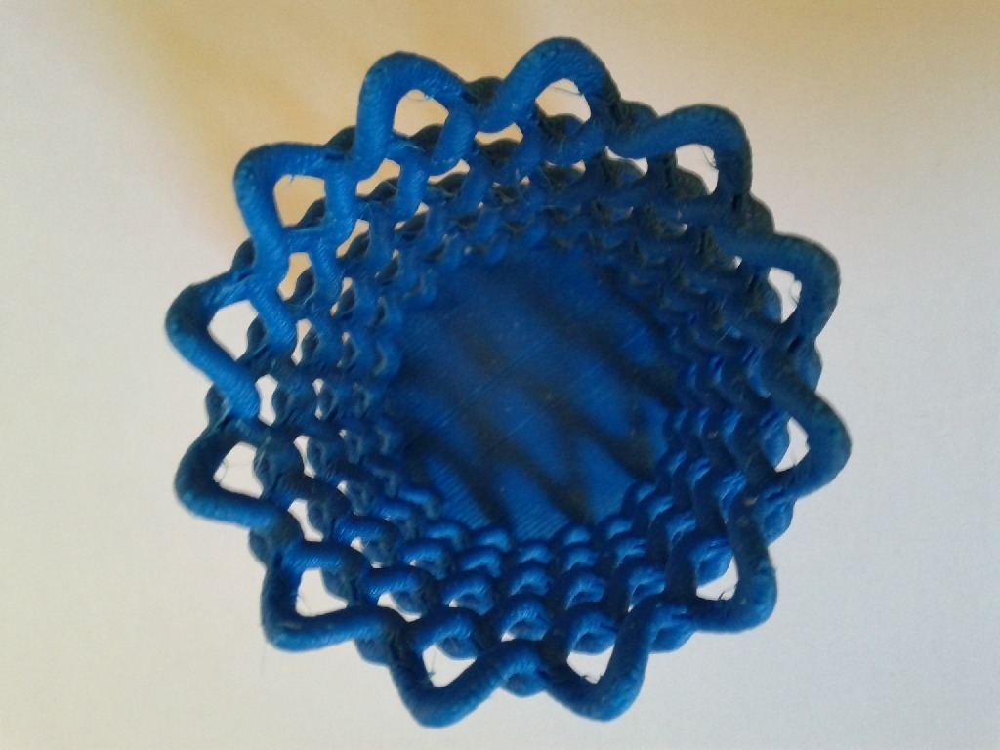

Tags
--------
cup , openscad , pencil , spiral  

  

License
--------
Spiral Cup II by MakeALot is licensed under the BSD License license.  

By: Mark Durbin (MakeALot)
--------
<http://NestedCube.com/>