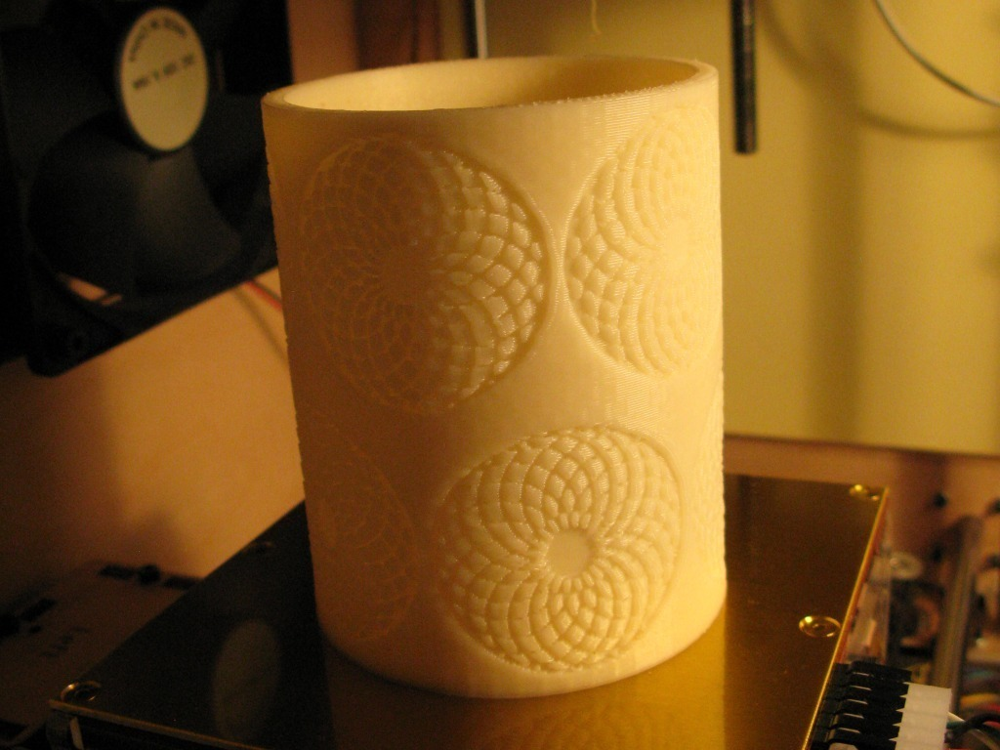
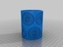
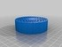
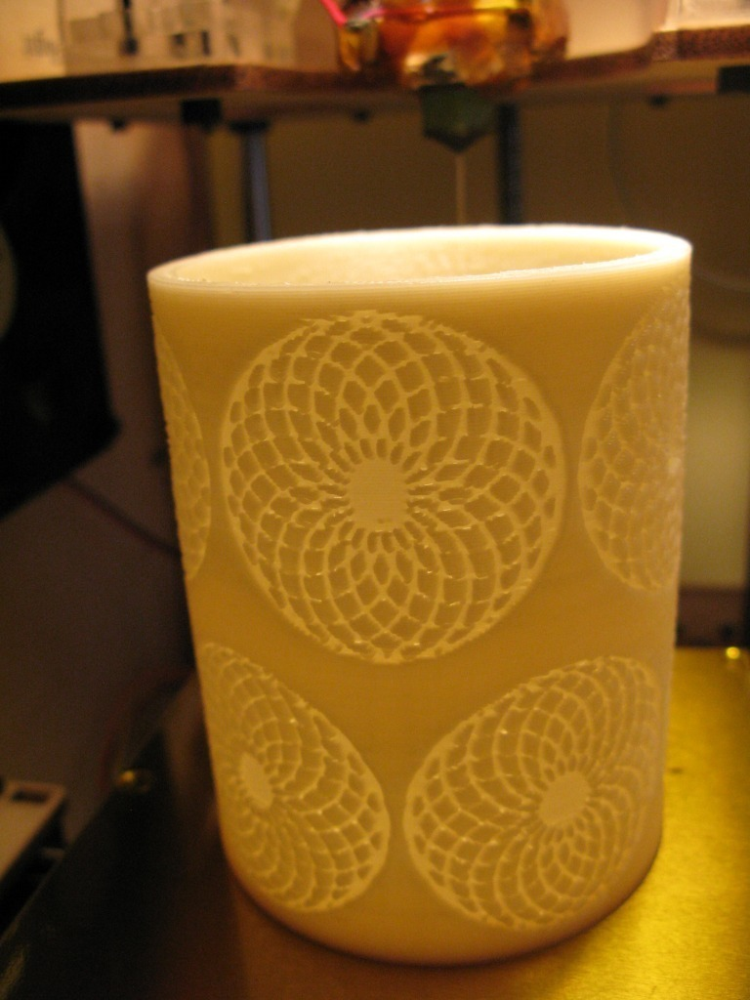
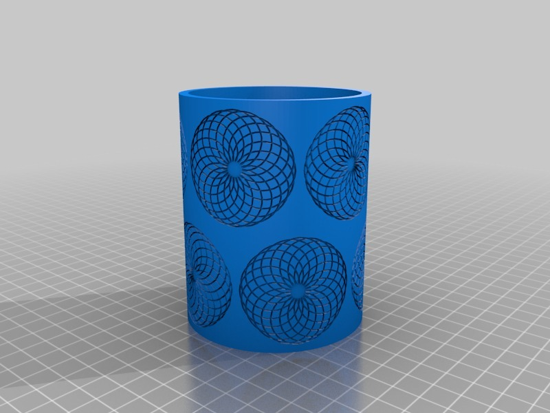
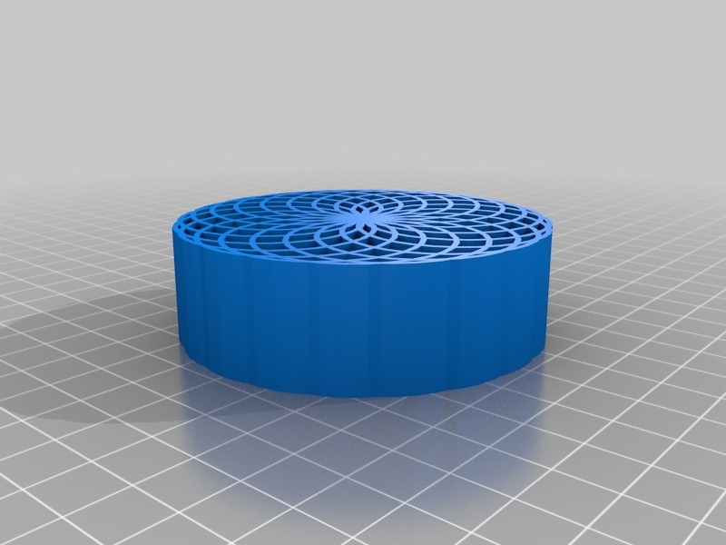

Spiropot
===============
**Please note: This thing is part of a list that was [automatically generated](https://github.com/carlosgs/export-things) and may have been updated since then. Make sure to check for the current license and authorship.**  

Spiropot  by MakeALot , published May 28, 2011

Description
--------
Pot embossed with Spiro-graph pattern

Instructions
--------
fill with stuff

Files
--------

 [ SpiroPot.stl](SpiroPot.stl)  

 [ onespiro.stl](onespiro.stl)  

Pictures
--------

Tags
--------
art , spirograph  

  

License
--------
Spiropot by MakeALot is licensed under the Creative Commons - Attribution license.  

By: Mark Durbin (MakeALot)
--------
<http://NestedCube.com/>