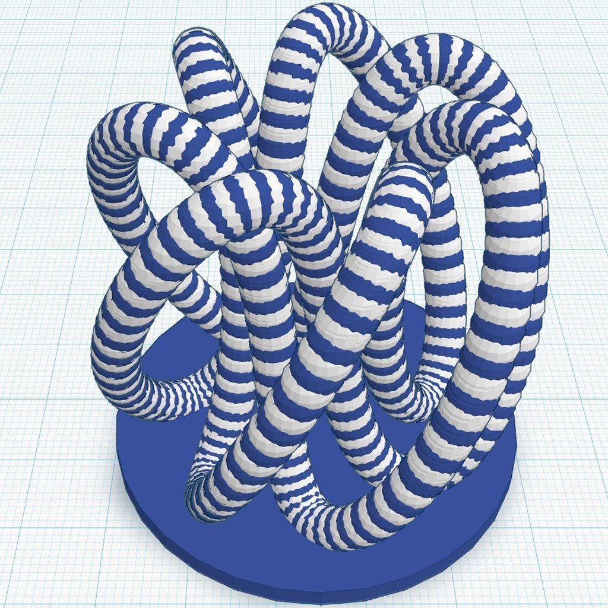
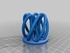
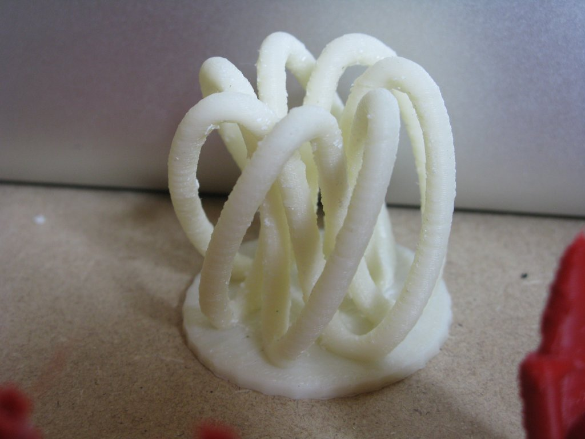
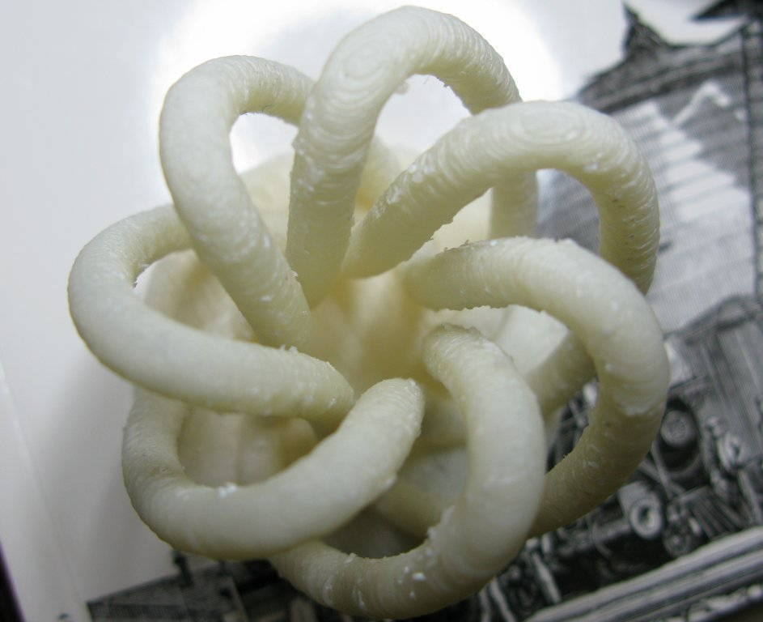
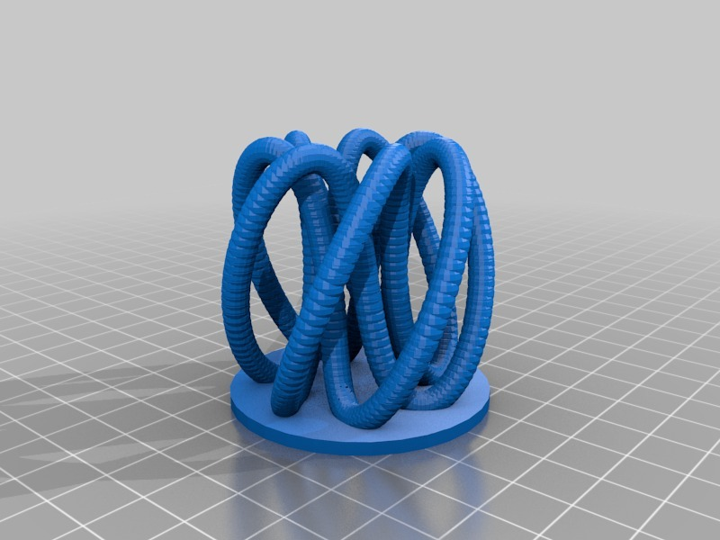

Striped 73 Knot
===============
**Please note: This thing is part of a list that was [automatically generated](https://github.com/carlosgs/export-things) and may have been updated since then. Make sure to check for the current license and authorship.**  

Striped 73 Knot  by MakeALot , published Apr 5, 2012

Description
--------
This thing was made with Tinkercad. Edit it online <a href="https://tinkercad.com/things/iRA415vVz1E" target="_blank" rel="nofollow">tinkercad.com/things/iRA415vVz1E</a> 
 
For anyone using Jetty's firmware, this was printed at 100mm/s on a MakerBot Thing-o-Matic

Instructions
--------
I'm afraid I can only print it in one colour :'( 
But at least I can print it :) 
 

Files
--------

 [ striped_73_knot.stl](striped_73_knot.stl)  

Pictures
--------

Tags
--------
knot , TinkerCAD  

  

License
--------
Striped 73 Knot by MakeALot is licensed under the Creative Commons - Attribution license.  

By: Mark Durbin (MakeALot)
--------
<http://NestedCube.com/>