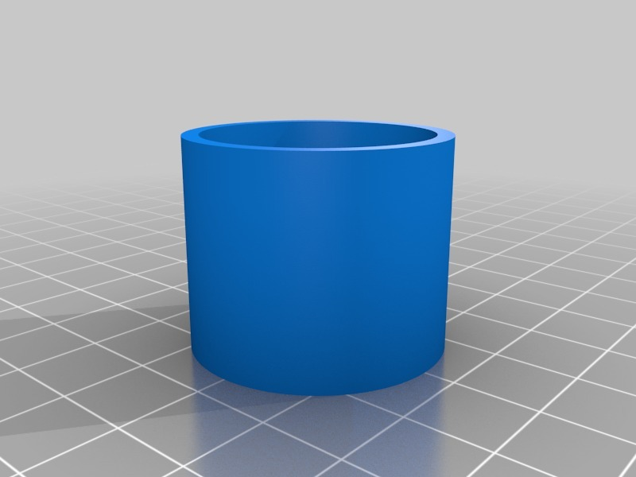
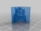
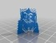
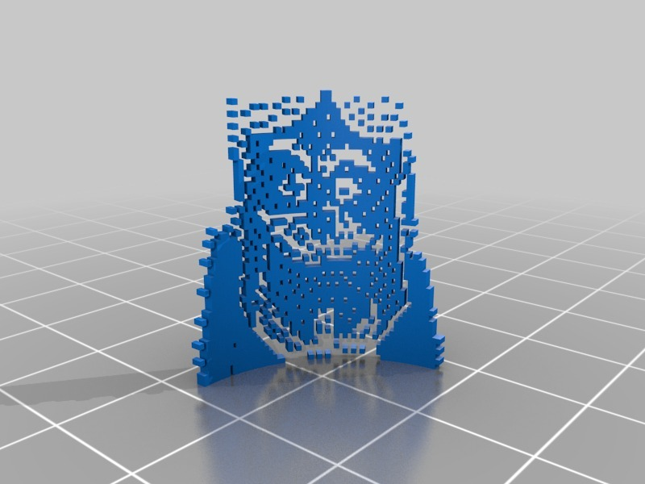
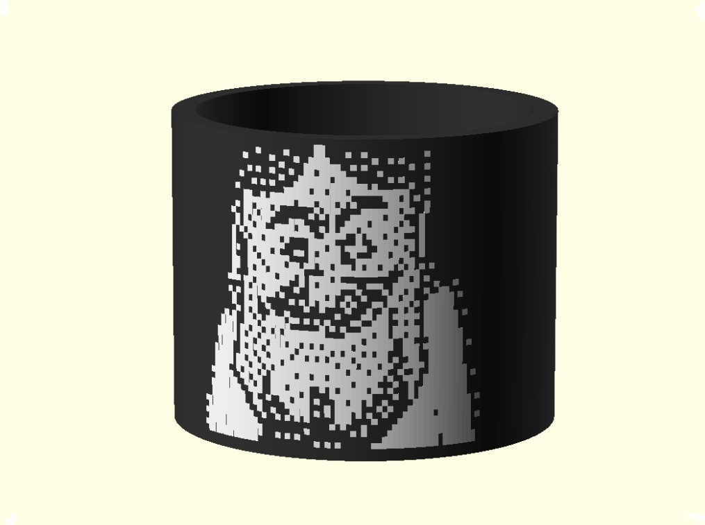
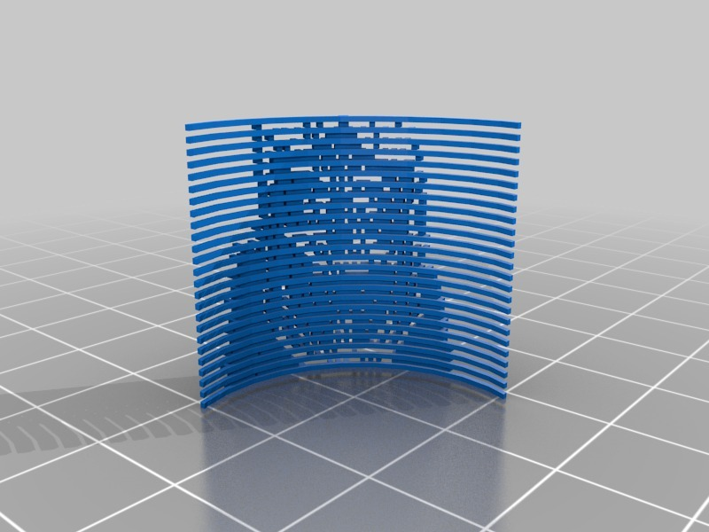
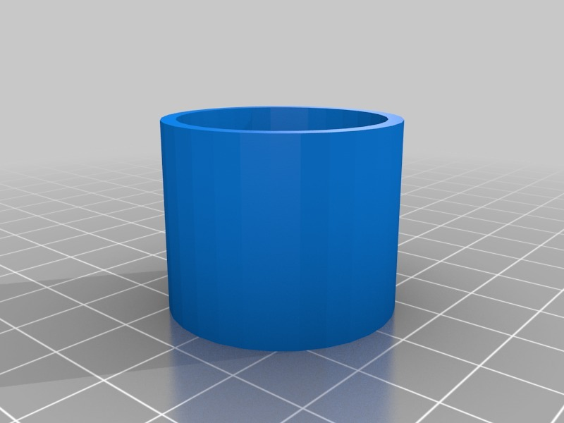

TBuser Icon test Pot
===============
**Please note: This thing is part of a list that was [automatically generated](https://github.com/carlosgs/export-things) and may have been updated since then. Make sure to check for the current license and authorship.**  

TBuser Icon test Pot  by MakeALot , published Oct 3, 2011

Description
--------
Test dual colour printing with this Icon-ic test pot

Instructions
--------
Print on dual filament printer...

Files
--------

 [ TBuserCartoonPotD.stl](TBuserCartoonPotD.stl)  

 [ TBuserCartoonPotA.stl](TBuserCartoonPotA.stl)  

 [ TBuserCartoonPot.scad](TBuserCartoonPot.scad)  

 [ TBuserCartoonPotC.stl](TBuserCartoonPotC.stl)  

 [ TBuserCartoonPotB.stl](TBuserCartoonPotB.stl)  

Pictures
--------

Tags
--------
2color , dual , openscad  

  

License
--------
TBuser Icon test Pot by MakeALot is licensed under the Creative Commons - Attribution license.  

By: Mark Durbin (MakeALot)
--------
<http://NestedCube.com/>