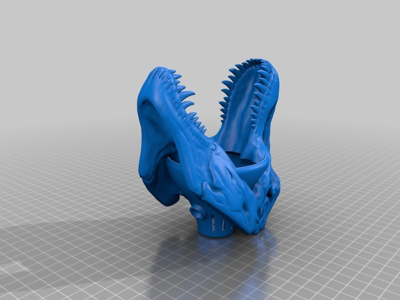
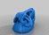
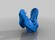
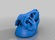
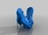
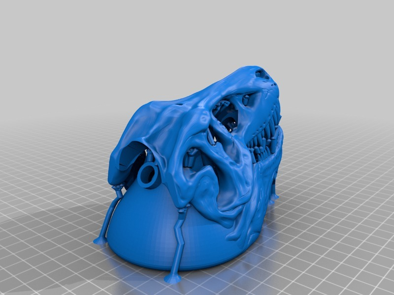
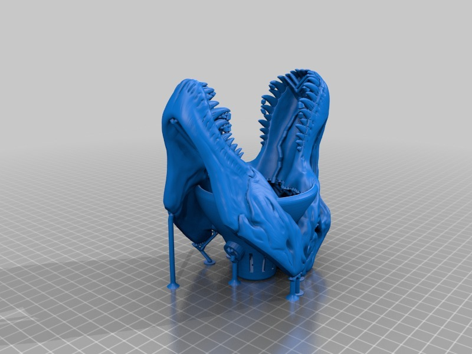
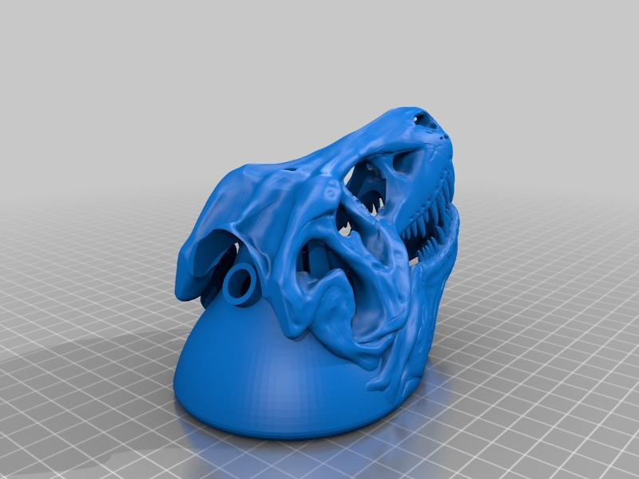

TRexo Junior
===============
**Please note: This thing is part of a list that was [automatically generated](https://github.com/carlosgs/export-things) and may have been updated since then. Make sure to check for the current license and authorship.**  

TRexo Junior  by MakeALot , published May 12, 2014

Description
--------
T-Rex Head on Junior-Luxo lamp   
 
I think it would look good with little arms :)   
 
You can chose from either the closed mouth looking ahead or the light coming from the mouth version.   
 
Print the rest of the parts from the original Snap Together Mini Lamp.   
 
Obviously, if you put a light in it, make sure it is a low heat source like a LED. Otherwise you'll have a melted Junior Rex Luxo lamp fire - which might make a good B movie.

Instructions
--------
None

Files
--------

 [ T-RexSkull_LuxoMMSupports.stl](T-RexSkull_LuxoMMSupports.stl)  

 [ T-RexSkull_LuxoOpen.stl](T-RexSkull_LuxoOpen.stl)  

 [ T-RexSkull_Luxo.stl](T-RexSkull_Luxo.stl)  

 [ T-RexSkull_LuxoOpenMMSupports.stl](T-RexSkull_LuxoOpenMMSupports.stl)  

Pictures
--------

Tags
--------
asdfa , TRexRemix  

  

License
--------
TRexo Junior by MakeALot is licensed under the Creative Commons - Attribution license.  

By: Mark Durbin (MakeALot)
--------
<http://NestedCube.com/>