Tardis with doors
===============
**Please note: This thing is part of a list that was [automatically generated](https://github.com/carlosgs/export-things) and may have been updated since then. Make sure to check for the current license and authorship.**  

Tardis with doors  by MakeALot , published Nov 19, 2012

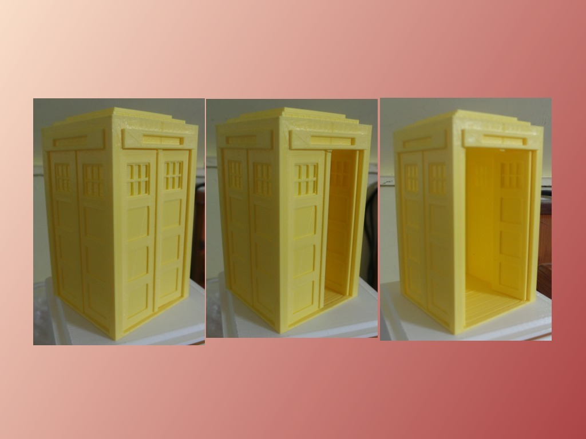

Description
--------
A Tardis with movable doors. 
 
Yes, I know only one is supposed to move, but the intention is to have them opening outward and then put some of my stacking drawers in it. 
 
I printed this 50% scale to test it worked and it looked so nice that I thought I'd upload it for all. 
 
I did search for Tardis, but I found so many results that this may be a duplicate of someone else's effort, sorry, let me know and I'll include a link here. 
 
I also thought about making Tardis Matryoshka dolls, but each inner model would have to be bigger than its container - needs more thought...

Instructions
--------
The door lugs are a little long, trim the top one straight and the botton one at a slight angle to help you slide it into place ( bend the door sightly to insert it) 
 
I will now model the one with the doors opening out and insert the draw supports. 
 
I've added a light for the top now, I may make an LED attachment at some point. 
 
There's a little support under one of the doors that will need to be trimmed off if you print it full size.  When I printed it at 50% it didn't get printed and the door still came out fine. 
 
Oh and obviously, don't print it in yellow! 
 
Update: added a back panel as suggested by MichaelAtOz 
I've also added a new model with features on the back, but I haven't printed it yet.

Files
--------
[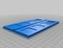](Doors.stl)
 [ Doors.stl](Doors.stl)  

[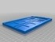](Back_Panel.stl)
 [ Back_Panel.stl](Back_Panel.stl)  

[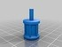](Light.stl)
 [ Light.stl](Light.stl)  

[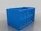](Main_Body_with_Back.stl)
 [ Main_Body_with_Back.stl](Main_Body_with_Back.stl)  

[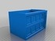](Main_Body.stl)
 [ Main_Body.stl](Main_Body.stl)  

Pictures
--------
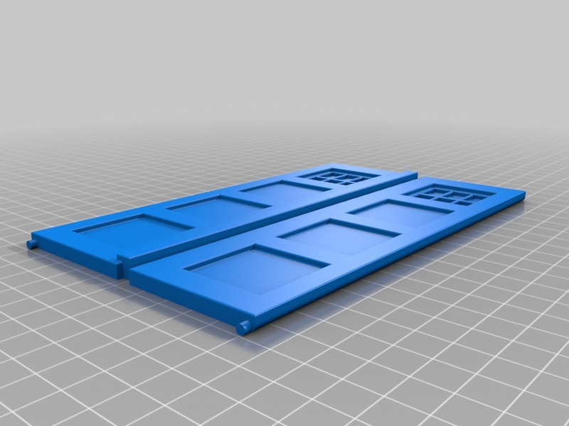
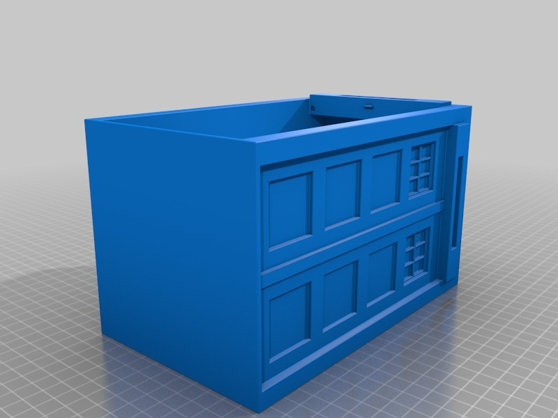
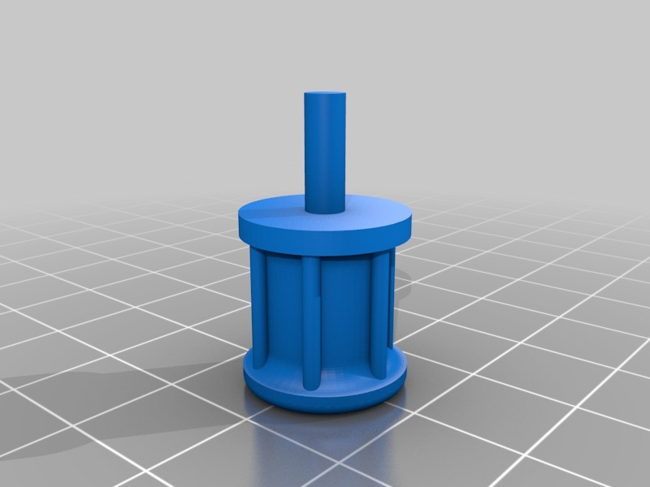
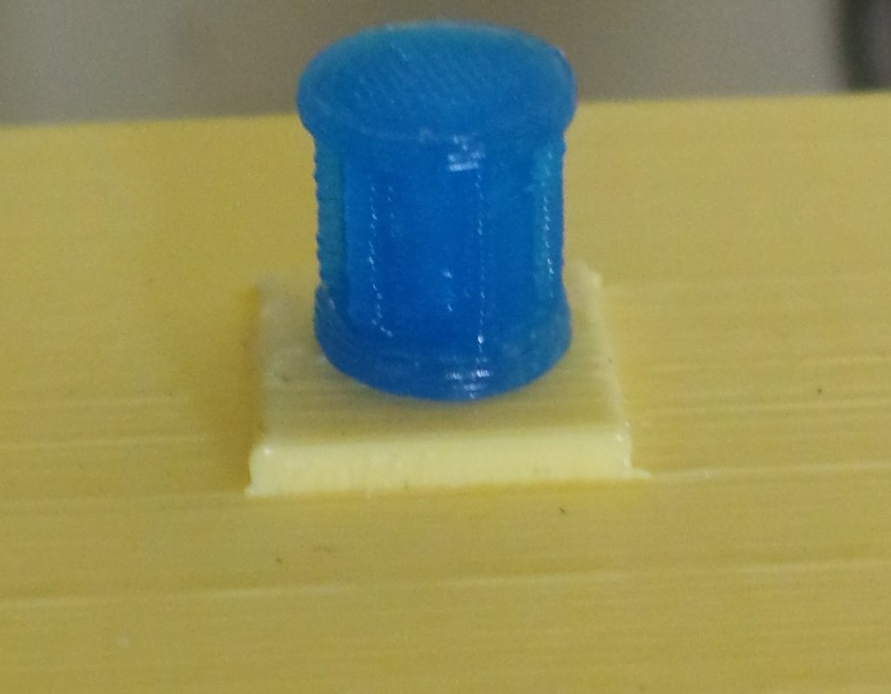
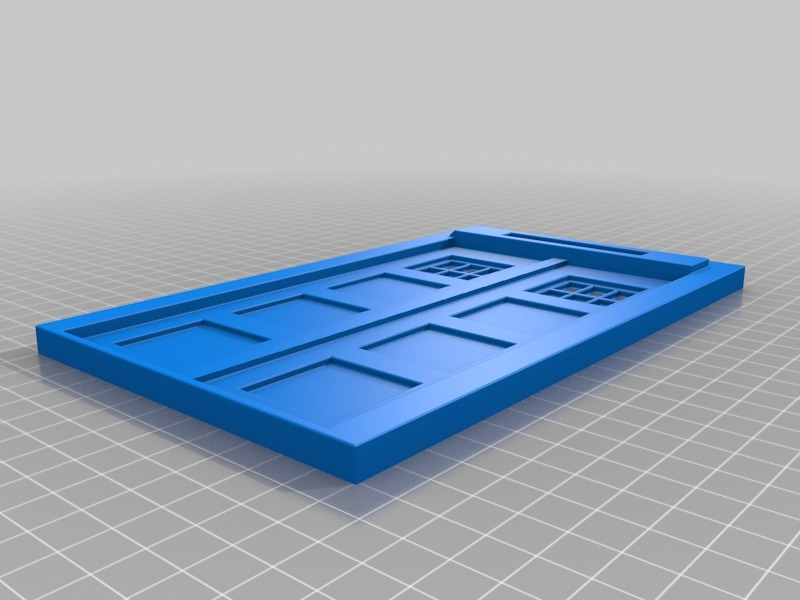
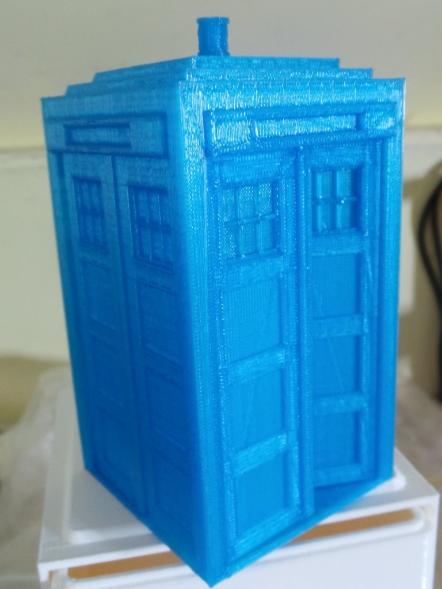
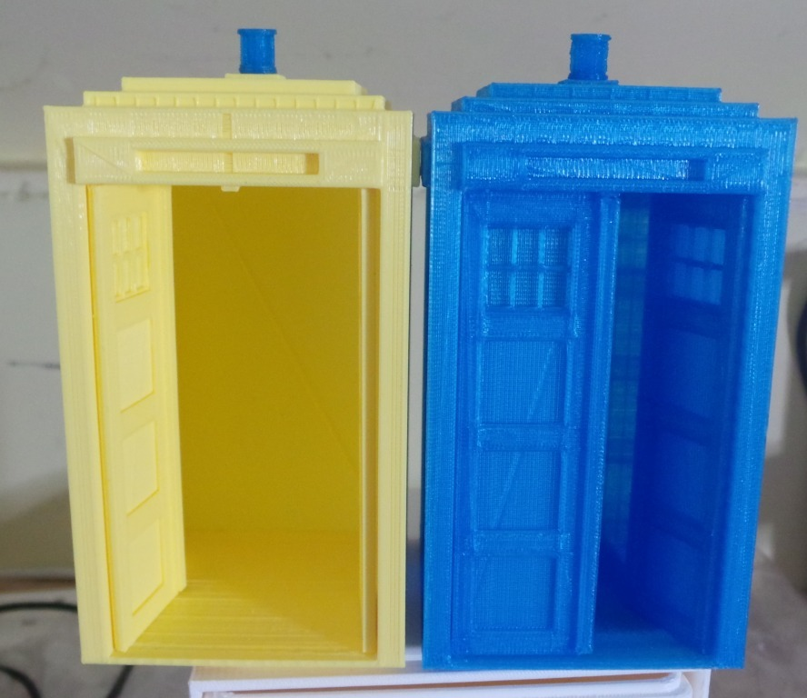
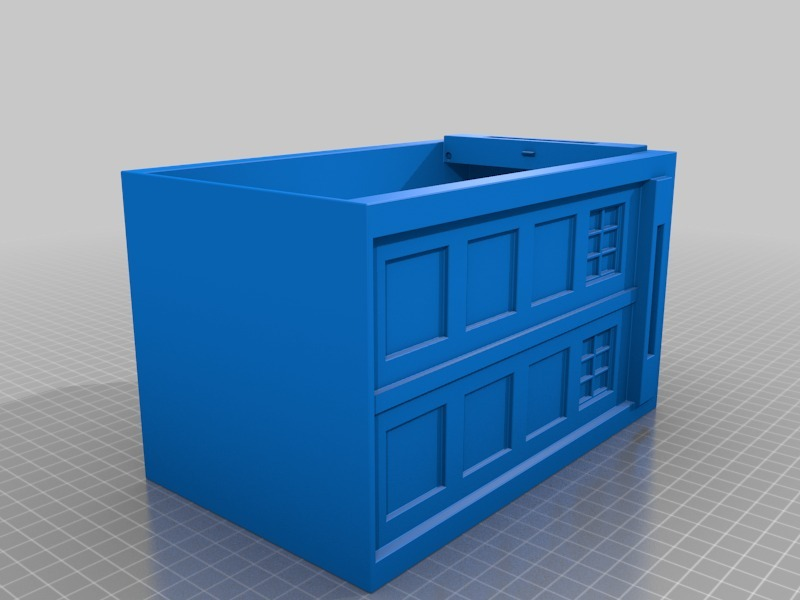

Tags
--------
doctor_who , opening_doors , Tardis  

  

License
--------
Tardis with doors by MakeALot is licensed under the Creative Commons - Attribution license.  

By: Mark Durbin (MakeALot)
--------
<http://NestedCube.com/>