Tardis with drawers
===============
**Please note: This thing is part of a list that was [automatically generated](https://github.com/carlosgs/export-things) and may have been updated since then. Make sure to check for the current license and authorship.**  

Tardis with drawers  by MakeALot , published Nov 23, 2012

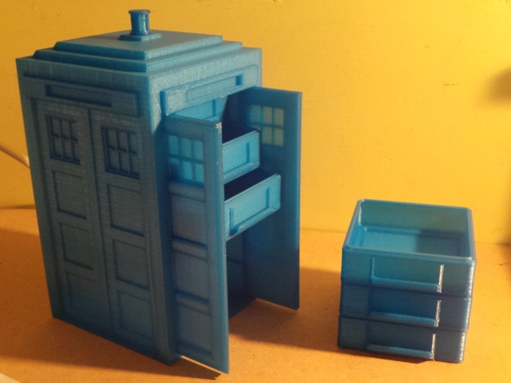

Description
--------
Combination of Tardis with doors and stacker drawers 
 
Could be filled with Who Chess set <a href="http://www.thingiverse.com/thing:19841" target="_blank" rel="nofollow">thingiverse.com/thing:19841</a> !

Instructions
--------
I've had to make the stacker drawer slightly narrower to keep the Tardis the same shape. 
 
I've also improved the base of the drawers so that they stick to the build platform by more surface area but still stack. 
 
I left the door stop on the original upload, if you downloaded that one, you can always just cut it off (I did!). 
 
I'll turn off work in progress when I've posted the rest of the drawer types. 
 
Update:  
 
The double height draw was too high, I've uploaded a new one. 
 
I'm going to turn off the Work In Progress flag, these drawers work, let me know if you want one of the others and I'll generate it. 
 
I have got a derivative that's nearly ready with a chess board embedded in the bottom of the 6 drawers.  I'll post that as a new item rather than adding it here.

Files
--------
[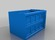](Main_Body_for_Thinner_Drawers_netfabb.stl)
 [ Main_Body_for_Thinner_Drawers_netfabb.stl](Main_Body_for_Thinner_Drawers_netfabb.stl)  

[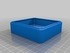](TStacker_Empty.stl)
 [ TStacker_Empty.stl](TStacker_Empty.stl)  

[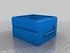](Double_Height_TStacker.stl)
 [ Double_Height_TStacker.stl](Double_Height_TStacker.stl)  

[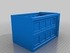](Main_Body_for_Thinner_Drawers.stl)
 [ Main_Body_for_Thinner_Drawers.stl](Main_Body_for_Thinner_Drawers.stl)  

[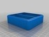](TStacker_2_Div.stl)
 [ TStacker_2_Div.stl](TStacker_2_Div.stl)  

[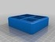](TStacker_4_Cross_Div.stl)
 [ TStacker_4_Cross_Div.stl](TStacker_4_Cross_Div.stl)  

[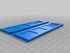](Open_Out_Doors.stl)
 [ Open_Out_Doors.stl](Open_Out_Doors.stl)  

[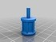](Light.stl)
 [ Light.stl](Light.stl)  

Pictures
--------
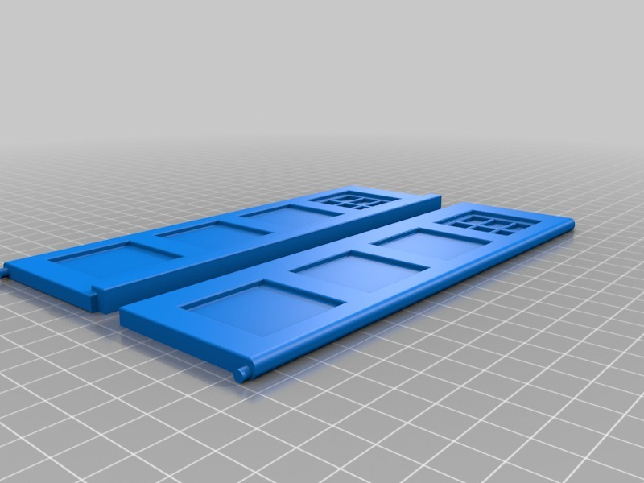
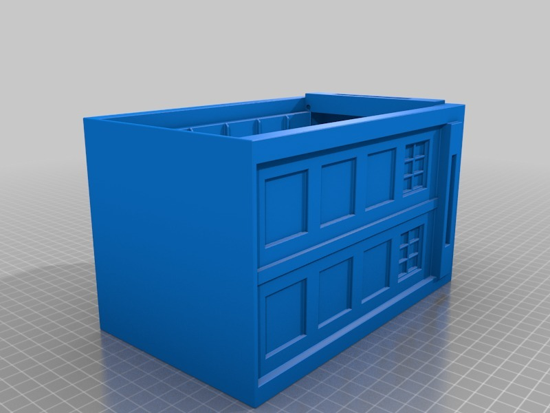
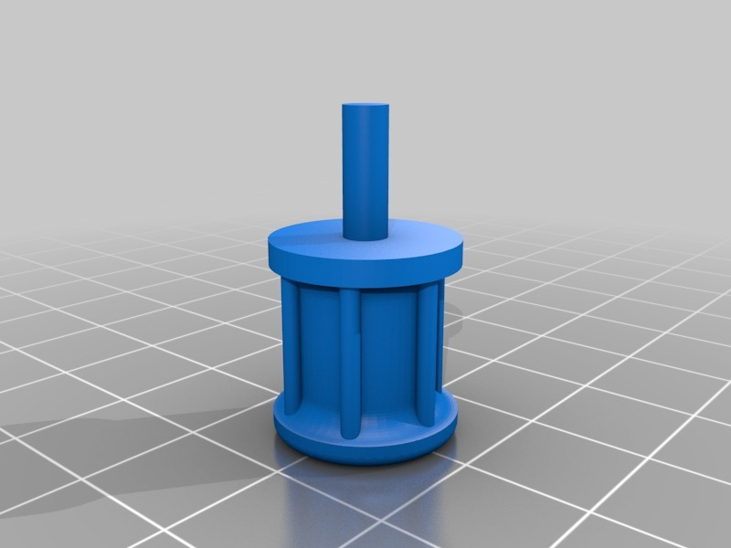
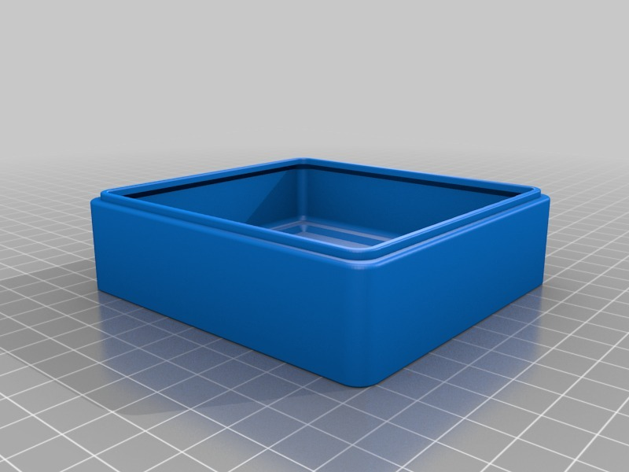
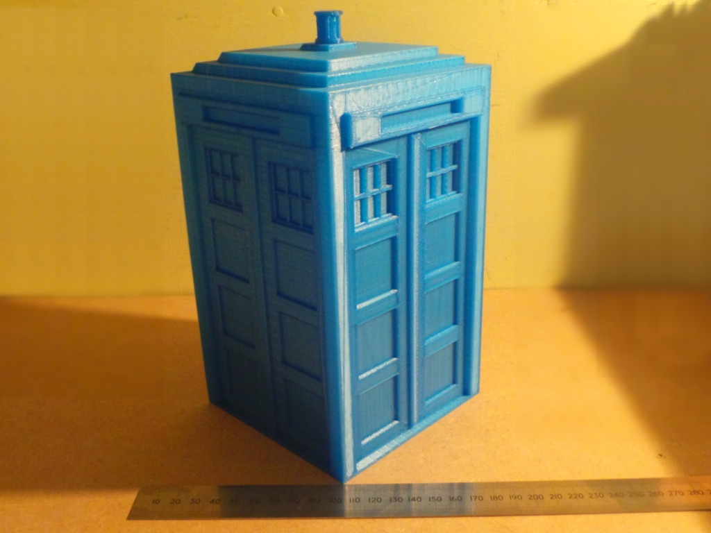
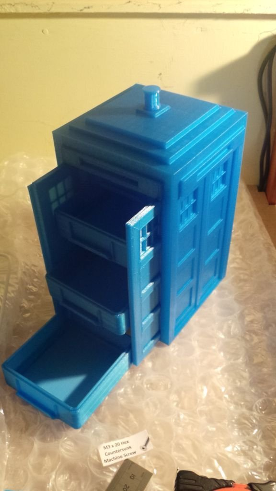
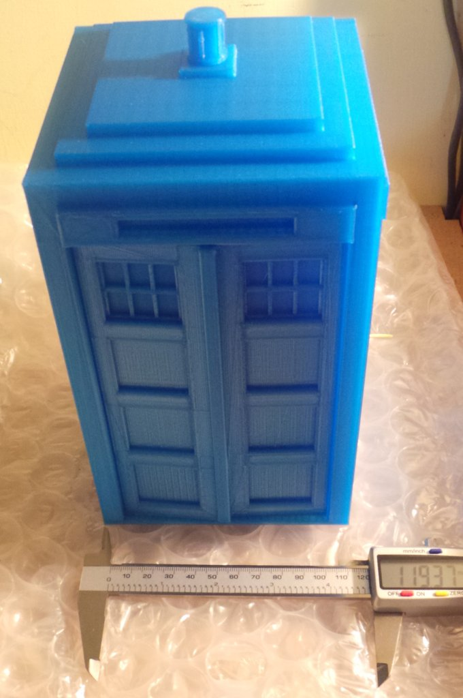
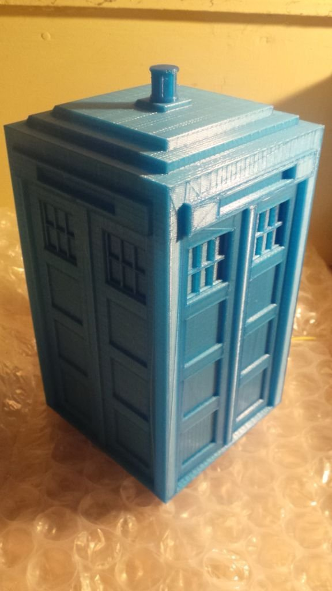
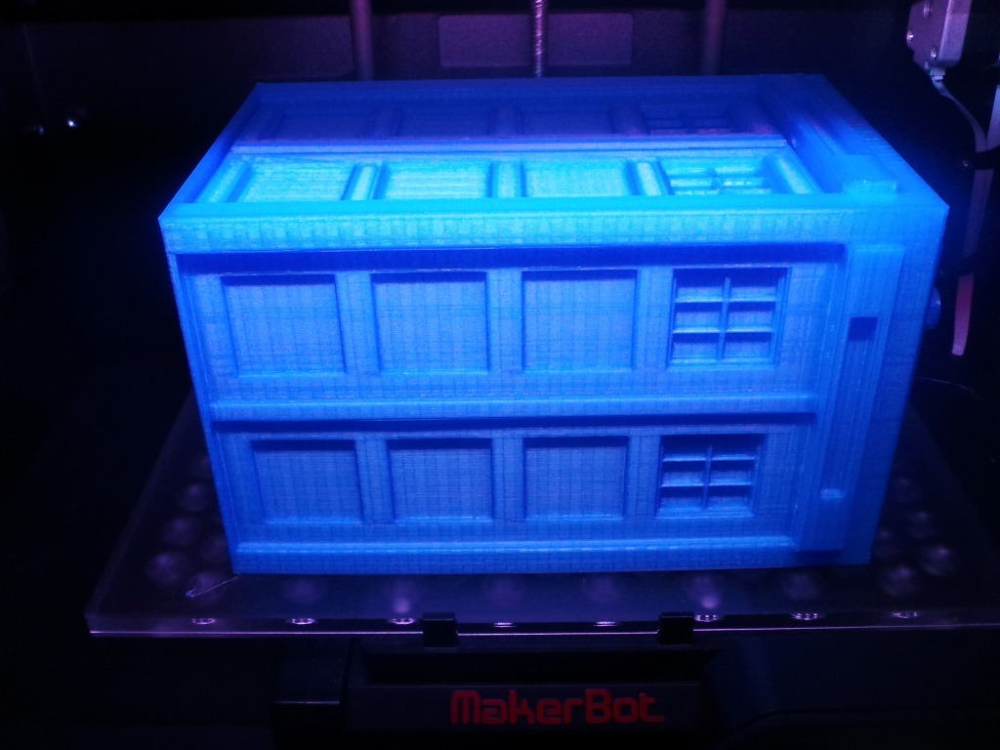
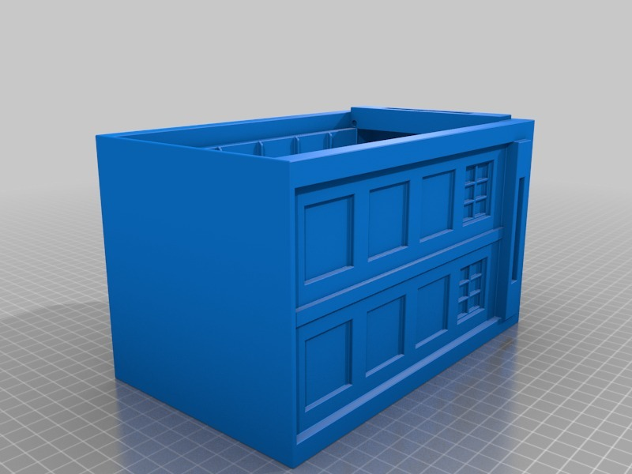
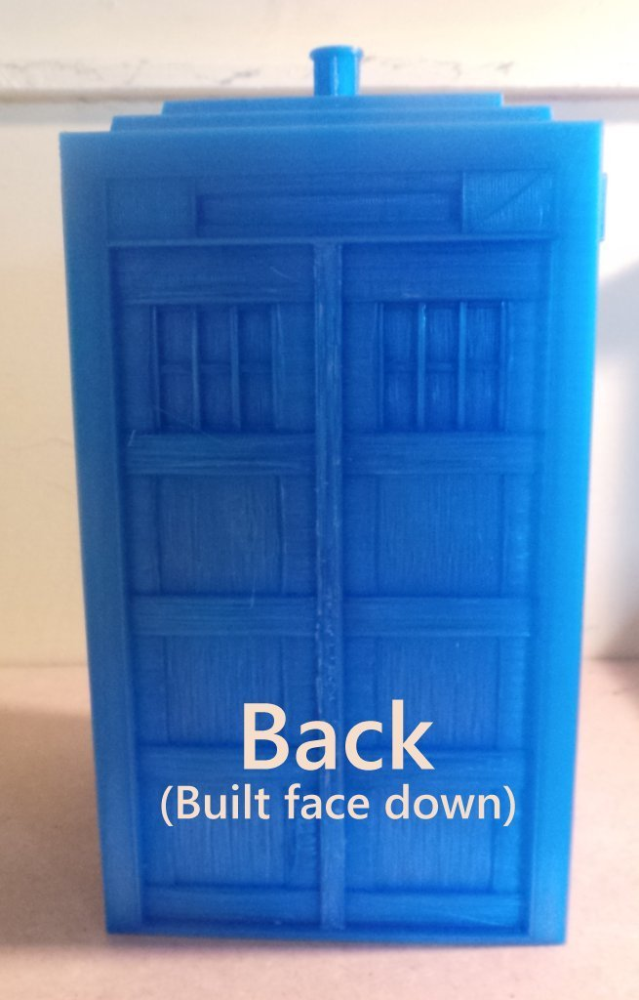
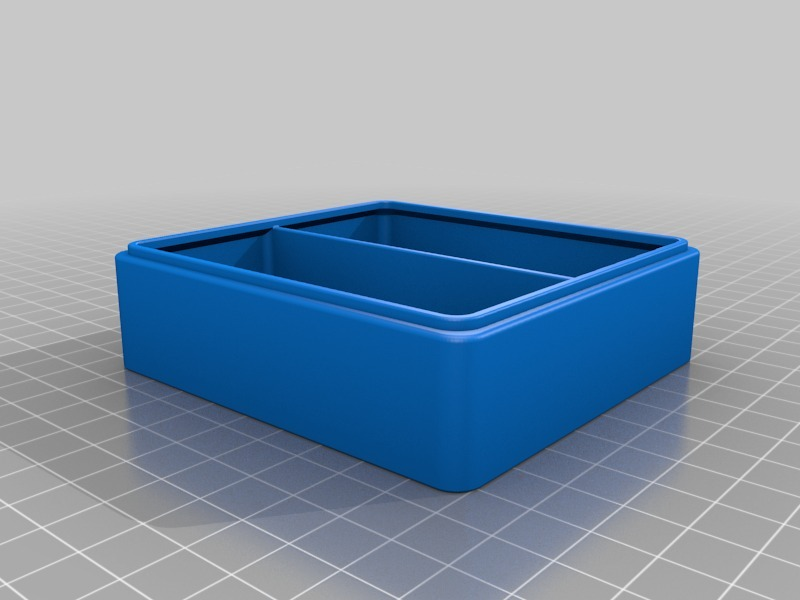
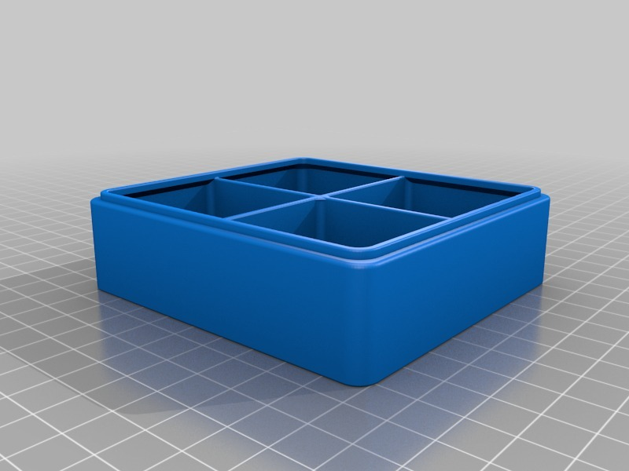
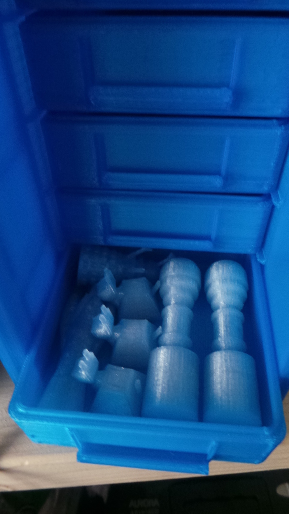
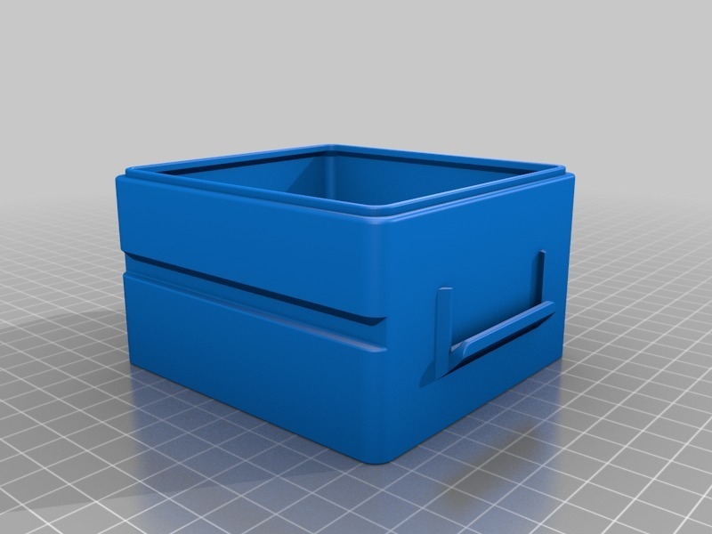

Tags
--------
doctor_who , drawers , LulzBot , storage , Tardis  

  

License
--------
Tardis with drawers by MakeALot is licensed under the Creative Commons - Attribution license.  

By: Mark Durbin (MakeALot)
--------
<http://NestedCube.com/>