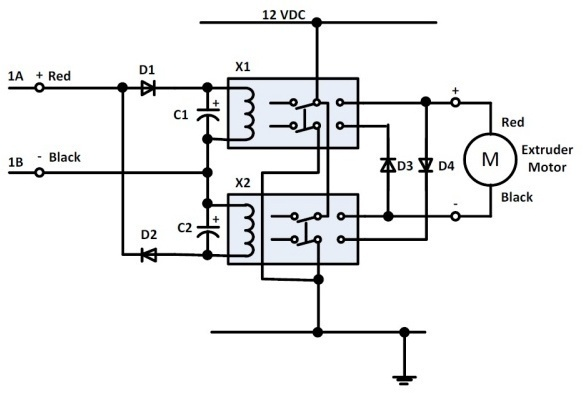

ToM Extruder Relay Fix
===============
**Please note: This thing is part of a list that was [automatically generated](https://github.com/carlosgs/export-things) and may have been updated since then. Make sure to check for the current license and authorship.**  

ToM Extruder Relay Fix  by MakeALot , published Jan 13, 2011

Description
--------
Extended design to include 2 relays for motor reverse

Instructions
--------
None

Files
--------

 [ Bi-directional_Motor_Relay_Hack.pdf](Bi-directional_Motor_Relay_Hack.pdf)  

Tags
--------
None  

  

License
--------
ToM Extruder Relay Fix by MakeALot is licensed under the Public Domain license.  

By: Mark Durbin (MakeALot)
--------
<http://NestedCube.com/>